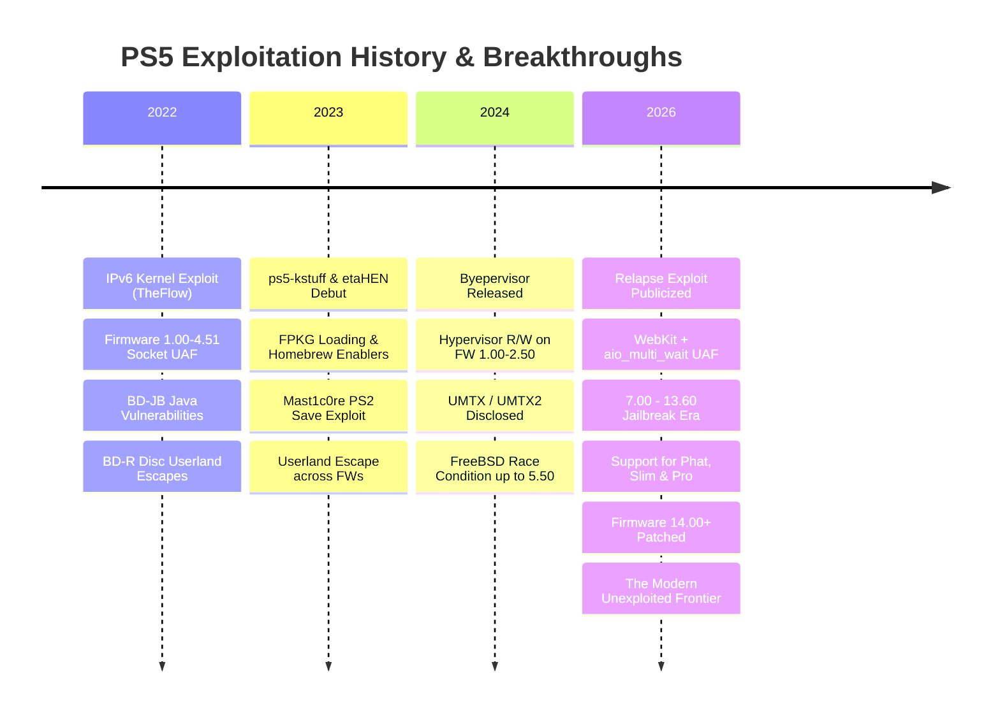
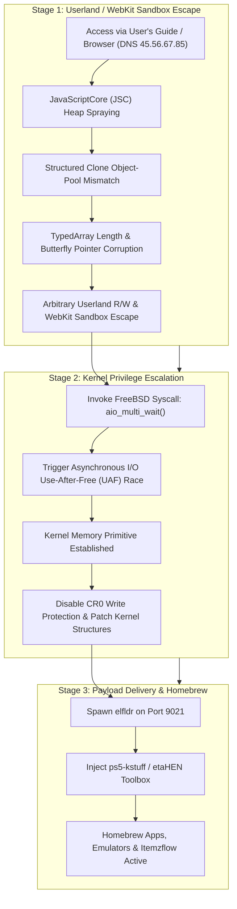
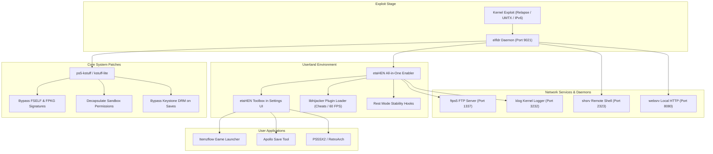
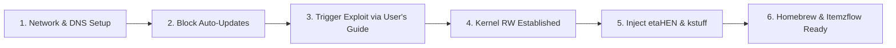

# 🎮 The Ultimate PS5 Jailbreak & Exploit Compendium 🚀

[](https://github.com/alonsojr1980/ps5-jailbreak-compendium)
[-blueviolet?style=for-the-badge&logo=codeforces&logoColor=white)](https://github.com/ntfargo/Relapse-Exploit)
[](https://github.com/alonsojr1980/ps5-jailbreak-compendium)
[](https://github.com/LightningMods/etaHEN)
[](LICENSE)

An exhaustive, curated, and community-verified encyclopedia of PlayStation 5 jailbreak links, exploit chains, payloads, homebrew applications, development tools, reverse-engineering documentation, and system security research.

---

## 📑 Table of Contents

- [🌟 Executive Summary & Current Scene Status](#-executive-summary--current-scene-status)
- [🔥 Featured Breakthrough: The Relapse Exploit (7.00 – 13.60)](#-featured-breakthrough-the-relapse-exploit-700--1360)
  - [Technical Architecture](#technical-architecture)
  - [Exploit Execution Pipeline](#exploit-execution-pipeline)
  - [Hardware & Model Compatibility](#hardware--model-compatibility)
  - [Quick Start Guide & DNS Setup](#quick-start-guide--dns-setup)
  - [Credits & Key Researchers](#credits--key-researchers)
- [📊 Master Firmware Compatibility Matrix](#-master-firmware-compatibility-matrix)
- [⚙️ Essential Payloads & System Frameworks](#️-essential-payloads--system-frameworks)
  - [Payload Execution Architecture](#payload-execution-architecture)
  - [1. etaHEN — All-In-One Homebrew Enabler](#1-etahen--all-in-one-homebrew-enabler)
  - [2. ps5-kstuff & kstuff-lite — Kernel Patching Engine](#2-ps5-kstuff--kstuff-lite--kernel-patching-engine)
  - [3. elfldr — Dynamic ELF Loader Daemon](#3-elfldr--dynamic-elf-loader-daemon)
  - [4. libhijacker — Dynamic Code Injection & Game Patching](#4-libhijacker--dynamic-code-injection--game-patching)
  - [5. shsrv — Interactive UNIX Shell Server](#5-shsrv--interactive-unix-shell-server)
  - [6. ftps5 — High-Performance File Transfer Protocol Daemon](#6-ftps5--high-performance-file-transfer-protocol-daemon)
  - [7. websrv & gdbsrv — Web Management & Remote Debugging](#7-websrv--gdbsrv--web-management--remote-debugging)
  - [Master Network Ports Directory](#master-network-ports-directory)
- [🚀 Payload Injection & Automation Guide](#-payload-injection--automation-guide)
  - [Method 1: USB Auto-Loading](#method-1-usb-auto-loading)
  - [Method 2: Network Injection via Netcat / Terminal](#method-2-network-injection-via-netcat--terminal)
  - [Method 3: Cross-Platform Python Injection Script](#method-3-cross-platform-python-injection-script)
- [🧰 Curated Exploits & Entry Points](#-curated-exploits--entry-points)
- [🕹️ Homebrew Apps, Emulators & Game Managers](#️-homebrew-apps-emulators--game-managers)
- [🌐 Exploit Hosts, DNS Servers & Offline Tools](#-exploit-hosts-dns-servers--offline-tools)
- [🛡️ Anti-Update & Telemetry Firewall Guide](#️-anti-update--telemetry-firewall-guide)
- [⚠️ PS5 Slim & Pro Detachable Disc Drive Advisory](#️-ps5-slim--pro-detachable-disc-drive-advisory)
- [📖 Step-by-Step Setup Guide: From Stock to Jailbroken](#-step-by-step-setup-guide-from-stock-to-jailbroken)
- [🔧 Troubleshooting & Panic Recovery](#-troubleshooting--panic-recovery)
- [📚 Glossary of PS5 Scene Terms](#-glossary-of-ps5-scene-terms)
- [⚖️ Disclaimer](#️-disclaimer)

---

## 🌟 Executive Summary & Current Scene Status

The PlayStation 5 security architecture relies on a multi-tiered defense model consisting of userland process isolation (FreeBSD Capsicum sandboxing), a customized FreeBSD 12 kernel (Prospero kernel), and an AMD Secure Processor / Hypervisor (Ring -1) enforcing code-signing and page table protections (eXecute-Only-Memory - XOM).

Exploitation has progressed across several distinct eras:



> [!IMPORTANT]
> **Golden Rule of Console Modding:** *Never update your PlayStation 5 console.*
> Firmware versions **13.60 and below** are fully exploitable. Consoles running firmware **14.00 or higher** have patched the `aio_multi_wait` vulnerability and are currently **not jailbreakable**.

---

## 🔥 Featured Breakthrough: The Relapse Exploit (7.00 – 13.60)

Released in late September 2026 by lead developer **ntfargo** (Nathan Fargo) alongside researchers **Sonic_Iso**, **Jordy**, and **ufm42**, the **Relapse Exploit** is the most significant milestone in the modern PS5 scene. It bypasses previous limitations, granting **arbitrary kernel read/write access** across firmwares **7.00 to 13.60** on all revisions: Original "Fat", Slim (CFI-2000), and Pro (CFI-7000).

### Technical Architecture

Relapse is a chained, multi-stage exploit combining a browser sandbox escape with a FreeBSD kernel race condition:



#### Deep Dive into the Two Stages:

1. **Stage 1 (Userland WebKit Escape)**:
   - **Target Engine**: PlayStation 5 WebKit JavaScriptCore (JSC).
   - **Vulnerability**: Exploits an information disclosure flaw coupled with an object-pool mismatch during `StructuredSerialize` / structured cloning operations.
   - **Mechanism**: Corrupts an `ArrayBuffer` / `Uint32Array` butterfly pointer, providing stable, arbitrary memory read/write within the userland WebKit process address space.

2. **Stage 2 (Kernel Escalation via `aio_multi_wait`)**:
   - **Target Subsystem**: FreeBSD-derived PS5 kernel asynchronous I/O (`aio`).
   - **Vulnerability**: Exploits a high-frequency race condition in `aio_multi_wait()`. When multiple async I/O requests synchronize, a dangling pointer permits a **Use-After-Free (UAF)**.
   - **Privilege Escalation**: Reclaims freed kernel memory with controlled userland data to craft fake kernel objects (`thread`, `proc`, and `cred` structures), bypassing `kASLR`, setting `cr_uid=0` (root context), and establishing full kernel read/write primitives.

### Exploit Execution Pipeline

1. Configure PS5 Network Primary DNS to `45.56.67.85`.
2. Navigate to **Settings** ➔ **System** ➔ **User's Guide, Health & Safety, and Other Information** ➔ **User's Guide**.
3. The console is redirected to the Relapse WebKit loader.
4. The WebKit exploit executes, spraying heap allocations until userland read/write is confirmed.
5. The kernel race condition triggers via `aio_multi_wait`.
6. Once kernel RW is obtained, the payload daemon (`elfldr`) launches in the background, listening on **TCP Port 9021**.
7. Payloads (such as `etaHEN` or `ps5-kstuff`) can now be injected over the local network via Netcat or auto-loaded from USB.

> [!WARNING]
> **Stability & Panic Advisory:**
> Relapse relies on a real-time thread race condition. While highly reliable, execution may trigger a kernel panic (instant console shutdown or freeze) approximately 10–20% of the time. If this occurs:
> 1. Wait 30 seconds.
> 2. Press the physical power button on the console.
> 3. Allow the console to repair system storage if prompted, then re-attempt.

### Hardware & Model Compatibility

| Model Series | Common Nickname | Supported Firmware Range | Disc Drive Pairing Note |
| :--- | :--- | :--- | :--- |
| **CFI-1000 / 1100 / 1200** | PS5 "Fat" / Original | All FWs up to 13.60 | Plug & Play physical disc drive (no online activation required) |
| **CFI-2000** | PS5 "Slim" | Up to 13.60 | **Crucial:** Detachable disc drive requires one-time PSN registration before offline jailbreaking |
| **CFI-7000** | PS5 "Pro" | Factory FW up to 13.60 | Fully compatible with Relapse; check out-of-box firmware upon purchase! |

### Quick Start Guide & DNS Setup

To run Relapse on firmware 7.00 through 13.60:

```text
PS5 Network Settings:
├── Wi-Fi / LAN Setup: Custom
├── IP Address Settings: Automatic
├── DHCP Host Name: Do Not Specify
├── DNS Settings: Manual
│   ├── Primary DNS:   45.56.67.85
│   └── Secondary DNS: 0.0.0.0 (or router/gateway IP)
├── MTU Settings: Automatic
└── Proxy Server: Do Not Use
```

Once configured, open the **User's Guide** to access the exploit payload hub.

### Credits & Key Researchers

- **ntfargo (Nathan Fargo)**: Exploit chain lead, integration, and public release.
- **Sonic_Iso**: Kernel exploit development and `aio_multi_wait` UAF primitive implementation.
- **Jordy**: WebKit JavaScriptCore memory corruption discovery and kernel vulnerability identification.
- **ufm42**: Tooling, payload coordination, and exploit stabilization.
- **TheFlow (Andy Nguyen)**: Foundational security research and FreeBSD vulnerability discoveries.
- **ChendoChap & SpecterDev**: Pioneering PS5 kernel exploitation research and userland memory manipulation.
- **flatz, SlidyBat, Dr. Yenyen**: Research, testing, and hardware validation.
- **LightningMods & EchoStretch**: Homebrew payload ecosystem adaptation (`etaHEN`, `ps5-kstuff`).

---

## 📊 Master Firmware Compatibility Matrix

| Firmware Bracket | Exploit Entry | Kernel Exploit | Hypervisor Status | kstuff / FPKG | etaHEN Status | Scene Verdict |
| :---: | :---: | :---: | :---: | :---: | :---: | :---: |
| **1.00 – 2.50** | WebKit / BD-JB | IPv6 UAF / UMTX | 🔓 **Byepervisor** (HV Defeated) | ✅ Full Support | ✅ Full Support | 👑 **The Holy Grail** (Hypervisor Root) |
| **3.00 – 4.51** | WebKit / BD-JB | IPv6 UAF / UMTX | 🔒 Hypervisor Enforced | ✅ Full Support | ✅ Full Support | 💎 **Golden Era** (Peak Stability) |
| **5.00 – 5.50** | WebKit / BD-JB | UMTX / UMTX2 | 🔒 Hypervisor Enforced | ✅ Full Support | ✅ Full Support | 🚀 **Highly Stable** |
| **6.00 – 6.50** | WebKit / BD-JB | UMTX2 / Mast1c0re | 🔒 Hypervisor Enforced | ⚠️ In Progress | ⚠️ Porting Active | 🧪 **Active Research** |
| **7.00 – 13.60** | **WebKit (JSC)** | **Relapse (aio_multi_wait)** | 🔒 Hypervisor Enforced | ✅ **Full Support** | ✅ **Full Support** | 🔥 **Modern Jailbreak Era** |
| **14.00+** | ❌ Patched | ❌ Patched | 🔒 Hypervisor Enforced | ❌ None | ❌ None | 🛑 **DO NOT UPDATE / Unexploited** |

---

## ⚙️ Essential Payloads & System Frameworks

Payloads are specialized binary programs (`.bin` or `.elf`) injected into the console after kernel read/write has been achieved. They patch the operating system in memory, run background servers, decapsulate security containers, and expose APIs to homebrew apps.

### Payload Execution Architecture



---

### 1. etaHEN — All-In-One Homebrew Enabler

Developed by **LightningMods**, **etaHEN** is the PlayStation 5 equivalent of GoldHEN on PS4. It acts as the central OS customization payload, injecting directly into the system software to create a stable, user-friendly homebrew environment.

#### Key Features:
- **Settings UI Integration (etaHEN Toolbox)**: Injects an official-looking configuration menu directly inside **Settings ➔ System ➔ etaHEN Toolbox**.
- **FPKG & FSELF Support**: Coordinates with `kstuff` to load, decrypt, and execute unsigned game packages and homebrew executables.
- **Embedded FTP Server**: Spawns an internal high-speed FTP server on **Port 1337** with access to all partitions (`/user`, `/system`, `/app0`).
- **Kernel Logger (klog)**: Transmits live kernel debug messages to **Port 3232** over UDP/TCP.
- **Game Plugins & Cheats Engine**: Interacts with `libhijacker` to load real-time memory patches:
  - 60 FPS patches for 30 FPS locked titles (Bloodborne, Red Dead Redemption 2, Driveclub, etc.).
  - Debug camera free-cam mods.
  - Cheat trainers and memory injectors.
- **Remote Play Patch**: Removes the requirement to authenticate with the PlayStation Network for Remote Play, allowing offline streaming with **Chiaki-ng**.
- **Custom Notifications**: Displays on-screen toast notifications for payload load status, temperature warnings, and connected FTP clients.
- **Rest Mode Preservation**: Implements hooks to prevent kernel crashes when entering and exiting Rest Mode while payloads are active.

#### Configuration Files:
Located on the internal SSD at `/data/etaHEN/`:
```ini
; /data/etaHEN/config.ini
[General]
log_level=1
ftp_port=1337
klog_port=3232
auto_launch_itemzflow=0
temperature_threshold=78
rest_mode_fix=1

[Plugins]
enable_game_plugins=1
allow_cheats=1
```

---

### 2. ps5-kstuff & kstuff-lite — Kernel Patching Engine

Developed by **ChendoChap**, **EchoStretch**, **John Törnblom**, and **flatz**, **kstuff** is the foundational kernel patcher that makes homebrew and game dumping possible on the PS5.

#### What kstuff Patches in the Prospero Kernel:
1. **FSELF (Fake Signed ELF) Decryption**: Patches `sys_execve` and the kernel ELF loader to accept executables with arbitrary or missing Sony cryptographic signatures.
2. **FPKG (Fake Package) Mounting**: Neutralizes signature verification in `app.db` and the package manager daemon (`pkg_install`), allowing custom packages to install and execute without official licensing.
3. **Capsicum Sandbox Decapsulation**: Strips security constraints from homebrew processes, allowing arbitrary file system traversal, socket creation, and shared memory access.
4. **Keystone DRM Neutralization**: Bypasses the cryptographic keystone check, allowing saves to be transferred between different consoles and accounts without corrupting data.

#### `ps5-kstuff` vs `kstuff-lite`:
- **ps5-kstuff (Standard)**: Comprehensive patch set including full dynamic hooking, system call interception, and debug facilities.
- **kstuff-lite**: Stripped-down, minimal memory-footprint variant optimized for systems experiencing memory pressure or kernel panics during exploit injection.

---

### 3. elfldr — Dynamic ELF Loader Daemon

Created by **John Törnblom** as part of the `ps5-payload-dev` project, **elfldr** is the universal payload loader.

- **Port**: TCP `9021`.
- **Function**: Runs as a daemon in the background with kernel/root execution context. When an ELF binary is sent to port 9021 over the local network, `elfldr` maps the binary into memory, relocates its symbols, and launches it in a dedicated thread.
- **Payload Chaining**: Enables running multiple payloads sequentially without needing to re-trigger the WebKit or kernel exploit.

---

### 4. libhijacker — Dynamic Code Injection & Game Patching

Maintained by **astrelsky**, **libhijacker** is a specialized framework designed to inject code and manage threads inside running PlayStation games and applications.

- **How It Works**: Uses FreeBSD debugging and process control primitives (`ptrace`, `/proc/curproc/mem`) to inject DLL/ELF hooks into a game's `eboot.bin` process.
- **Applications**:
  - Illusion's 60 FPS patches for PS4/PS5 titles.
  - Resolution and graphical detail unlockers.
  - In-game debug camera controls for video capture and research.

---

### 5. shsrv — Interactive UNIX Shell Server

Maintained by the **ps5-payload-dev** organization, **shsrv** exposes a remote terminal shell.

- **Port**: TCP `2323`.
- **Connection**: Connect using any standard Telnet client:
  ```bash
  telnet 192.168.1.150 2323
  ```
- **Capabilities**: Grants root interactive access to standard FreeBSD commands (`ls`, `ps`, `kill`, `mount`, `cp`, `mkdir`, `dmesg`).

---

### 6. ftps5 — High-Performance File Transfer Protocol Daemon

Developed by **Florinsdistortedvision**, **ftps5** provides full access to the PS5 file structure over Gigabit Ethernet / Wi-Fi.

- **Port**: TCP `1337` (or standard `21`).
- **Mount Points Exposed**:
  - `/user/home`: User saves, profiles, and configuration data.
  - `/user/app`: Installed games and application packages.
  - `/system`: OS binaries, core firmware modules, and certificates.
  - `/data`: Homebrew directories, etaHEN configs, and payload folders.
  - `/mnt/usb0` & `/mnt/usb1`: External USB flash drives and hard drives.
  - `/mnt/ext0`: Formatted M.2 NVMe SSD storage.

---

### 7. websrv & gdbsrv — Web Management & Remote Debugging

- **websrv (Port 8080)**: Lightweight embedded HTTP server allowing console administration and status viewing from a mobile or desktop web browser.
- **gdbsrv (Port 2159)**: GDB remote debugger server. Allows developers to connect IDA Pro, Ghidra, or `gdb-multiarch` directly to a running PS5 process for real-time reverse engineering and breakpoint inspection.

---

### Master Network Ports Directory

| Port | Protocol | Service / Payload | Description | Example Client Command |
| :---: | :---: | :---: | :---: | :---: |
| **9021** | TCP | `elfldr` | Primary ELF Payload Loader | `nc -w 3 <PS5_IP> 9021 < payload.bin` |
| **9027** | TCP | `kstuff-loader` | Dedicated kstuff injection socket | `nc -w 3 <PS5_IP> 9027 < kstuff.bin` |
| **1337** | TCP | `ftps5` / `etaHEN FTP` | High-speed root FTP server | Connect via FileZilla / WinSCP on port 1337 |
| **2323** | TCP | `shsrv` | Root UNIX Telnet Shell | `telnet <PS5_IP> 2323` |
| **3232** | UDP/TCP | `klog` | Live Kernel Logger Stream | `nc -u -l 3232` (or Socat logger) |
| **8080** | TCP | `websrv` | Local Web Admin Interface | Open `http://<PS5_IP>:8080` in web browser |
| **2159** | TCP | `gdbsrv` | Remote GDB Debugger Stub | `gdb-multiarch -ex "target remote <PS5_IP>:2159"` |

---

## 🚀 Payload Injection & Automation Guide

### Method 1: USB Auto-Loading

The cleanest and most reliable way to load payloads without sending them across the network:

1. Format a USB drive as **exFAT** with MBR partition scheme.
2. Create a folder named `payloads` at the root of the USB drive:
   ```text
   USB Drive (exFAT):
   └── payloads/
       ├── etaHEN.bin
       ├── ps5-kstuff.bin
       └── custom_payload.elf
   ```
3. Insert the USB drive into any rear USB 3.0 port on the PS5.
4. When you trigger Relapse or your exploit host, the autoloader will automatically detect and execute the files from the `/payloads/` directory.

---

### Method 2: Network Injection via Netcat / Terminal

Once the exploit has completed and `elfldr` is listening on port 9021:

#### On Linux / macOS / WSL:
```bash
# Inject etaHEN
nc -w 3 192.168.1.150 9021 < etaHEN.bin

# Inject kstuff
nc -w 3 192.168.1.150 9021 < ps5-kstuff.bin
```

#### On Windows (PowerShell):
```powershell
$ps5_ip = "192.168.1.150"
$payload = [System.IO.File]::ReadAllBytes("X:\path\to\etaHEN.bin")
$client = New-Object System.Net.Sockets.TcpClient($ps5_ip, 9021)
$stream = $client.GetStream()
$stream.Write($payload, 0, $payload.Length)
$stream.Close()
$client.Close()
Write-Host "[SUCCESS] Payload delivered to PS5!"
```

---

### Method 3: Cross-Platform Python Injection Script

Create a script named `send_payload.py`:

```python
import sys
import socket

def send_payload(ps5_ip: str, payload_path: str, port: int = 9021):
    print(f"[*] Reading payload: {payload_path}")
    with open(payload_path, "rb") as f:
        data = f.read()
    
    print(f"[*] Connecting to PS5 at {ps5_ip}:{port}...")
    with socket.socket(socket.AF_INET, socket.SOCK_STREAM) as s:
        s.settimeout(5.0)
        s.connect((ps5_ip, port))
        s.sendall(data)
    print(f"[+] Successfully delivered {len(data)} bytes to {ps5_ip}!")

if __name__ == "__main__":
    if len(sys.argv) < 3:
        print("Usage: python send_payload.py <PS5_IP> <PAYLOAD_PATH> [PORT]")
        sys.exit(1)
    port = int(sys.argv[3]) if len(sys.argv) > 3 else 9021
    send_payload(sys.argv[1], sys.argv[2], port)
```

Run with:
```bash
python send_payload.py 192.168.1.150 etaHEN.bin
```

---

## 🧰 Curated Exploits & Entry Points

### 1. Modern Exploits (7.00 – 13.60)
- **[ntfargo/Relapse-Exploit](https://github.com/ntfargo/Relapse-Exploit)**: Official repository for the PS5 7.00–13.60 WebKit + `aio_multi_wait` kernel exploit chain.
- **[itsPLK/ps5-webkit-autoloader](https://github.com/itsPLK/ps5-webkit-autoloader)**: Automated WebKit payload runner tailored for Relapse and modern PS5 firmware brackets.

### 2. Mid-Range Exploits (5.00 – 5.50 / 6.xx)
- **[ChendoChap/PS5-UMTX-Jailbreak](https://github.com/ChendoChap/PS5-UMTX-Jailbreak)**: Implementation of the FreeBSD UMTX race condition kernel exploit (CVE-2024-43102) for PS5 firmwares up to 5.50.
- **[TheOfficialFloW/UMTX](https://github.com/TheOfficialFloW)**: Upstream vulnerability research and disclosures by Andy Nguyen.

### 3. Foundational Exploits (1.00 – 4.51)
- **[Cryptogenic/PS5-IPV6-Kernel-Exploit](https://github.com/Cryptogenic/PS5-IPV6-Kernel-Exploit)**: SpecterDev's implementation of the IPv6 use-after-free vulnerability discovered by TheFlow.
- **[ChendoChap/ps5-ipv6-uaf](https://github.com/ChendoChap/ps5-ipv6-uaf)**: High-reliability IPv6 socket UAF exploit supporting firmwares 3.00 through 4.51.
- **[TheOfficialFloW/bd-jb](https://github.com/TheOfficialFloW/bd-jb)**: Blu-ray Disc Java (BD-J) sandbox escape chain for physical disc PS5 models.
- **[CTurt/mast1c0re](https://github.com/CTurt/mast1c0re)**: PS2 emulator vulnerability leveraging savegame exploits for unsigned code execution on PS4 and PS5.

### 4. Hypervisor Research (1.00 – 2.50)
- **[PS5Dev/Byepervisor](https://github.com/PS5Dev/Byepervisor)**: Breakthrough hypervisor compromise tool utilizing sleep mode / secure loader transitions to gain arbitrary hypervisor read/write and memory decryption on early firmware.
- **[EchoStretch/Byepervisor](https://github.com/EchoStretch/Byepervisor)**: Community implementation and porting branches for Byepervisor payloads.

---

## 🕹️ Homebrew Apps, Emulators & Game Managers

- **[LightningMods/Itemzflow](https://github.com/LightningMods/Itemzflow)**: The gold-standard open-source game launcher, manager, and backup dumper for PlayStation 5.
  - Direct game dumping to external NVMe/USB storage.
  - Virtual game categorization and custom cover art downloader.
  - Direct execution of game backups from external drives.
  - Integrated game trainer engine.
- **[bucanero/apollo-ps5](https://github.com/bucanero/apollo-ps5)**: Comprehensive save-game management tool to resign, unlock, import, export, and apply cheat codes to PS4 and PS5 game saves.
- **[PS5SX2](https://github.com/)**: PlayStation 2 emulator port tailored for jailbroken PS5 consoles with hardware acceleration.
- **[Chiaki-ng](https://github.com/streetpea/chiaki-ng)**: Next-generation open-source PlayStation Remote Play client that connects to jailbroken consoles without requiring PSN sign-in.
- **[RetroArch PS5](https://github.com/libretro/RetroArch)**: Universal multi-system emulation frontend ported to Prospero homebrew.

---

## 🌐 Exploit Hosts, DNS Servers & Offline Tools

### Primary Public DNS Resolvers

Configure these DNS addresses on your PS5 connection to auto-redirect the **User's Guide** to exploit menus while blocking official Sony update hosts:

| Provider | Primary DNS | Secondary DNS | Primary Exploit Served |
| :--- | :--- | :--- | :--- |
| **Relapse Official DNS** | `45.56.67.85` | `0.0.0.0` | Relapse (7.00 – 13.60) |
| **Al-Azif DNS (Classic)** | `165.227.83.145` | `192.241.221.79` | Multi-host / 1.00 – 4.51 |
| **EchoStretch DNS** | `62.210.38.117` | `0.0.0.0` | UMTX & Modern Hosts |

### Recommended Web Exploit Hosts
- **[idlesauce.github.io/ps5-jb](https://idlesauce.github.io/ps5-jb/)**: Lightweight, highly stable web host featuring automatic firmware detection and payload cache.
- **[esphost](https://github.com/)**: Firmware for ESP32-S2 / ESP32-S3 boards allowing 100% offline, wireless exploit hosting directly from a micro-controller plugged into the PS5's USB port.

### Running a Local Self-Host Server
For zero latency and 100% network isolation, host the exploit files locally on your PC:

```bash
# Clone the exploit repository
git clone https://github.com/ntfargo/Relapse-Exploit.git
cd Relapse-Exploit

# Launch a lightweight Python HTTP server on port 8080
python -m http.server 8080
```
Then navigate to `http://<YOUR_PC_IP>:8080` from your PS5 browser or custom DNS redirect.

---

## 🛡️ Anti-Update & Telemetry Firewall Guide

Accidental system updates are the number one cause of lost jailbreak compatibility. Follow this checklist to bulletproof your console.

### 1. In-Console Settings Configuration
Navigate through your PS5 Settings and toggle the following:
- [x] **Settings ➔ System ➔ System Software ➔ System Software Updates and Settings**:
  - Turn **OFF** *Download Update Files Automatically*.
  - Turn **OFF** *Install Update Files Automatically*.
- [x] **Settings ➔ System ➔ Power Saving ➔ Features Available in Rest Mode**:
  - Turn **OFF** *Stay Connected to the Internet* (or strictly restrict background downloads).
- [x] **Settings ➔ Saved Data and Game/App Settings ➔ Automatic Updates**:
  - Turn **OFF** *Auto-Download*.
  - Turn **OFF** *Auto-Install in Rest Mode*.

### 2. Network & Router Domain Blocklist
Add the following Sony telemetry and firmware update domains to your **Pi-hole**, **AdGuard Home**, or router firewall rules:

```text
# PS5 Firmware Update Servers (MUST BLOCK)
fus01.ps5.update.playstation.net
fuk01.ps5.update.playstation.net
feu01.ps5.update.playstation.net
fjp01.ps5.update.playstation.net
fkr01.ps5.update.playstation.net
fcn01.ps5.update.playstation.net
ps5.update.playstation.net

# General PlayStation Telemetry & Telemetry Endpoints
telemetry.api.playstation.com
telemetry-ingest.api.playstation.com
activity.api.playstation.com
commerce.api.playstation.com
hades.world.playstation.com
ares.dl.playstation.net
```

---

## ⚠️ PS5 Slim & Pro Detachable Disc Drive Advisory

> [!CAUTION]
> If you own a **PS5 Slim (CFI-2000 series)** or **PS5 Pro (CFI-7000 series)** with a detachable disc drive:
>
> 1. **Factory Pairing Requirement**: Sony requires the detachable Blu-ray drive to perform a one-time cryptographic handshake with Sony servers to pair with the motherboard before it can read discs.
> 2. **The Dilemma**: Connecting to the PlayStation Network on an outdated firmware will prompt an immediate, forced system software update.
> 3. **Best Practice**: If acquiring a brand-new Slim/Pro console on a lower firmware, verify whether the drive has been paired. Do not initiate an online update to pair the drive if you wish to preserve jailbreak capability on firmwares 13.60 and below. Digital game backups and USB/M.2 NVMe storage homebrew remain fully functional regardless of drive pairing state.

---

## 📖 Step-by-Step Setup Guide: From Stock to Jailbroken

Follow this step-by-step procedure to exploit your console safely:



1. **Verify Firmware**: Go to **Settings ➔ System ➔ System Software ➔ Console Information**. Confirm your firmware is **13.60 or lower**.
2. **Disable Automatic Updates**: Apply all toggles in [Anti-Update Guide](#️-anti-update--telemetry-firewall-guide).
3. **Configure DNS**: Go to **Settings ➔ Network ➔ Settings ➔ Set Up Internet Connection**.
   - Select your Wi-Fi or LAN.
   - Choose **Advanced Settings**.
   - Change **DNS Settings** to **Manual**.
   - Primary DNS: `45.56.67.85` (for Relapse) or your preferred self-host/Al-Azif DNS.
   - Secondary DNS: `0.0.0.0`.
4. **Trigger the Exploit**:
   - Go to **Settings ➔ System ➔ User's Guide, Health & Safety, and Other Information ➔ User's Guide**.
   - The Relapse / WebKit Exploit Menu will load.
   - Wait for the Stage 1 WebKit heap spray to execute.
   - Wait for the Stage 2 `aio_multi_wait` kernel race condition to complete.
   - A success notification will appear: `"Kernel RW Obtained - elfldr listening on 9021"`.
5. **Load Payloads**:
   - If using a USB drive with `/payloads/etaHEN.bin`, it will auto-load.
   - Otherwise, inject `etaHEN.bin` over your LAN using Netcat:
     ```bash
     nc -w 3 <PS5_IP> 9021 < etaHEN.bin
     ```
6. **Enjoy Homebrew**: You will see an **etaHEN** notification appear on your TV. The **etaHEN Toolbox** is now unlocked in Settings, and apps like **Itemzflow** can be launched.

---

## 🔧 Troubleshooting & Panic Recovery

| Symptom | Cause | Solution |
| :--- | :--- | :--- |
| **Instant Console Shutdown (Black screen)** | Kernel Panic during `aio_multi_wait` race condition | Wait 30 seconds. Power on via console button. Let storage repair complete; re-launch exploit. |
| **"There is not enough free system memory"** | WebKit heap spray failure | Press `OK`, refresh the page or clear browser cookies & cache in settings. |
| **Exploit loops without triggering elfldr** | Cache corruption or DNS desync | Clear browser website data, disconnect and reconnect to network, verify Primary DNS is set. |
| **Port 9021 Connection Refused** | Stage 2 did not complete or `elfldr` crashed | Re-run exploit via User's Guide until "Ready for payloads" or "Listening on 9021" appears. |
| **Games fail to launch with CE-xxxx error** | `ps5-kstuff` payload not loaded | Ensure `kstuff` or `etaHEN` (with kstuff enabled) is injected prior to opening titles. |
| **Rest Mode causes crash on resume** | Rest mode sleep hook conflict | Ensure `rest_mode_fix=1` in `etaHEN.ini` or avoid Rest Mode while homebrew is running. |

---

## 📚 Glossary of PS5 Scene Terms

- **WebKit**: The open-source browser rendering engine used in the PS5 User's Guide. Serves as the primary userland entry point to execute unprivileged JavaScript.
- **UAF (Use-After-Free)**: A memory corruption flaw where an application continues to use a memory pointer after the allocated buffer has been freed, enabling race-condition exploitation.
- **Relapse**: The multi-stage exploit chain targeting PS5 firmware 7.00–13.60 utilizing JavaScriptCore and `aio_multi_wait`.
- **kASLR (Kernel Address Space Layout Randomization)**: A defense mechanism that randomizes kernel memory addresses upon each boot. Exploit chains must bypass kASLR to locate kernel functions.
- **Hypervisor (HV)**: A security layer operating above the FreeBSD kernel (Ring -1). On PS5, the hypervisor enforces code signing and page table integrity (XOM).
- **Byepervisor**: A specialized exploit defeating the hypervisor on firmwares 1.00–2.50.
- **FPKG (Fake Package)**: Decrypted and repackaged PlayStation application packages created for homebrew execution.
- **FSELF (Fake Signed ELF)**: Executable binaries stripped of Sony's proprietary ECDSA signatures, executable only when kernel verification is bypassed.
- **etaHEN**: An all-in-one Homebrew Enabler payload providing settings menus, debug options, and patch hooks.
- **ps5-kstuff**: A lightweight kernel patcher payload that circumvents application execution security checks.
- **elfldr**: Resident payload daemon that accepts ELF binaries over TCP port 9021.
- **libhijacker**: Process hooking library used to inject cheats, patches, and mods into running game threads.

---

## ⚖️ Disclaimer

*This repository and documentation are intended solely for academic research, digital rights archiving, software interoperability, and security auditing purposes. Modifying gaming console software may void manufacturer warranties and violate terms of service agreements. This project does not host, link to, or endorse copyrighted game binaries or intellectual property.*

---

<p align="center">
  <b>Maintained by the PS5 Open Security & Homebrew Community</b><br>
  <i>Knowledge is free. Keep your console offline and preserve your firmware.</i>
</p>
