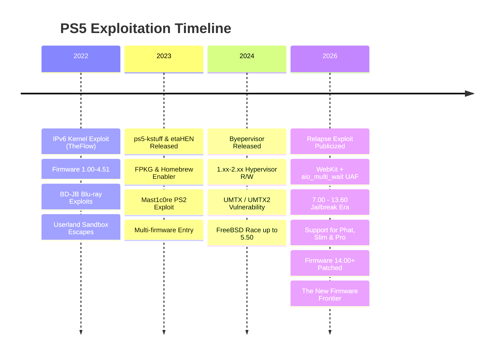
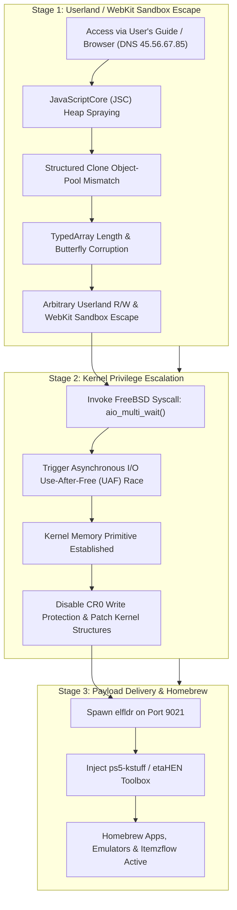
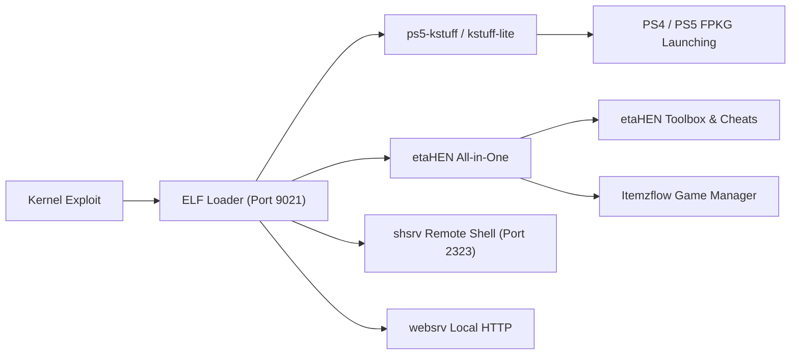

# 🎮 The Ultimate PS5 Jailbreak & Exploit Compendium 🚀

[](https://github.com/)
[-blueviolet?style=for-the-badge&logo=codeforces&logoColor=white)](https://github.com/ntfargo/Relapse-Exploit)
[](https://github.com/)
[](https://github.com/LightningMods/etaHEN)
[](LICENSE)

An exhaustive, curated, and community-verified directory of PlayStation 5 jailbreak links, exploit chains, payloads, homebrew applications, development tools, and security research documentation.

---

## 📑 Table of Contents

- [🌟 Executive Summary & Current Scene Status](#-executive-summary--current-scene-status)
- [🔥 Featured Breakthrough: The Relapse Exploit (7.00 – 13.60)](#-featured-breakthrough-the-relapse-exploit-700--1360)
  - [Technical Architecture](#technical-architecture)
  - [Exploit Execution Flow](#exploit-execution-flow)
  - [Hardware & Model Compatibility](#hardware--model-compatibility)
  - [Quick Start Guide & DNS Setup](#quick-start-guide--dns-setup)
  - [Credits & Key Researchers](#credits--key-researchers)
- [📊 Master Firmware Compatibility Matrix](#-master-firmware-compatibility-matrix)
- [🧰 Curated Exploits & Entry Points](#-curated-exploits--entry-points)
- [⚙️ Essential Payloads & Frameworks](#️-essential-payloads--frameworks)
- [🕹️ Homebrew Apps, Emulators & Game Managers](#️-homebrew-apps-emulators--game-managers)
- [🌐 Exploit Hosts, DNS Servers & Offline Tools](#-exploit-hosts-dns-servers--offline-tools)
- [🛡️ Anti-Update & Telemetry Blocking Guide](#️-anti-update--telemetry-blocking-guide)
- [⚠️ PS5 Slim & Pro Detachable Disc Drive Advisory](#️-ps5-slim--pro-detachable-disc-drive-advisory)
- [🔧 Troubleshooting & Panic Recovery](#-troubleshooting--panic-recovery)
- [📖 Glossary of PS5 Scene Terms](#-glossary-of-ps5-scene-terms)
- [⚖️ Disclaimer](#️-disclaimer)

---

## 🌟 Executive Summary & Current Scene Status

The PlayStation 5 hacking scene has evolved through several distinct historical epochs:



> [!IMPORTANT]
> **Golden Rule of Console Modding:** *Never update your PlayStation 5 console.*
> Firmware versions **13.60 and below** are exploitable. Consoles running firmware **14.00 or higher** have patched the `aio_multi_wait` vulnerability and are currently **not jailbreakable**.

---

## 🔥 Featured Breakthrough: The Relapse Exploit (7.00 – 13.60)

Released in late September 2026 by lead developer **ntfargo** (Nathan Fargo) and a coalition of seasoned reverse engineers, the **Relapse Exploit** represents the most significant breakthrough in the PS5 homebrew ecosystem since the original 4.51 jailbreak. It breaks the longstanding firmwares above 5.50/7.61, granting **kernel arbitrary read/write access** across firmwares **7.00 to 13.60**.

### Technical Architecture

Relapse is a chained, multi-stage exploit that combines an advanced browser sandbox escape with a kernel race condition:



#### Deep Dive into the Two Stages:

1. **Stage 1 (Userland WebKit Escape)**:
   - **Target**: PlayStation 5 WebKit JavaScriptCore (JSC) engine.
   - **Technique**: Leverages an information disclosure vulnerability coupled with an object-pool mismatch during `StructuredSerialize` / structured cloning operations.
   - **Result**: Corrupts an `ArrayBuffer` / `Uint32Array` butterfly pointer, providing stable, arbitrary memory read/write within the userland WebKit process address space.

2. **Stage 2 (Kernel Escalation via `aio_multi_wait`)**:
   - **Target**: FreeBSD-derived PS5 kernel subsystem for Asynchronous I/O (`aio`).
   - **Technique**: Exploits a high-frequency race condition in `aio_multi_wait()`. When multiple async requests are synchronized, a dangling pointer permits a **Use-After-Free (UAF)**.
   - **Payload Injection**: Reclaims the freed kernel allocation with controlled userland data to craft fake kernel objects (`thread`, `proc`, `cred` structures), escalating process credentials to `uid=0` (root/kernel) and resolving kernel base via `kASLR` bypass.

### Exploit Execution Flow

1. Configure PS5 Network Primary DNS to `45.56.67.85`.
2. Navigate to **Settings** ➔ **System** ➔ **User's Guide, Health & Safety, and Other Information** ➔ **User's Guide**.
3. The console is redirected to the Relapse WebKit loader.
4. The WebKit exploit runs automatically, spraying heap allocations until userland read/write is confirmed.
5. The kernel race condition is triggered via `aio_multi_wait`.
6. Once kernel RW is obtained, the payload daemon (`elfldr`) is launched in the background, listening on **port 9021**.
7. Payloads (such as `etaHEN` or `ps5-kstuff`) can now be injected over the local network via Netcat or auto-loaded from USB.

> [!WARNING]
> **Stability & Panic Advisory:**
> Relapse relies on a real-time thread race condition. While highly reliable, execution may fail with a kernel panic (instant console shutdown or freeze) approximately 10–20% of the time. If this occurs:
> 1. Wait 30 seconds.
> 2. Press the physical power button on the PS5.
> 3. Allow the console to rebuild system storage if prompted, then re-attempt.

### Hardware & Model Compatibility

| Model Series | Common Nickname | Supported Firmware Range | Disc Drive Pairing Note |
| :--- | :--- | :--- | :--- |
| **CFI-1000 / 1100 / 1200** | PS5 "Fat" / Original | All FWs up to 13.60 | Plug & Play physical disc drive (no online activation required) |
| **CFI-2000** | PS5 "Slim" | Up to 13.60 | **Crucial:** Detachable disc drive requires one-time PSN registration before offline jailbreaking |
| **CFI-7000** | PS5 "Pro" | Factory FW up to 13.60 | Compatible with Relapse; check out-of-box firmware upon purchase! |

### Quick Start Guide & DNS Setup

To run Relapse on firmware 7.00 through 13.60:

```text
PS5 Network Settings:
├── Wi-Fi / LAN Setup: Custom
├── IP Address Settings: Automatic
├── DHCP Host Name: Do Not Specify
├── DNS Settings: Manual
│   ├── Primary DNS:   45.56.67.85
│   └── Secondary DNS: 0.0.0.0 (or router/gateway IP)
├── MTU Settings: Automatic
└── Proxy Server: Do Not Use
```

Once configured, open the **User's Guide** to access the exploit payload hub.

### Credits & Key Researchers

- **ntfargo (Nathan Fargo)**: Exploit chain lead, integration, and public release.
- **Sonic_Iso**: Kernel exploit development and `aio_multi_wait` UAF primitive implementation.
- **Jordy**: WebKit JavaScriptCore memory corruption discovery and kernel vulnerability identification.
- **ufm42**: Tooling, payload coordination, and exploit stabilization.
- **TheFlow (Andy Nguyen)**: Fundamental security research and foundational FreeBSD vulnerability discoveries.
- **ChendoChap & SpecterDev**: Pioneering PS5 kernel exploitation research and userland memory manipulation.
- **flatz, SlidyBat, Dr. Yenyen**: Research, testing, and hardware validation.
- **LightningMods & EchoStretch**: Homebrew payload ecosystem adaptation (`etaHEN`, `ps5-kstuff`).

---

## 📊 Master Firmware Compatibility Matrix

| Firmware Bracket | Exploit Entry | Kernel Exploit | Hypervisor Status | kstuff / FPKG | etaHEN Status | Scene Verdict |
| :---: | :---: | :---: | :---: | :---: | :---: | :---: |
| **1.00 – 2.50** | WebKit / BD-JB | IPv6 UAF / UMTX | 🔓 **Byepervisor** (HV Defeated) | ✅ Full Support | ✅ Full Support | 👑 **The Holy Grail** (Hypervisor Root) |
| **3.00 – 4.51** | WebKit / BD-JB | IPv6 UAF / UMTX | 🔒 Hypervisor Enforced | ✅ Full Support | ✅ Full Support | 💎 **Golden Era** (Peak Stability) |
| **5.00 – 5.50** | WebKit / BD-JB | UMTX / UMTX2 | 🔒 Hypervisor Enforced | ✅ Full Support | ✅ Full Support | 🚀 **Highly Stable** |
| **6.00 – 6.50** | WebKit / BD-JB | UMTX2 / Mast1c0re | 🔒 Hypervisor Enforced | ⚠️ In Progress | ⚠️ Porting Active | 🧪 **Active Research** |
| **7.00 – 13.60** | **WebKit (JSC)** | **Relapse (aio_multi_wait)** | 🔒 Hypervisor Enforced | ✅ **Full Support** | ✅ **Full Support** | 🔥 **Modern Jailbreak Era** |
| **14.00+** | ❌ Patched | ❌ Patched | 🔒 Hypervisor Enforced | ❌ None | ❌ None | 🛑 **DO NOT UPDATE / Unexploited** |

---

## 🧰 Curated Exploits & Entry Points

### 1. Modern Exploits (7.00 – 13.60)
- **[ntfargo/Relapse-Exploit](https://github.com/ntfargo/Relapse-Exploit)**: Official repository for the PS5 7.00–13.60 WebKit + `aio_multi_wait` kernel exploit chain.
- **[itsPLK/ps5-webkit-autoloader](https://github.com/itsPLK/ps5-webkit-autoloader)**: Automated WebKit payload runner tailored for Relapse and modern PS5 firmware brackets.

### 2. Mid-Range Exploits (5.00 – 5.50 / 6.xx)
- **[ChendoChap/PS5-UMTX-Jailbreak](https://github.com/ChendoChap/PS5-UMTX-Jailbreak)**: Implementation of the FreeBSD UMTX race condition kernel exploit (CVE-2024-43102) for PS5 firmwares up to 5.50.
- **[TheOfficialFloW/UMTX](https://github.com/TheOfficialFloW)**: Upstream vulnerability research and disclosures by Andy Nguyen.

### 3. Foundational Exploits (1.00 – 4.51)
- **[Cryptogenic/PS5-IPV6-Kernel-Exploit](https://github.com/Cryptogenic/PS5-IPV6-Kernel-Exploit)**: SpecterDev's implementation of the IPv6 use-after-free vulnerability discovered by TheFlow.
- **[ChendoChap/ps5-ipv6-uaf](https://github.com/ChendoChap/ps5-ipv6-uaf)**: High-reliability IPv6 socket UAF exploit supporting firmwares 3.00 through 4.51.
- **[TheOfficialFloW/bd-jb](https://github.com/TheOfficialFloW/bd-jb)**: Blu-ray Disc Java (BD-J) sandbox escape chain for physical disc PS5 models.
- **[CTurt/mast1c0re](https://github.com/CTurt/mast1c0re)**: PS2 emulator vulnerability leveraging savegame exploits for unsigned code execution on PS4 and PS5.

### 4. Hypervisor Research (1.00 – 2.50)
- **[PS5Dev/Byepervisor](https://github.com/PS5Dev/Byepervisor)**: Breakthrough hypervisor compromise tool utilizing sleep mode / secure loader transitions to gain arbitrary hypervisor read/write and memory decryption on early firmware.
- **[EchoStretch/Byepervisor](https://github.com/EchoStretch/Byepervisor)**: Community implementation and porting branches for Byepervisor payloads.

---

## ⚙️ Essential Payloads & Frameworks



### Core Payloads
- **[LightningMods/etaHEN](https://github.com/LightningMods/etaHEN)**: The premier All-In-One Homebrew Enabler for PS5. Features include:
  - Custom etaHEN Toolbox menu integration in System Settings.
  - FPKG (Fake Package) application support.
  - Built-in FTP and Klog servers.
  - Custom game plugins, cheats, and patch manager.
  - Temperature monitoring, fan speed overrides, and performance statistics.
- **[ps5-payload-dev/kstuff](https://github.com/ps5-payload-dev/kstuff)**: Dynamic kernel patcher enabling `fself` execution, `fpkg` mounting, and filesystem sandbox decapsulation.
- **[ps5-payload-dev/elfldr](https://github.com/ps5-payload-dev/elfldr)**: Resident daemon listening on TCP port `9021` to receive and execute ELF binaries in kernel or root context.
- **[ps5-payload-dev/shsrv](https://github.com/ps5-payload-dev/shsrv)**: Telnet-compatible remote interactive shell daemon running on port `2323`.
- **[ps5-payload-dev/websrv](https://github.com/ps5-payload-dev/websrv)**: Lightweight HTTP server embedded into the PS5 payload runtime.
- **[astrelsky/libhijacker](https://github.com/astrelsky/libhijacker)**: C library providing process hijacking, code injection, and thread hijacking mechanics for FreeBSD / Orbis / Prospero.

---

## 🕹️ Homebrew Apps, Emulators & Game Managers

- **[LightningMods/Itemzflow](https://github.com/LightningMods/Itemzflow)**: The gold-standard open-source game launcher, manager, and backup dumper for PlayStation 5.
  - Direct game dumping to external NVMe/USB storage.
  - Virtual game categorization and custom cover art downloader.
  - Deep integration with `etaHEN` and `ps5-kstuff`.
- **[bucanero/apollo-ps5](https://github.com/bucanero/apollo-ps5)**: Comprehensive save-game management tool to resign, unlock, import, export, and apply cheat codes to PS4 and PS5 game saves.
- **[PS5SX2](https://github.com/)**: PlayStation 2 emulator port tailored for jailbroken PS5 consoles with hardware acceleration.
- **[Florinsdistortedvision/ftps5](https://github.com/Florinsdistortedvision/ftps5)**: High-speed, multi-threaded FTP server offering full read/write access to system partitions (`/user`, `/system`, `/app0`).

---

## 🌐 Exploit Hosts, DNS Servers & Offline Tools

### Primary Public DNS Resolvers

Configure these DNS addresses on your PS5 connection to auto-redirect the **User's Guide** to exploit menus while blocking official Sony update hosts:

| Provider | Primary DNS | Secondary DNS | Primary Exploit Served |
| :--- | :--- | :--- | :--- |
| **Relapse Official DNS** | `45.56.67.85` | `0.0.0.0` | Relapse (7.00 – 13.60) |
| **Al-Azif DNS (Classic)** | `165.227.83.145` | `192.241.221.79` | Multi-host / 1.00 – 4.51 |
| **EchoStretch DNS** | `62.210.38.117` | `0.0.0.0` | UMTX & Modern Hosts |

### Recommended Web Exploit Hosts
- **[idlesauce.github.io/ps5-jb](https://idlesauce.github.io/ps5-jb/)**: Lightweight, highly stable web host featuring automatic firmware detection and payload cache.
- **[esphost](https://github.com/)**: Firmware for ESP32-S2 / ESP32-S3 boards allowing 100% offline, wireless exploit hosting directly from a micro-controller plugged into the PS5's USB port.

### Running a Local Self-Host Server
For zero latency and 100% network isolation, host the exploit files locally on your PC:

```bash
# Clone the exploit repository
git clone https://github.com/ntfargo/Relapse-Exploit.git
cd Relapse-Exploit

# Launch a lightweight Python HTTP server on port 8080
python -m http.server 8080
```
Then navigate to `http://<YOUR_PC_IP>:8080` from your PS5 browser or custom DNS redirect.

### Sending Payloads via Terminal (Netcat)
When `elfldr` is active on port 9021:

```bash
# Send etaHEN or any custom ELF payload directly to your PS5
nc -w 3 <PS5_IP_ADDRESS> 9021 < etaHEN.bin
```

---

## 🛡️ Anti-Update & Telemetry Blocking Guide

Accidental system updates are the number one cause of lost jailbreak compatibility. Follow this checklist to bulletproof your console.

### 1. In-Console Settings Configuration
Navigate through your PS5 Settings and toggle the following:
- [x] **Settings ➔ System ➔ System Software ➔ System Software Updates and Settings**:
  - Turn **OFF** *Download Update Files Automatically*.
  - Turn **OFF** *Install Update Files Automatically*.
- [x] **Settings ➔ System ➔ Power Saving ➔ Features Available in Rest Mode**:
  - Turn **OFF** *Stay Connected to the Internet* (or strictly restrict background downloads).
- [x] **Settings ➔ Saved Data and Game/App Settings ➔ Automatic Updates**:
  - Turn **OFF** *Auto-Download*.
  - Turn **OFF** *Auto-Install in Rest Mode*.

### 2. Network & Router Domain Blocklist
Add the following Sony telemetry and firmware update domains to your **Pi-hole**, **AdGuard Home**, or router firewall rules:

```text
# PS5 Firmware Update Servers (MUST BLOCK)
fus01.ps5.update.playstation.net
fuk01.ps5.update.playstation.net
feu01.ps5.update.playstation.net
fjp01.ps5.update.playstation.net
fkr01.ps5.update.playstation.net
fcn01.ps5.update.playstation.net
ps5.update.playstation.net

# General PlayStation Telemetry & Telemetry Endpoints
telemetry.api.playstation.com
telemetry-ingest.api.playstation.com
activity.api.playstation.com
commerce.api.playstation.com
hades.world.playstation.com
ares.dl.playstation.net
```

---

## ⚠️ PS5 Slim & Pro Detachable Disc Drive Advisory

> [!CAUTION]
> If you own a **PS5 Slim (CFI-2000 series)** or **PS5 Pro (CFI-7000 series)** with a detachable disc drive:
>
> 1. **Factory Pairing Requirement**: Sony requires the detachable Blu-ray drive to perform a one-time cryptographic handshake with Sony servers to pair with the motherboard before it can read discs.
> 2. **The Dilemma**: Connecting to the PlayStation Network on an outdated firmware will prompt an immediate, forced system software update.
> 3. **Best Practice**: If acquiring a brand-new Slim/Pro console on a lower firmware, verify whether the drive has been paired. Do not initiate an online update to pair the drive if you wish to preserve jailbreak capability on firmwares 13.60 and below. Digital game backups and USB/M.2 NVMe storage homebrew remain fully functional regardless of drive pairing state.

---

## 🔧 Troubleshooting & Panic Recovery

| Symptom | Cause | Solution |
| :--- | :--- | :--- |
| **Instant Console Shutdown (Black screen)** | Kernel Panic during `aio_multi_wait` race condition | Wait 30 seconds. Power on via console button. Let storage repair complete; re-launch exploit. |
| **"There is not enough free system memory"** | WebKit heap spray failure | Press `OK`, refresh the page or clear browser cookies & cache in settings. |
| **Exploit loops without triggering elfldr** | Cache corruption or DNS desync | Clear browser website data, disconnect and reconnect to network, verify Primary DNS is set. |
| **Port 9021 Connection Refused** | Stage 2 did not complete or `elfldr` crashed | Re-run exploit via User's Guide until "Ready for payloads" or "Listening on 9021" appears. |
| **Games fail to launch with CE-xxxx error** | `ps5-kstuff` payload not loaded | Ensure `kstuff` or `etaHEN` (with kstuff enabled) is injected prior to opening titles. |

---

## 📖 Glossary of PS5 Scene Terms

- **WebKit**: The open-source browser rendering engine used in the PS5 User's Guide. Serves as the primary userland entry point to execute unprivileged JavaScript.
- **UAF (Use-After-Free)**: A memory corruption flaw where an application continues to use a memory pointer after the allocated buffer has been freed, enabling race-condition exploitation.
- **Relapse**: The multi-stage exploit chain targeting PS5 firmware 7.00–13.60 utilizing JavaScriptCore and `aio_multi_wait`.
- **kASLR (Kernel Address Space Layout Randomization)**: A defense mechanism that randomizes kernel memory addresses upon each boot. Exploit chains must bypass kASLR to locate kernel functions.
- **Hypervisor (HV)**: A security layer operating above the FreeBSD kernel (Ring -1). On PS5, the hypervisor enforces code signing and page table integrity.
- **Byepervisor**: A specialized exploit defeating the hypervisor on firmwares 1.00–2.50.
- **FPKG (Fake Package)**: Decrypted and repackaged PlayStation application packages created for homebrew execution.
- **etaHEN**: An all-in-one Homebrew Enabler payload providing settings menus, debug options, and patch hooks.
- **ps5-kstuff**: A lightweight kernel patcher payload that circumvents application execution security checks.

---

## ⚖️ Disclaimer

*This repository and documentation are intended solely for academic research, digital rights archiving, software interoperability, and security auditing purposes. Modifying gaming console software may void manufacturer warranties and violate terms of service agreements. This project does not host, link to, or endorse copyrighted game binaries or intellectual property.*

---

<p align="center">
  <b>Maintained by the PS5 Open Security & Homebrew Community</b><br>
  <i>Knowledge is free. Keep your console offline and preserve your firmware.</i>
</p>
