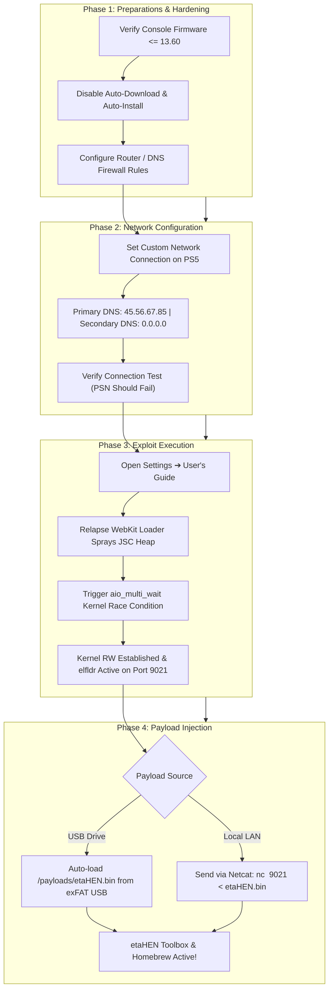
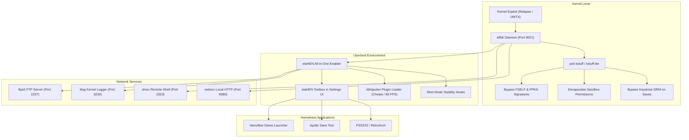
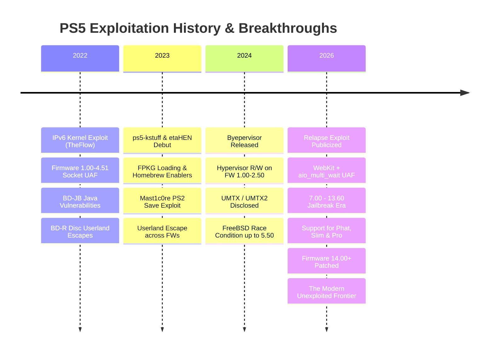

# 🎮 The Ultimate PS5 Jailbreak & Exploit Compendium 🚀
### *by ALONSOJR1980*

<div align="center">

[](https://github.com/alonsojr1980/ps5-jailbreak-compendium)
[-blueviolet?style=for-the-badge&logo=codeforces&logoColor=white)](https://github.com/ntfargo/Relapse-Exploit)
[](https://github.com/alonsojr1980/ps5-jailbreak-compendium)
[](https://github.com/LightningMods/etaHEN)
[](../../LICENSE)

**Languages:**
🇺🇸 **English** | [🇧🇷 Português](../pt/README.md) | [🌐 Back to Main](../../README.md)

</div>

> [!TIP]
> **Looking for specific guides?**
> - 🚀 **[PS5 Jailbreak: Direct How-To Guide](jailbreak_how_to.md)** — A direct, step-by-step procedural walkthrough for jailbreaking each firmware.
> - 🔬 **[PS5 Jailbreak: Technical Deep Dive](jailbreak_tech_info.md)** — In-depth architectural analysis, exploit mechanics, payload engineering, and socket internals for tech-savvy readers.

An exhaustive, curated, and community-verified encyclopedia of PlayStation 5 jailbreak links, exploit chains, payloads, homebrew applications, development tools, reverse-engineering documentation, and system security research.

---

## 📑 Table of Contents (Organized by Relevance)

1. [📊 1. Firmwares with Available Jailbreaks](#-1-firmwares-with-available-jailbreaks)
   - [Master Firmware Compatibility Matrix](#master-firmware-compatibility-matrix)
   - [Firmware Tier Breakdown & Scene Recommendations](#firmware-tier-breakdown--scene-recommendations)
   - [Deep Dive: The Relapse Exploit (7.00 – 13.60)](#deep-dive-the-relapse-exploit-700--1360)
   - [Hardware & Model Compatibility](#hardware--model-compatibility)
2. [🚀 2. How to Jailbreak: Chain of Procedures & Preparations](#-2-how-to-jailbreak-chain-of-procedures--preparations)
   - [Complete Execution Pipeline Flowchart](#complete-execution-pipeline-flowchart)
   - [Phase 1: Pre-Jailbreak Preparations & Anti-Update Firewall](#phase-1-pre-jailbreak-preparations--anti-update-firewall)
   - [Phase 2: PS5 Slim & Pro Detachable Drive Critical Advisory](#phase-2-ps5-slim--pro-detachable-drive-critical-advisory)
   - [Phase 3: Network & DNS Configuration](#phase-3-network--dns-configuration)
   - [Phase 4: Triggering the Exploit](#phase-4-triggering-the-exploit)
   - [Phase 5: Post-Exploit Payload Injection](#phase-5-post-exploit-payload-injection)
3. [🧰 3. Curated Exploits & Entry Points](#-3-curated-exploits--entry-points)
   - [Modern Exploits (7.00 – 13.60)](#modern-exploits-700--1360)
   - [Mid-Range Exploits (5.00 – 5.50 / 6.xx)](#mid-range-exploits-500--550--6xx)
   - [Foundational Exploits (1.00 – 4.51)](#foundational-exploits-100--451)
   - [Hypervisor Exploitation (1.00 – 2.50)](#hypervisor-exploitation-100--250)
4. [⚙️ 4. Essential Payloads & System Frameworks](#️-4-essential-payloads--system-frameworks)
   - [Payload Execution Architecture](#payload-execution-architecture)
   - [Core Payloads (etaHEN, ps5-kstuff, elfldr, libhijacker, etc.)](#core-payloads-breakdown)
   - [Master Network Ports Directory](#master-network-ports-directory)
5. [📦 5. Payload Injection & Automation Methods](#-5-payload-injection--automation-methods)
   - [Method 1: USB Auto-Loading](#method-1-usb-auto-loading)
   - [Method 2: Network Injection via Netcat / Terminal](#method-2-network-injection-via-netcat--terminal)
   - [Method 3: Cross-Platform Python Script](#method-3-cross-platform-python-script)
6. [🕹️ 6. Homebrew Apps, Emulators & Game Managers](#️-6-homebrew-apps-emulators--game-managers)
7. [🌐 7. Exploit Hosts, DNS Servers & Offline Tools](#-7-exploit-hosts-dns-servers--offline-tools)
8. [🔧 8. Troubleshooting & Panic Recovery](#-8-troubleshooting--panic-recovery)
9. [📚 9. Technical Terms & Scene Glossary](#-9-technical-terms--scene-glossary)
10. [🏛️ 10. Background: Exploitation Timeline & Security Architecture](#️-10-background-exploitation-timeline--security-architecture)
11. [⚖️ 11. Disclaimer & AI Curation Notice](#️-11-disclaimer--ai-curation-notice)

---

## 📊 1. Firmwares with Available Jailbreaks

> [!IMPORTANT]
> **The Golden Rule:** *Never update your PlayStation 5 console.*
> Firmware versions **13.60 and below** are fully exploitable. Consoles running firmware **14.00 or higher** have patched the underlying kernel vulnerability and are currently **not jailbreakable**.

### Master Firmware Compatibility Matrix

| Firmware Bracket | Exploit Entry Point | Kernel Exploit | Hypervisor (HV) Status | kstuff / FPKG Support | etaHEN Support | Scene Verdict & Status |
| :---: | :---: | :---: | :---: | :---: | :---: | :---: |
| **1.00 – 2.50** | WebKit / BD-JB | IPv6 UAF / UMTX | 🔓 **Byepervisor** (HV Defeated) | ✅ Full Support | ✅ Full Support | 👑 **The Holy Grail** (Full Hypervisor Root) |
| **3.00 – 4.51** | WebKit / BD-JB | IPv6 UAF / UMTX | 🔒 Hypervisor Enforced | ✅ Full Support | ✅ Full Support | 💎 **Golden Era** (Peak Stability & Compatibility) |
| **5.00 – 5.50** | WebKit / BD-JB | UMTX / UMTX2 | 🔒 Hypervisor Enforced | ✅ Full Support | ✅ Full Support | 🚀 **Highly Stable** (Mature Ecosystem) |
| **6.00 – 6.50** | WebKit / BD-JB | UMTX2 / Mast1c0re | 🔒 Hypervisor Enforced | ⚠️ In Progress | ⚠️ Porting Active | 🧪 **Active Development** |
| **7.00 – 13.60** | **WebKit (JSC)** | **Relapse (aio_multi_wait)** | 🔒 Hypervisor Enforced | ✅ **Full Support** | ✅ **Full Support** | 🔥 **Modern Jailbreak Era** (Active Standard) |
| **14.00+** | ❌ Patched | ❌ Patched | 🔒 Hypervisor Enforced | ❌ None | ❌ None | 🛑 **UNEXPLOITED / DO NOT UPDATE** |

---

### Firmware Tier Breakdown & Scene Recommendations

1. **Tier 1: Firmwares 1.00 – 2.50 (Hypervisor Defeated)**
   - **Advantage**: The only firmware range where the PS5 Hypervisor (Ring -1) has been completely compromised via **Byepervisor**.
   - **Capability**: Arbitrary Hypervisor read/write, memory decryption, page table manipulation, and kernel code signing completely disabled.
   - **Recommendation**: *Never update under any circumstance.*

2. **Tier 2: Firmwares 3.00 – 4.51 (Peak Stability)**
   - **Advantage**: Uses the mature IPv6 socket UAF or UMTX kernel exploit with nearly 100% success rate and virtually zero kernel panics.
   - **Capability**: Full `ps5-kstuff`, `etaHEN`, `Itemzflow`, and FPKG support.
   - **Recommendation**: Highly stable daily driver for homebrew and backups.

3. **Tier 3: Firmwares 5.00 – 5.50 (UMTX Era)**
   - **Advantage**: Fully exploitable via the UMTX race condition (CVE-2024-43102). Highly reliable and fully compatible with modern payloads.

4. **Tier 4: Firmwares 7.00 – 13.60 (Relapse Era)**
   - **Advantage**: Unlocks the vast majority of modern PS5 consoles, including the PS5 Slim (CFI-2000) and PS5 Pro (CFI-7000).
   - **Capability**: Full kernel read/write, `ps5-kstuff`, `etaHEN`, and homebrew support via the `aio_multi_wait` kernel exploit.
   - **Recommendation**: The current modern standard. Do not update beyond 13.60!

5. **Tier 5: Firmwares 14.00+ (Patched)**
   - **Status**: The `aio_multi_wait` kernel race condition and WebKit memory corruption bugs are completely patched by Sony. Keep your console completely offline and wait for future vulnerability disclosures.

---

### Deep Dive: The Relapse Exploit (7.00 – 13.60)

Released in late September 2026 by lead developer **ntfargo** (Nathan Fargo) with researchers **Sonic_Iso**, **Jordy**, and **ufm42**, the **Relapse Exploit** represents the modern standard for PS5 jailbreaking.

#### Technical Exploit Chain:
1. **Stage 1 (Userland WebKit Escape)**:
   - **Target**: JavaScriptCore (JSC) engine within the PS5 User's Guide browser.
   - **Mechanism**: Exploits an information disclosure flaw coupled with an object-pool mismatch during `StructuredSerialize` structured cloning operations.
   - **Result**: Corrupts an `ArrayBuffer` / `Uint32Array` butterfly pointer, establishing stable, arbitrary userland read/write within the WebKit process sandbox.
2. **Stage 2 (Kernel Escalation via `aio_multi_wait`)**:
   - **Target**: FreeBSD-derived Prospero kernel Asynchronous I/O subsystem (`aio`).
   - **Mechanism**: Triggers a high-frequency Use-After-Free (UAF) race condition in `aio_multi_wait()`.
   - **Result**: Reclaims freed kernel memory with controlled userland data to craft fake `thread`, `proc`, and `cred` structures. Bypasses `kASLR`, elevates process credentials to `uid=0` (root/kernel), and spawns `elfldr` on **TCP Port 9021**.

---

### Hardware & Model Compatibility

| Model Series | Common Nickname | Supported Firmware Range | Disc Drive Pairing Advisory |
| :--- | :--- | :--- | :--- |
| **CFI-1000 / 1100 / 1200** | PS5 "Fat" / Original | All FWs up to 13.60 | Plug & Play physical disc drive (no online activation required) |
| **CFI-2000** | PS5 "Slim" | Factory FW up to 13.60 | **Crucial:** Detachable drive requires one-time PSN pairing before going offline |
| **CFI-7000** | PS5 "Pro" | Factory FW up to 13.60 | Fully compatible with Relapse; check out-of-box firmware upon purchase! |

---

## 🚀 2. How to Jailbreak: Chain of Procedures & Preparations

### Complete Execution Pipeline Flowchart



---

### Phase 1: Pre-Jailbreak Preparations & Anti-Update Firewall

Accidental system updates are the number one cause of lost jailbreak compatibility. Follow this checklist to bulletproof your console.

#### 1. In-Console Settings Configuration:
- [x] **Settings ➔ System ➔ System Software ➔ System Software Updates and Settings**:
  - Turn **OFF** *Download Update Files Automatically*.
  - Turn **OFF** *Install Update Files Automatically*.
- [x] **Settings ➔ System ➔ Power Saving ➔ Features Available in Rest Mode**:
  - Turn **OFF** *Stay Connected to the Internet*.
- [x] **Settings ➔ Saved Data and Game/App Settings ➔ Automatic Updates**:
  - Turn **OFF** *Auto-Download*.
  - Turn **OFF** *Auto-Install in Rest Mode*.

#### 2. Network & Router Domain Blocklist:
Block these domains on your **Pi-hole**, **AdGuard Home**, or router firewall:

```text
# PS5 Firmware Update Servers (MUST BLOCK)
fus01.ps5.update.playstation.net
fuk01.ps5.update.playstation.net
feu01.ps5.update.playstation.net
fjp01.ps5.update.playstation.net
fkr01.ps5.update.playstation.net
fcn01.ps5.update.playstation.net
ps5.update.playstation.net

# General PlayStation Telemetry Endpoints
telemetry.api.playstation.com
telemetry-ingest.api.playstation.com
activity.api.playstation.com
commerce.api.playstation.com
hades.world.playstation.com
ares.dl.playstation.net
```

---

### Phase 2: PS5 Slim & Pro Detachable Drive Critical Advisory

> [!CAUTION]
> **Detachable Disc Drive Factory Pairing Handshake:**
> - On the **PS5 Slim (CFI-2000 series)** and **PS5 Pro (CFI-7000 series)**, the detachable Blu-ray drive requires a one-time cryptographic registration with Sony's servers to bind with the console motherboard.
> - **The Problem**: Connecting to the PlayStation Network while running an older firmware will force an immediate system software update.
> - **The Solution**: If purchasing a brand-new Slim or Pro, verify drive pairing status. If not paired, **do not update** to pair the drive. You can still use the console for digital game backups, homebrew, emulators, and external USB/NVMe game storage without the physical disc drive paired.

---

### Phase 3: Network & DNS Configuration

1. On your PS5, go to **Settings ➔ Network ➔ Settings ➔ Set Up Internet Connection**.
2. Highlight your connection (Wi-Fi or LAN) and press the **Options button (☰)** ➔ **Advanced Settings**.
3. Configure the following parameters:
   - **IP Address Settings**: `Automatic`
   - **DHCP Host Name**: `Do Not Specify`
   - **DNS Settings**: `Manual`
     - **Primary DNS**: `45.56.67.85` (Official Relapse DNS) or `62.210.38.117`
     - **Secondary DNS**: `0.0.0.0`
   - **Proxy Server**: `Do Not Use`
   - **MTU Settings**: `Automatic`
4. Save and run the connection test. *Internet Connection: Successful*; *PlayStation Network Sign-In: Failed* (this is normal and confirms Sony servers are blocked).

---

### Phase 4: Triggering the Exploit

1. Navigate to **Settings ➔ System ➔ User's Guide, Health & Safety, and Other Information ➔ User's Guide**.
2. Select **User's Guide**. Your custom DNS will redirect the page to the WebKit exploit menu.
3. The page will display the exploit initialization:
   - *Stage 1*: JavaScriptCore memory corruption runs automatically.
   - *Stage 2*: Kernel race condition triggers via `aio_multi_wait`.
4. Once successful, an on-screen prompt will confirm:
   `[+] Kernel RW Obtained! elfldr listening on port 9021...`

> [!TIP]
> If the console freezes or powers off abruptly, this is a **kernel panic** caused by the timing race condition. Wait 30 seconds, power the console back on via the physical button, let storage repair complete, and try again.

---

### Phase 5: Post-Exploit Payload Injection

Once `elfldr` is active on port 9021:
- **Automatic Method**: If an exFAT USB drive containing `/payloads/etaHEN.bin` is plugged into the PS5, it will load immediately.
- **Manual Network Method**: Send the payload from your PC via terminal:
  ```bash
  nc -w 3 <PS5_IP> 9021 < etaHEN.bin
  ```
- **Verification**: You will see an **etaHEN** notification appear on your screen. System Settings will now include the **etaHEN Toolbox**, and all homebrew apps like **Itemzflow** are ready to launch.

---

## 🧰 3. Curated Exploits & Entry Points

### Modern Exploits (7.00 – 13.60)
- **[ntfargo/Relapse-Exploit](https://github.com/ntfargo/Relapse-Exploit)**: Official implementation of the PS5 7.00–13.60 WebKit + `aio_multi_wait` kernel exploit chain.
- **[itsPLK/ps5-webkit-autoloader](https://github.com/itsPLK/ps5-webkit-autoloader)**: Automated WebKit payload runner tailored for Relapse and modern PS5 firmware brackets.

### Mid-Range Exploits (5.00 – 5.50 / 6.xx)
- **[ChendoChap/PS5-UMTX-Jailbreak](https://github.com/ChendoChap/PS5-UMTX-Jailbreak)**: High-reliability implementation of the FreeBSD UMTX race condition kernel exploit (CVE-2024-43102) for firmwares up to 5.50.
- **[TheOfficialFloW/UMTX](https://github.com/TheOfficialFloW)**: Upstream vulnerability research and disclosures by Andy Nguyen.

### Foundational Exploits (1.00 – 4.51)
- **[Cryptogenic/PS5-IPV6-Kernel-Exploit](https://github.com/Cryptogenic/PS5-IPV6-Kernel-Exploit)**: SpecterDev's implementation of the IPv6 socket use-after-free vulnerability discovered by TheFlow.
- **[ChendoChap/ps5-ipv6-uaf](https://github.com/ChendoChap/ps5-ipv6-uaf)**: High-stability IPv6 socket UAF exploit supporting firmwares 3.00 through 4.51.
- **[TheOfficialFloW/bd-jb](https://github.com/TheOfficialFloW/bd-jb)**: Blu-ray Disc Java (BD-J) sandbox escape chain for physical disc PS5 models.
- **[CTurt/mast1c0re](https://github.com/CTurt/mast1c0re)**: PS2 emulator vulnerability leveraging savegame exploits for unsigned code execution on PS4 and PS5.

### Hypervisor Exploitation (1.00 – 2.50)
- **[PS5Dev/Byepervisor](https://github.com/PS5Dev/Byepervisor)**: Breakthrough hypervisor compromise tool utilizing sleep mode / secure loader transitions to gain arbitrary hypervisor read/write and memory decryption on early firmware.
- **[EchoStretch/Byepervisor](https://github.com/EchoStretch/Byepervisor)**: Community implementation and porting branches for Byepervisor payloads.

---

## ⚙️ 4. Essential Payloads & System Frameworks

### Payload Execution Architecture



---

### Core Payloads Breakdown

#### 1. etaHEN — All-In-One Homebrew Enabler
Developed by **LightningMods**, **etaHEN** is the premier homebrew enabler for the PS5 (the equivalent of GoldHEN on PS4).
- **Settings UI Integration (etaHEN Toolbox)**: Injects an official-looking configuration menu directly inside **Settings ➔ System ➔ etaHEN Toolbox**.
- **FPKG & FSELF Support**: Coordinates with `kstuff` to load, decrypt, and execute unsigned game packages and homebrew executables.
- **Embedded FTP Server**: Spawns an internal high-speed FTP server on **Port 1337** with access to all partitions (`/user`, `/system`, `/app0`).
- **Kernel Logger (klog)**: Transmits live kernel debug messages to **Port 3232** over UDP/TCP.
- **Game Plugins & Cheats Engine**: Interacts with `libhijacker` to load real-time memory patches (60 FPS patches, debug cameras, trainers).
- **Remote Play Patch**: Removes the PSN authentication requirement for Remote Play, allowing offline streaming with **Chiaki-ng**.
- **Rest Mode Preservation**: Hooks system power states to prevent kernel panics when putting the console into Rest Mode.

#### 2. ps5-kstuff & kstuff-lite — Kernel Patching Engine
Developed by **ChendoChap**, **EchoStretch**, **John Törnblom**, and **flatz**:
- **FSELF Decryption**: Patches `sys_execve` to execute binaries stripped of Sony's ECDSA signatures.
- **FPKG Mounting**: Neutralizes signature verification in `app.db` and the package manager daemon (`pkg_install`).
- **Capsicum Sandbox Decapsulation**: Strips security constraints from homebrew processes, allowing arbitrary file system traversal and socket creation.
- **Keystone DRM Neutralization**: Bypasses the cryptographic keystone check, allowing saves to be transferred between different accounts without corruption.

#### 3. elfldr — Dynamic ELF Loader Daemon
Created by **John Törnblom** (`ps5-payload-dev`). Listens on **TCP Port 9021**. Allows sending multiple ELF binaries sequentially over the network without rebooting the console.

#### 4. libhijacker — Dynamic Code Injection & Game Patching
Maintained by **astrelsky**. Dynamically hijacks game processes (`eboot.bin`) using FreeBSD debugging primitives to inject 60 FPS patches, graphical unlockers, and debug camera mods.

#### 5. shsrv — Interactive UNIX Shell Server
Exposes an interactive root FreeBSD shell on **TCP Port 2323**. Connect via `telnet <PS5_IP> 2323` to execute system commands (`ls`, `ps`, `kill`, `mount`, `cp`).

#### 6. ftps5 — High-Performance File Transfer Protocol Daemon
Spawns a multi-threaded FTP server on **TCP Port 1337** (or `21`) with full read/write access to system mount points: `/user`, `/system`, `/app0`, `/data`, `/mnt/usb0`, and `/mnt/ext0`.

---

### Master Network Ports Directory

| Port | Protocol | Service / Payload | Description | Example Client Command |
| :---: | :---: | :---: | :---: | :---: |
| **9021** | TCP | `elfldr` | Primary ELF Payload Loader | `nc -w 3 <PS5_IP> 9021 < payload.bin` |
| **9027** | TCP | `kstuff-loader` | Dedicated kstuff injection socket | `nc -w 3 <PS5_IP> 9027 < kstuff.bin` |
| **1337** | TCP | `ftps5` / `etaHEN FTP` | High-speed root FTP server | Connect via FileZilla / WinSCP on port 1337 |
| **2323** | TCP | `shsrv` | Root UNIX Telnet Shell | `telnet <PS5_IP> 2323` |
| **3232** | UDP/TCP | `klog` | Live Kernel Logger Stream | `nc -u -l 3232` (or Socat logger) |
| **8080** | TCP | `websrv` | Local Web Admin Interface | Open `http://<PS5_IP>:8080` in web browser |
| **2159** | TCP | `gdbsrv` | Remote GDB Debugger Stub | `gdb-multiarch -ex "target remote <PS5_IP>:2159"` |

---

## 📦 5. Payload Injection & Automation Methods

### Method 1: USB Auto-Loading
1. Format a USB drive as **exFAT** with MBR partition scheme.
2. Create a folder named `payloads` at the root of the USB drive:
   ```text
   USB Drive (exFAT):
   └── payloads/
       ├── etaHEN.bin
       ├── ps5-kstuff.bin
       └── custom_payload.elf
   ```
3. Insert the USB drive into a rear USB 3.0 port on the PS5. The exploit loader will automatically detect and load payloads sequentially.

---

### Method 2: Network Injection via Netcat / Terminal

#### On Linux / macOS / WSL:
```bash
# Inject etaHEN
nc -w 3 192.168.1.150 9021 < etaHEN.bin

# Inject kstuff
nc -w 3 192.168.1.150 9021 < ps5-kstuff.bin
```

#### On Windows (PowerShell):
```powershell
$ps5_ip = "192.168.1.150"
$payload = [System.IO.File]::ReadAllBytes("X:\path\to\etaHEN.bin")
$client = New-Object System.Net.Sockets.TcpClient($ps5_ip, 9021)
$stream = $client.GetStream()
$stream.Write($payload, 0, $payload.Length)
$stream.Close()
$client.Close()
Write-Host "[SUCCESS] Payload delivered to PS5!"
```

---

### Method 3: Cross-Platform Python Script

Save as `send_payload.py`:
```python
import sys
import socket

def send_payload(ps5_ip: str, payload_path: str, port: int = 9021):
    print(f"[*] Reading payload: {payload_path}")
    with open(payload_path, "rb") as f:
        data = f.read()
    
    print(f"[*] Connecting to PS5 at {ps5_ip}:{port}...")
    with socket.socket(socket.AF_INET, socket.SOCK_STREAM) as s:
        s.settimeout(5.0)
        s.connect((ps5_ip, port))
        s.sendall(data)
    print(f"[+] Successfully delivered {len(data)} bytes to {ps5_ip}!")

if __name__ == "__main__":
    if len(sys.argv) < 3:
        print("Usage: python send_payload.py <PS5_IP> <PAYLOAD_PATH> [PORT]")
        sys.exit(1)
    port = int(sys.argv[3]) if len(sys.argv) > 3 else 9021
    send_payload(sys.argv[1], sys.argv[2], port)
```

---

## 🕹️ 6. Homebrew Apps, Emulators & Game Managers

- **[LightningMods/Itemzflow](https://github.com/LightningMods/Itemzflow)**: The gold-standard open-source game launcher, manager, and backup dumper for PlayStation 5.
  - Direct game dumping to external NVMe/USB storage.
  - Virtual game categorization and custom cover art downloader.
  - Direct execution of game backups from external drives.
  - Integrated game trainer engine.
- **[bucanero/apollo-ps5](https://github.com/bucanero/apollo-ps5)**: Comprehensive save-game management tool to resign, unlock, import, export, and apply cheat codes to PS4 and PS5 game saves.
- **[PS5SX2](https://github.com/)**: PlayStation 2 emulator port tailored for jailbroken PS5 consoles with hardware acceleration.
- **[Chiaki-ng](https://github.com/streetpea/chiaki-ng)**: Next-generation open-source PlayStation Remote Play client that connects to jailbroken consoles without requiring PSN sign-in.
- **[RetroArch PS5](https://github.com/libretro/RetroArch)**: Universal multi-system emulation frontend ported to Prospero homebrew.

---

## 🌐 7. Exploit Hosts, DNS Servers & Offline Tools

### Primary Public DNS Resolvers
| Provider | Primary DNS | Secondary DNS | Primary Exploit Served |
| :--- | :--- | :--- | :--- |
| **Relapse Official DNS** | `45.56.67.85` | `0.0.0.0` | Relapse (7.00 – 13.60) |
| **Al-Azif DNS (Classic)** | `165.227.83.145` | `192.241.221.79` | Multi-host / 1.00 – 4.51 |
| **EchoStretch DNS** | `62.210.38.117` | `0.0.0.0` | UMTX & Modern Hosts |

### Recommended Web Exploit Hosts
- **[idlesauce.github.io/ps5-jb](https://idlesauce.github.io/ps5-jb/)**: Lightweight, highly stable web host featuring automatic firmware detection and payload cache.
- **[esphost](https://github.com/)**: Firmware for ESP32-S2 / ESP32-S3 boards allowing 100% offline, wireless exploit hosting directly from a micro-controller plugged into the PS5's USB port.

### Running a Local Self-Host Server
```bash
# Clone the exploit repository
git clone https://github.com/ntfargo/Relapse-Exploit.git
cd Relapse-Exploit

# Launch a lightweight Python HTTP server on port 8080
python -m http.server 8080
```

---

## 🔧 8. Troubleshooting & Panic Recovery

| Symptom | Cause | Solution |
| :--- | :--- | :--- |
| **Instant Console Shutdown (Black screen)** | Kernel Panic during `aio_multi_wait` race condition | Wait 30 seconds. Power on via console button. Let storage repair complete; re-launch exploit. |
| **"There is not enough free system memory"** | WebKit heap spray failure | Press `OK`, refresh the page or clear browser cookies & cache in settings. |
| **Exploit loops without triggering elfldr** | Cache corruption or DNS desync | Clear browser website data, disconnect and reconnect to network, verify Primary DNS is set. |
| **Port 9021 Connection Refused** | Stage 2 did not complete or `elfldr` crashed | Re-run exploit via User's Guide until "Ready for payloads" or "Listening on 9021" appears. |
| **Games fail to launch with CE-xxxx error** | `ps5-kstuff` payload not loaded | Ensure `kstuff` or `etaHEN` (with kstuff enabled) is injected prior to opening titles. |
| **Rest Mode causes crash on resume** | Rest mode sleep hook conflict | Ensure `rest_mode_fix=1` in `etaHEN.ini` or avoid Rest Mode while homebrew is running. |

---

## 📚 9. Technical Terms & Scene Glossary

> [!NOTE]
> In cybersecurity, reverse engineering, and console exploitation, specific technical terms represent standardized industry concepts. These core terms must **never be translated** into regional dialects across localized documentation, as doing so leads to ambiguity and breaks alignment with developer tools and security advisories.

### 🔒 Core Technical Terms (Untranslatable Standards)

| Technical Term | Domain | Definition & Technical Context | Why It Must NOT Be Translated |
| :--- | :--- | :--- | :--- |
| **Handshake** | Cryptography / Networking | Automated mutual verification between console hardware/firmware and Sony servers (e.g., Slim/Pro detachable disc drive pairing). | Translating as "aperto de mão" obscures the cryptographic protocol definition. |
| **Jailbreak** | System Exploitation | Privilege escalation process gaining root/kernel access to execute unsigned code. | Universal term across iOS, PS4, and PS5 scenes. |
| **Exploit / Exploit Chain** | Security Research | Software technique leveraging a vulnerability (e.g. WebKit + `aio_multi_wait`) to alter execution flow. | Standard security vulnerability taxonomy term. |
| **Payload** | Binary Execution | Executable code delivered and run post-exploitation (`etaHEN`, `kstuff`, `elfldr`). | Translating as "carga útil" causes confusion with physical/network payloads. |
| **Payload Injection** | Execution Delivery | Transmitting binary payloads to memory over TCP sockets (Port 9021) or USB loaders. | Standard low-level execution terminology. |
| **Kernel Panic (KP)** | Operating System | Critical internal crash halted by the FreeBSD kernel when memory corruption or illegal states occur. | Standard POSIX/UNIX crash classification. |
| **Use-After-Free (UAF)** | Memory Corruption | Vulnerability where memory is accessed after deallocation, creating race condition primitives. | Standard CWE category (CWE-416). |
| **Heap Spray / Grooming** | Memory Exploitation | Allocating structured objects across memory to make memory layouts deterministic and exploitable. | Technical memory exploitation concept. |
| **Race Condition** | Concurrency Flaw | Asynchronous timing flaw where two threads compete for access to shared kernel resources. | Standard concurrency defect classification. |
| **Information Leak (Infoleak)** | Memory Safety | Vulnerability revealing memory addresses, enabling bypass of kASLR. | Standard exploitation primitive term. |
| **Sandbox / Sandbox Escape** | Security Boundary | Process isolation jail (Capsicum/WebKit) and the breakout technique used to escape it. | Universal security boundary term. |
| **Userland** | Execution Ring | Unprivileged CPU privilege space (Ring 3) running the UI, games, and WebKit browser. | Standard operating systems architectural term. |
| **Kernel** | Operating System | Ring 0 privileged core supervisor managing hardware, syscalls, and virtual memory. | Standard OS terminology. |
| **Hypervisor (HV)** | Virtualization | Ring -1 security layer above the kernel enforcing code signing and eXecute-Only-Memory (XOM). | Universal computing architecture term. |
| **kASLR** | Security Mitigation | Kernel Address Space Layout Randomization; randomizes base kernel memory addresses on each boot. | Industry-standard security mitigation acronym. |
| **FSELF** | Sony Binary Format | Fake Signed ELF; binary executables stripped of proprietary Sony ECDSA signatures. | Proprietary PlayStation binary format designation. |
| **FPKG** | Package Format | Fake Package; decrypted PlayStation application archive signed with dummy keys for homebrew. | PlayStation scene standard package format. |
| **Rest Mode** | Power State | Official low-power sleep state of the PlayStation operating system. | Official Sony console feature and state name. |
| **Dump / Dumping** | File Extraction | Extracting and decrypting disc or digital games, keys, and system partitions to storage. | Universal scene terminology for extraction. |
| **Hook / Hooking** | Dynamic Code Injection | Intercepting function calls or syscalls at runtime to alter behavior (used by `libhijacker`). | Standard software engineering & reverse engineering term. |
| **Keystone / Keystone DRM** | PlayStation DRM | Cryptographic data file tying game saves to individual user account IDs. | Proprietary Sony save data encryption mechanism. |
| **Autoloader** | Automation | Script or web routine that automatically runs and injects payloads upon exploit trigger. | Scene automation utility term. |

### 🛠️ Ecosystem Frameworks & Tools

- **WebKit**: Open-source web engine used in the User's Guide browser; serves as the initial userland entry point.
- **etaHEN**: All-In-One Homebrew Enabler payload providing settings toolbox, FTP (Port 1337), klog (Port 3232), and cheat support.
- **ps5-kstuff / kstuff-lite**: Foundational kernel patcher enabling FSELF execution, FPKG mounting, and sandbox decapsulation.
- **elfldr**: Resident daemon on Port 9021 accepting ELF binaries for in-memory execution.
- **libhijacker**: Process hooking library injecting code, 60 FPS patches, and cheats into running game processes.
- **shsrv**: Root FreeBSD interactive shell server operating on Port 2323.
- **ftps5**: High-speed multi-threaded FTP server exposing root system directories.
- **Byepervisor**: Hypervisor exploit on firmwares 1.00–2.50 providing bare-metal hypervisor read/write control.
- **Relapse**: Modern multi-stage exploit chain targeting firmwares 7.00–13.60 via JSC and `aio_multi_wait`.

---

## 🏛️ 10. Background: Exploitation Timeline & Security Architecture

The PlayStation 5 security architecture relies on a multi-tiered defense model consisting of userland process isolation (FreeBSD Capsicum sandboxing), a customized FreeBSD 12 kernel (Prospero kernel), and an AMD Secure Processor / Hypervisor (Ring -1) enforcing code-signing and page table protections (eXecute-Only-Memory - XOM).



---

## ⚖️ 11. Disclaimer & AI Curation Notice

*This repository and documentation are intended solely for academic research, digital rights archiving, software interoperability, and security auditing purposes. Modifying gaming console software may void manufacturer warranties and violate terms of service agreements. This project does not host, link to, or endorse copyrighted game binaries or intellectual property.*

---

<p align="center">
  <b>🤖 AI-Generated & Curated Compendium</b><br>
  <i>This reference guide is synthesized using AI from publicly disclosed security research and community documentation for educational and archival purposes. Keep your console offline and preserve your firmware.</i>
</p>
