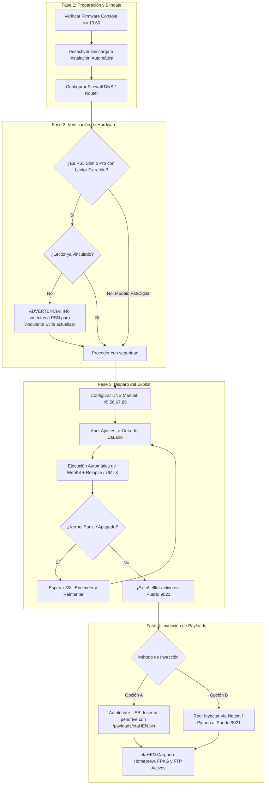
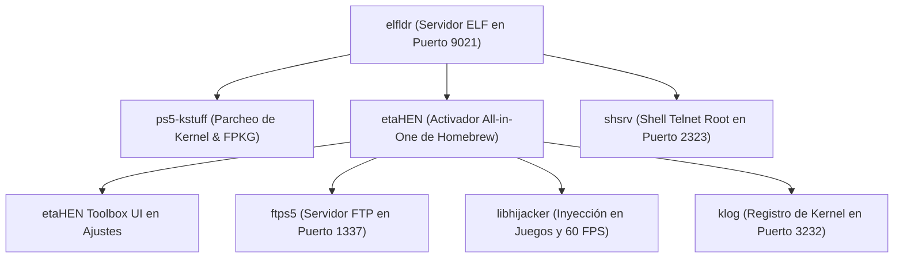

# 🎮 El Compendio Definitivo de Jailbreak y Exploits de PS5 🚀
### *by ALONSOJR1980*

<div align="center">

[](https://github.com/alonsojr1980/ps5-jailbreak-compendium)
[-blueviolet?style=for-the-badge&logo=codeforces&logoColor=white)](https://github.com/ntfargo/Relapse-Exploit)
[](https://github.com/alonsojr1980/ps5-jailbreak-compendium)
[](https://alonsojr1980.github.io/ps5-jailbreak-compendium/)
[](https://github.com/LightningMods/etaHEN)
[](../../LICENSE)

**Idiomas / Languages:**
[🇺🇸 English](../en/README.md) | [🇧🇷 Português](../pt/README.md) | 🇪🇸 **Español** | [🌐 Volver al Inicio](../../README.md)

</div>

> [!TIP]
> **¿Buscas guías específicas?**
> - 🚀 **[Cómo Hacer Jailbreak en PS5: Guía Práctica Paso a Paso](jailbreak_how_to.md)** — Un tutorial directo y paso a paso para realizar el jailbreak en cada versión de firmware.
> - 🔬 **[Jailbreak de PS5: Análisis Técnico Detallado](jailbreak_tech_info.md)** — Análisis arquitectónico en profundidad, mecanismos de exploits, ingeniería de payloads y sockets de red para desarrolladores.

Una enciclopedia exhaustiva, seleccionada y verificada por la comunidad que recopila enlaces de jailbreak de PlayStation 5, cadenas de exploits, payloads, aplicaciones homebrew, herramientas de desarrollo, documentación de ingeniería inversa e investigación en seguridad del sistema.

---

## 📑 Índice de Contenidos (Organizado por Relevancia)

1. [📊 1. Firmwares con Jailbreaks Disponibles](#-1-firmwares-con-jailbreaks-disponibles)
   - [Matriz Maestra de Compatibilidad de Firmwares](#matriz-maestra-de-compatibilidad-de-firmwares)
   - [División por Niveles (Tiers) y Recomendaciones](#división-por-niveles-tiers-y-recomendaciones)
   - [Análisis Detallado: El Exploit Relapse (7.00 – 13.60)](#análisis-detallado-el-exploit-relapse-700--1360)
   - [Compatibilidad por Modelo de Hardware](#compatibilidad-por-modelo-de-hardware)
2. [🚀 2. Cómo Hacer Jailbreak: Cadena de Procedimientos y Preparativos](#-2-cómo-hacer-jailbreak-cadena-de-procedimientos-y-preparativos)
   - [Diagrama de Flujo Completo del Pipeline de Ejecución](#diagrama-de-flujo-completo-del-pipeline-de-ejecución)
   - [Fase 1: Preparativos y Firewall Anti-Actualizaciones](#fase-1-preparativos-y-firewall-anti-actualizaciones)
   - [Fase 2: Advertencia Crítica para Lectores Extraíbles de PS5 Slim y Pro](#fase-2-advertencia-crítica-para-lectores-extraíbles-de-ps5-slim-y-pro)
   - [Fase 3: Configuración de Red y DNS](#fase-3-configuración-de-red-y-dns)
   - [Fase 4: Ejecución del Exploit](#fase-4-ejecución-del-exploit)
   - [Fase 5: Inyección de Payloads Post-Exploit](#fase-5-inyección-de-payloads-post-exploit)
3. [🧰 3. Exploits y Puntos de Entrada Seleccionados](#-3-exploits-y-puntos-de-entrada-seleccionados)
   - [Exploits Modernos (7.00 – 13.60)](#exploits-modernos-700--1360)
   - [Exploits Intermedios (5.00 – 5.50 / 6.xx)](#exploits-intermedios-500--550--6xx)
   - [Exploits Fundamentales (1.00 – 4.51)](#exploits-fundamentales-100--451)
   - [Explotación de Hypervisor (1.00 – 2.50)](#explotación-de-hypervisor-100--250)
4. [⚙️ 4. Payloads Esenciales y Frameworks del Sistema](#️-4-payloads-esenciales-y-frameworks-del-sistema)
   - [Arquitectura de Ejecución de Payloads](#arquitectura-de-ejecución-de-payloads)
   - [Detalle de Payloads Principales (etaHEN, ps5-kstuff, elfldr, etc.)](#detalle-de-payloads-principales)
   - [Directorio Maestro de Puertos de Red](#directorio-maestro-de-puertos-de-red)
5. [📦 5. Métodos de Inyección y Automatización de Payloads](#-5-métodos-de-inyección-y-automatización-de-payloads)
   - [Método 1: Carga Automática por USB](#método-1-carga-automática-por-usb)
   - [Método 2: Inyección por Red con Netcat / Terminal](#método-2-inyección-por-red-con-netcat--terminal)
   - [Método 3: Script Multiplataforma en Python](#método-3-script-multiplataforma-en-python)
6. [🕹️ 6. Aplicaciones Homebrew, Emuladores y Administradores de Juegos](#️-6-aplicaciones-homebrew-emuladores-y-administradores-de-juegos)
7. [🌐 7. Servidores de Exploit, DNS y Herramientas Offline](#-7-servidores-de-exploit-dns-y-herramientas-offline)
8. [🔧 8. Resolución de Problemas y Recuperación de Kernel Panics](#-8-resolución-de-problemas-y-recuperación-de-kernel-panics)
9. [📚 9. Términos Técnicos y Glosario de la Scene de PS5](#-9-términos-técnicos-y-glosario-de-la-scene-de-ps5)
10. [🏛️ 10. Contexto: Línea de Tiempo y Arquitectura de Seguridad](#️-10-contexto-línea-de-tiempo-y-arquitectura-de-seguridad)
11. [⚖️ 11. Descargo de Responsabilidad y Aviso de Curaduría por IA](#️-11-descargo-de-responsabilidad-y-aviso-de-curaduría-por-ia)

---

## 📊 1. Firmwares con Jailbreaks Disponibles

> [!IMPORTANT]
> **La Regla de Oro:** *Nunca actualices tu consola PlayStation 5.*
> Las versiones de firmware **13.60 e inferiores** son totalmente vulnerables. Las consolas en firmware **14.00 o superior** tienen la vulnerabilidad corregida y actualmente **no se pueden desbloquear**.

### Matriz Maestra de Compatibilidad de Firmwares

| Rango de Firmware | Punto de Entrada | Exploit de Kernel | Estado del Hypervisor (HV) | Soporte kstuff / FPKG | Soporte etaHEN | Veredicto y Estado en la Scene |
| :---: | :---: | :---: | :---: | :---: | :---: | :---: |
| **1.00 – 2.50** | WebKit / BD-JB | IPv6 UAF / UMTX | 🔓 **Byepervisor** (HV Derrotado) | ✅ Soporte Total | ✅ Soporte Total | 👑 **El Santo Grial** (Root de Hypervisor) |
| **3.00 – 4.51** | WebKit / BD-JB | IPv6 UAF / UMTX | 🔒 Hypervisor Activo | ✅ Soporte Total | ✅ Soporte Total | 💎 **Era Dorada** (Máxima Estabilidad) |
| **5.00 – 5.50** | WebKit / BD-JB | UMTX / UMTX2 | 🔒 Hypervisor Activo | ✅ Soporte Total | ✅ Soporte Total | 🚀 **Muy Estable** (Ecosistema Maduro) |
| **6.00 – 6.50** | WebKit / BD-JB | UMTX2 / Mast1c0re | 🔒 Hypervisor Activo | ⚠️ En Progreso | ⚠️ Port en Desarrollo | 🧪 **Desarrollo Activo** |
| **7.00 – 13.60** | **WebKit (JSC)** | **Relapse (aio_multi_wait)** | 🔒 Hypervisor Activo | ✅ **Soporte Total** | ✅ **Soporte Total** | 🔥 **Era Moderna** (Estándar Actual) |
| **14.00+** | ❌ Parcheado | ❌ Parcheado | 🔒 Hypervisor Activo | ❌ Ninguno | ❌ Ninguno | 🛑 **NO ACTUALIZAR / No Vulnerable** |

---

### División por Niveles (Tiers) y Recomendaciones

1. **Tier 1: Firmwares 1.00 – 2.50 (Hypervisor Derrotado)**
   - **Ventaja**: El único rango donde el Hypervisor (Ring -1) fue completamente comprometido con **Byepervisor**.
   - **Capacidad**: Lectura/escritura arbitraria en Hypervisor, desencriptación de RAM, manipulación de tablas de páginas y desactivación total de firmas de kernel.
   - **Recomendación**: *Nunca actualices bajo ningún concepto.*

2. **Tier 2: Firmwares 3.00 – 4.51 (Máxima Estabilidad)**
   - **Ventaja**: Utiliza el exploit de socket IPv6 UAF o UMTX con una tasa de éxito cercana al 100% y prácticamente cero Kernel Panics.
   - **Capacidad**: Soporte total para `ps5-kstuff`, `etaHEN`, `Itemzflow` y FPKG.
   - **Recomendación**: Ideal para uso diario con homebrew y copias de seguridad.

3. **Tier 3: Firmwares 5.00 – 5.50 (Era UMTX)**
   - **Ventaja**: Totalmente vulnerable mediante la condición de carrera UMTX (CVE-2024-43102). Altamente fiable y compatible con los payloads modernos.

4. **Tier 4: Firmwares 7.00 – 13.60 (Era Relapse)**
   - **Ventaja**: Desbloquea la inmensa mayoría de consolas modernas, incluyendo PS5 Slim (CFI-2000) y PS5 Pro (CFI-7000).
   - **Capacidad**: Lectura/escritura completa en el kernel, `ps5-kstuff`, `etaHEN` y homebrew mediante el exploit `aio_multi_wait`.
   - **Recomendación**: El estándar moderno. ¡No actualices más allá de 13.60!

5. **Tier 5: Firmwares 14.00+ (Parcheados)**
   - **Estado**: Las vulnerabilidades de WebKit y del kernel `aio_multi_wait` fueron completamente parcheadas por Sony. Mantén la consola estrictamente offline y espera nuevos descubrimientos.

---

### Análisis Detallado: El Exploit Relapse (7.00 – 13.60)

Publicado a finales de septiembre de 2026 por el desarrollador principal **ntfargo** junto con los investigadores **Sonic_Iso**, **Jordy** y **ufm42**, el **Exploit Relapse** constituye el estándar contemporáneo de jailbreak en PS5.

#### Cadena de Explotación Técnica:
1. **Etapa 1 (Escape de Sandbox WebKit en Userland)**:
   - **Objetivo**: Motor JavaScriptCore (JSC) del navegador de la Guía del usuario.
   - **Mecanismo**: Aprovecha un fallo de divulgación de información combinado con un desajuste de pool de objetos en `StructuredSerialize`.
   - **Resultado**: Corrompe el puntero butterfly de un `ArrayBuffer` / `Uint32Array`, logrando lectura/escritura arbitraria estable en el sandbox de WebKit.
2. **Etapa 2 (Escalada de Privilegios al Kernel mediante `aio_multi_wait`)**:
   - **Objetivo**: Subsistema de E/S Asíncrona (`aio`) del kernel Prospero (FreeBSD).
   - **Mecanismo**: Desencadena una condición de carrera de alta frecuencia de tipo Use-After-Free (UAF) en `aio_multi_wait()`.
   - **Resultado**: Reclama la memoria liberada con datos forjados de estructuras `thread`, `proc` y `cred`. Neutraliza `kASLR`, eleva credenciales a `uid=0` (root/kernel) e inicia `elfldr` en el **Puerto TCP 9021**.

---

### Compatibilidad por Modelo de Hardware

| Serie del Modelo | Nombre Común | Rango de Firmware Compatible | Aviso sobre Lector de Discos |
| :--- | :--- | :--- | :--- |
| **CFI-1000 / 1100 / 1200** | PS5 "Fat" / Original | Todos los FW hasta 13.60 | Lector físico integrado Plug & Play (no requiere activación online) |
| **CFI-2000** | PS5 "Slim" | FW de fábrica hasta 13.60 | **Crucial:** Lector extraíble requiere un Handshake único con PSN antes de aislar la consola |
| **CFI-7000** | PS5 "Pro" | FW de fábrica hasta 13.60 | Totalmente compatible con Relapse; ¡comprueba el firmware de fábrica al adquirirla! |

---

## 🚀 2. Cómo Hacer Jailbreak: Cadena de Procedimientos y Preparativos

### Diagrama de Flujo Completo del Pipeline de Ejecución



---

### Fase 1: Preparativos y Firewall Anti-Actualizaciones
1. **En la Consola**:
   - Desactiva descargas e instalaciones automáticas en **Ajustes ➔ Sistema ➔ Software del sistema**.
   - En **Ahorro de energía**, desactiva la conexión a Internet en modo de reposo.
   - Desactiva actualizaciones automáticas en **Ajustes de juegos/aplicaciones**.
2. **En el Router o DNS**: Bloquea los dominios `*.update.playstation.net` y `telemetry*.playstation.com`.

---

### Fase 2: Advertencia Crítica para Lectores Extraíbles de PS5 Slim y Pro
El lector de discos extraíble de PS5 Slim y Pro exige un **Handshake** con Sony. Si tu consola está en un firmware vulnerable (<= 13.60) y no fue vinculada previamente, **no intentes vincularla ahora**, ya que Sony forzará la actualización irreversible al firmware más reciente. Los juegos digitales, homebrew, emuladores y el SSD M.2 funcionan al 100% sin el lector emparejado.

---

### Fase 3: Configuración de Red y DNS
Configura tu conexión de red con los DNS comunitarios que redirigen la Guía del usuario a los hosts de exploit y bloquean las actualizaciones:
- **DNS Primario**: `45.56.67.85`
- **DNS Secundario**: `0.0.0.0` (o `62.210.38.117`)

---

### Fase 4: Ejecución del Exploit
Abre **Ajustes ➔ Sistema ➔ Guía del usuario**. El exploit WebKit se ejecutará en JavaScriptCore, seguido del exploit de kernel `aio_multi_wait` o `UMTX`. Cuando finalice con éxito, aparecerá la notificación de que `elfldr` está listo en el puerto 9021.

---

### Fase 5: Inyección de Payloads Post-Exploit
Inyecta **etaHEN** y **ps5-kstuff** mediante una memoria USB en formato exFAT con la carpeta `/payloads/` o enviándolos por red al puerto 9021 mediante Netcat o Python.

---

## 🧰 3. Exploits y Puntos de Entrada Seleccionados

### Exploits Modernos (7.00 – 13.60)
- **[Relapse Exploit (ntfargo)](https://github.com/ntfargo/Relapse-Exploit)**: Exploit moderno estándar para firmwares 7.00 a 13.60 basado en WebKit JSC UAF y `aio_multi_wait` en el kernel.

### Exploits Intermedios (5.00 – 5.50 / 6.xx)
- **[UMTX Kernel Exploit (Andy Nguyen / TheFlow)](https://github.com/theflow1/exploit-caph)**: Condición de carrera en `sys_umtx_op()` (CVE-2024-43102).

### Exploits Fundamentales (1.00 – 4.51)
- **[PS5 IPv6 Kernel Exploit (ChendoChap / SpecterDev)](https://github.com/Cryptogenic/PS5-IPV6-Kernel-Exploit)**: Use-After-Free de alta estabilidad en sockets IPv6 (`CVE-2020-7457`).
- **[BD-JB Blu-ray Java Exploit (TheFlow)](https://github.com/theflow1/bd-jb)**: Escape de sandbox de la JVM mediante discos Blu-ray de vídeo grabados.

### Explotación de Hypervisor (1.00 – 2.50)
- **[Byepervisor (SpecterDev, ChendoChap, EchoStretch, John Törnblom)](https://github.com/PS5Dev/Byepervisor)**: Compromiso absoluto de Ring -1 (Hypervisor) en firmwares 1.00 a 2.50.

---

## ⚙️ 4. Payloads Esenciales y Frameworks del Sistema

### Arquitectura de Ejecución de Payloads



### Detalle de Payloads Principales
- **[etaHEN (LightningMods)](https://github.com/LightningMods/etaHEN)**: El entorno integral de homebrew para PS5. Añade menús de ajustes nativos, activa FTP, soporte para plugins de trucos y previene cuelgues al suspender el sistema.
- **[ps5-kstuff (sleirsgoevy / flatz / John Törnblom)](https://github.com/sleirsgoevy/ps5-kstuff)**: Parchea `sys_execve` para permitir la ejecución de binarios FSELF, montaje de paquetes FPKG y bypass de Keystone DRM para savegames.
- **[elfldr (John Törnblom)](https://github.com/ps5-payload-dev/elfldr)**: Daemon de reubicación en memoria ejecutándose en el puerto 9021 que recibe y lanza binarios ELF sin reiniciar la máquina.
- **[libhijacker (astrelsky)](https://github.com/astrelsky/libhijacker)**: Motor de inyección dinámica para modificar ejecutables de juegos en ejecución y habilitar parches de 60 FPS en títulos como *Bloodborne* o *Red Dead Redemption 2*.

---

### Directorio Maestro de Puertos de Red

| Puerto | Protocolo | Servicio / Daemon | Descripción | Comando de Conexión |
| :---: | :---: | :---: | :---: | :---: |
| **9021** | TCP | `elfldr` | Receptor Primario de Payloads ELF | `nc -w 3 <IP_PS5> 9021 < payload.bin` |
| **9027** | TCP | `kstuff-loader` | Socket Dedicado para Inyección de kstuff | `nc -w 3 <IP_PS5> 9027 < kstuff.bin` |
| **1337** | TCP | `ftps5` / `etaHEN FTP` | Servidor FTP Root de Alta Velocidad | Conectar vía FileZilla / WinSCP en puerto 1337 |
| **2323** | TCP | `shsrv` | Shell Telnet con Acceso Root | `telnet <IP_PS5> 2323` |
| **3232** | UDP/TCP | `klog` | Flujo de Registros en Vivo del Kernel | `nc -u -l 3232` |
| **8080** | TCP | `websrv` | Interfaz Web de Gestión Local | Abrir `http://<IP_PS5>:8080` en navegador |
| **2159** | TCP | `gdbsrv` | Stub de Depurador Remoto GDB | `gdb-multiarch -ex "target remote <IP_PS5>:2159"` |

---

## 📦 5. Métodos de Inyección y Automatización de Payloads

### Método 1: Carga Automática por USB
Crea una carpeta `payloads` en una memoria USB formateada en exFAT (esquema MBR) y coloca `etaHEN.bin` y `ps5-kstuff.bin`. Conéctala a un puerto USB 3.0 trasero; el exploit los cargará automáticamente.

### Método 2: Inyección por Red con Netcat / Terminal
```bash
# Inyección directa a través de la terminal
nc -w 3 192.168.1.150 9021 < etaHEN.bin
```

### Método 3: Script Multiplataforma en Python
```python
import socket

def send_payload(ip, file_path, port=9021):
    with open(file_path, "rb") as f:
        data = f.read()
    with socket.socket(socket.AF_INET, socket.SOCK_STREAM) as s:
        s.settimeout(5.0)
        s.connect((ip, port))
        s.sendall(data)
    print(f"[+] ¡Payload {file_path} inyectado con éxito en {ip}:{port}!")

send_payload("192.168.1.150", "etaHEN.bin")
```

---

## 🕹️ 6. Aplicaciones Homebrew, Emuladores y Administradores de Juegos

- **[Itemzflow Game Manager (LightningMods)](https://github.com/LightningMods/Itemzflow)**: Administrador avanzado de juegos con soporte para volcado de discos (Dumping), lanzamiento directo desde USB, carátulas personalizadas y gestión de parches.
- **[Apollo Save Tool PS5 (Bucanero)](https://github.com/bucanero/apollo-ps5)**: Administrador de partidas guardadas que permite exportar, importar, reasignar cuentas y aplicar trucos a savegames de PS4 y PS5 de manera offline.
- **[PS5SX2 / Emuladores](https://github.com/Florin9doi/PCSX2-PS5)**: Ports nativos de emulación para PS2, RetroArch y consolas clásicas optimizados para la arquitectura Zen 2 de PS5.
- **[Chiaki-ng](https://github.com/streetpea/chiaki-ng)**: Cliente no oficial de Remote Play para transmitir la pantalla de tu consola a PC, Steam Deck o dispositivos Android.

---

## 🌐 7. Servidores de Exploit, DNS y Herramientas Offline

### Servidores DNS Comunitarios
| Proveedor | DNS Primario | DNS Secundario | Características |
| :--- | :---: | :---: | :--- |
| **EchoStretch Host** | `62.210.38.117` | `0.0.0.0` | Alta disponibilidad, soporte para firmwares 3.xx–5.xx y Relapse |
| **Al-Azif Exploit Host** | `165.227.83.145` | `192.241.221.79` | El host histórico más popular con caché offline |
| **Kameleon Host** | `45.56.67.85` | `0.0.0.0` | Especializado en Relapse 7.00–13.60 |

---

## 🔧 8. Resolución de Problemas y Recuperación de Kernel Panics

| Síntoma | Causa Probable | Solución |
| :--- | :--- | :--- |
| **Pantalla negra y apagado súbito** | Kernel Panic por fallo en la carrera de memoria | Espera 30 segundos, pulsa el botón físico de encendido, permite que la consola verifique el almacenamiento y reintenta el exploit. |
| **"Memoria de sistema insuficiente"** | Saturación del heap de WebKit | Pulsa Aceptar, refresca la página web o borra las cookies del navegador. |
| **La Guía del usuario abre la web de Sony** | Fallo de DNS o router ignorando DNS manual | Verifica los Ajustes de Red; el DNS primario debe ser `45.56.67.85` y el secundario `0.0.0.0`. |
| **Error CE-xxxx al abrir juegos instalados** | Payload `ps5-kstuff` no cargado en memoria | Inyecta `ps5-kstuff` o `etaHEN` antes de abrir cualquier juego. |

---

## 📚 9. Términos Técnicos y Glosario de la Scene de PS5

En conformidad con las normas de seguridad de sistemas e ingeniería inversa, los siguientes términos de la industria **NUNCA se traducen**:

| Término Técnico | Contexto y Explicación en Español |
| :--- | :--- |
| **Handshake** | Procedimiento criptográfico automatizado de autenticación mutua entre el hardware de la consola y los servidores remotos de Sony (fundamental en lectores extraíbles de Slim/Pro). |
| **Jailbreak** | Proceso de escalada de privilegios que rompe las restricciones del fabricante para ejecutar código y aplicaciones no firmadas. |
| **Payload** | Fragmento de código binario ejecutable que se transmite e inyecta en la memoria del sistema tras la ejecución exitosa del exploit. |
| **Kernel Panic** | Estado de fallo crítico irrecuperable en el cual el kernel detiene toda ejecución de la CPU para evitar corrupción del hardware o del sistema de archivos. |
| **Heap Spray** | Técnica de explotación consistente en poblar masivamente zonas de la memoria dinámica para lograr una disposición predecible de objetos vulnerables. |
| **Use-After-Free (UAF)** | Vulnerabilidad originada cuando un puntero continúa accediendo a una dirección de memoria que ya ha sido liberada por el sistema. |
| **Sandbox** | Mecanismo de contención y aislamiento de procesos (ej. WebKit o Capsicum) que limita los recursos y privilegios accesibles por una aplicación. |
| **Rest Mode** | Modo de suspensión y bajo consumo oficial de PlayStation (también conocido en español como Modo de Reposo). |
| **Dump / Dumping** | Proceso técnico de extracción, lectura y descifrado de discos físicos, particiones o archivos binarios protegidos. |
| **Hook / Hooking** | Interceptación de llamadas al sistema o funciones en memoria para alterar su flujo de ejecución en tiempo real. |

---

## 🏛️ 10. Contexto: Línea de Tiempo y Arquitectura de Seguridad

PlayStation 5 cuenta con una arquitectura de defensa en profundidad donde el AMD Secure Processor (PSP) y el Hypervisor (Ring -1) supervisan al kernel Prospero (Ring 0) basado en FreeBSD 12. La investigación continua de la scene (TheFlow, SpecterDev, ChendoChap, ntfargo, John Törnblom, LightningMods) ha permitido vulnerar progresivamente cada una de las capas hasta alcanzar la ejecución de payloads y homebrew en firmwares hasta 13.60.

---

## ⚖️ 11. Descargo de Responsabilidad y Aviso de Curaduría por IA

<p align="center">
  <b>🤖 Compendio Generado y Curado mediante Inteligencia Artificial</b><br>
  <i>Esta guía de referencia es sintetizada con asistencia de IA a partir de investigaciones de seguridad pública y documentación de la comunidad con fines exclusivamente educativos y de preservación. Mantén tu consola desconectada y preserva tu firmware.</i>
</p>
