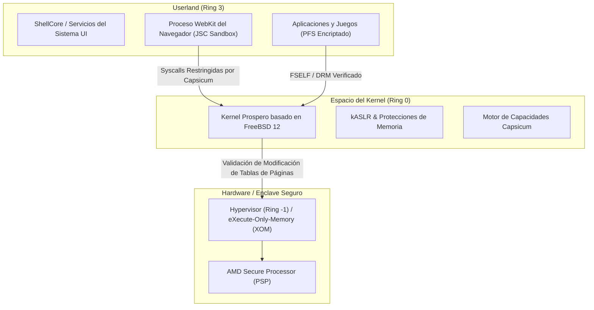
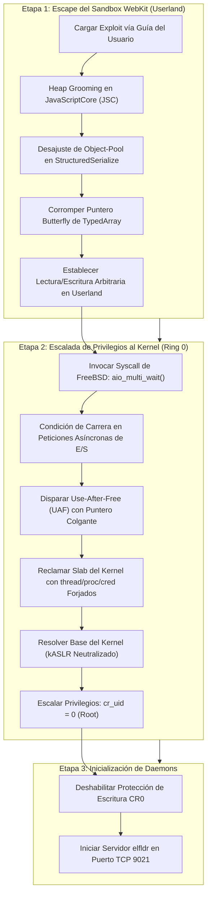
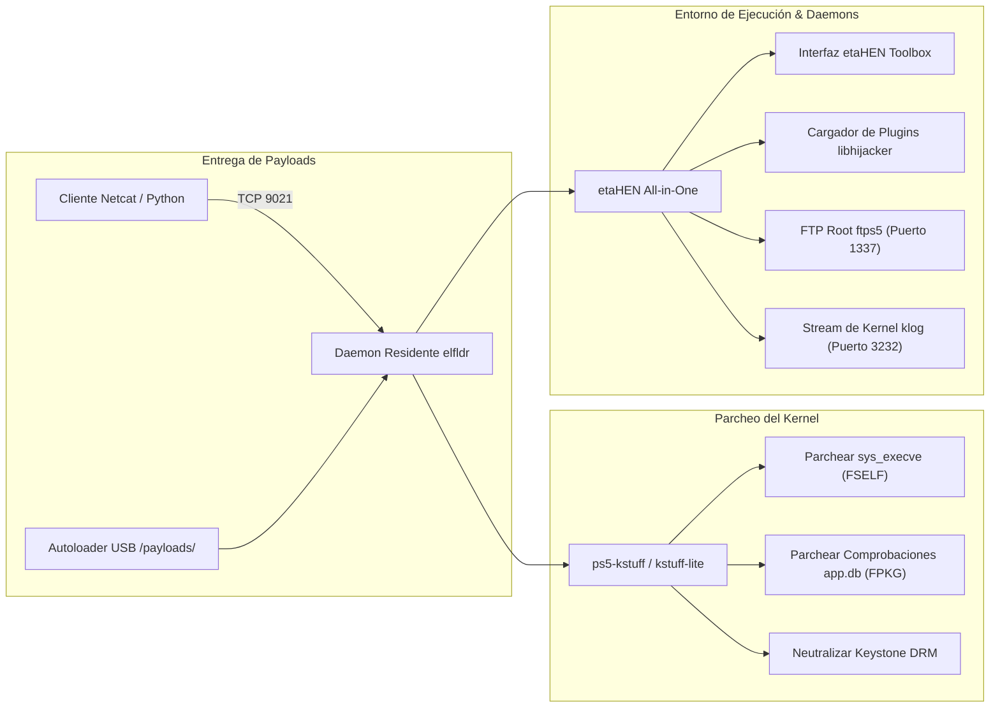
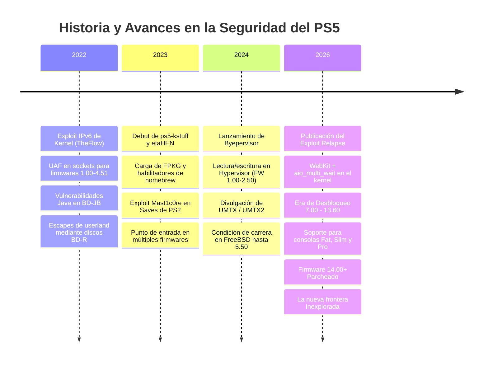

# 🔬 Jailbreak de PS5: Análisis Técnico Detallado y Arquitectura Interna
### *by ALONSOJR1980*

<div align="center">

[](https://github.com/alonsojr1980/ps5-jailbreak-compendium)
[-blueviolet?style=for-the-badge&logo=c&logoColor=white)](https://github.com/ntfargo/Relapse-Exploit)
[](https://alonsojr1980.github.io/ps5-jailbreak-compendium/)
[-orange?style=for-the-badge)](https://github.com/PS5Dev/Byepervisor)

**Navegación / Navigation:**
[🚀 Guía Práctica Paso a Paso (How-To)](jailbreak_how_to.md) | [🇺🇸 English Version](../en/jailbreak_tech_info.md) | [🇧🇷 Versão em Português](../pt/jailbreak_tech_info.md) | [🌐 Portal Principal](../../README.md)

</div>

Una referencia técnica exhaustiva que cubre la arquitectura de seguridad de PlayStation 5, mecanismos de explotación de bajo nivel (incluyendo Relapse y UMTX), primitivas de memoria de kernel, ingeniería de payloads, estructura de daemons y sockets de red.

---

## 📑 Índice de Contenidos

1. [🏛️ 1. Arquitectura de Seguridad de PS5 y Defensa en Profundidad](#️-1-arquitectura-de-seguridad-de-ps5-y-defensa-en-profundidad)
2. [🔥 2. Análisis Detallado: La Cadena del Exploit Relapse (7.00 – 13.60)](#-2-análisis-detallado-la-cadena-del-exploit-relapse-700--1360)
   - [Etapa 1: Corrupción de Memoria en JavaScriptCore (JSC) de WebKit](#etapa-1-corrupción-de-memoria-en-javascriptcore-jsc-de-webkit)
   - [Etapa 2: Escalada de Privilegios en el Kernel vía aio_multi_wait](#etapa-2-escalada-de-privilegios-en-el-kernel-vía-aio_multi_wait)
   - [Estabilización Post-Exploit y Primitiva de Lectura/Escritura en Kernel](#estabilización-post-exploit-y-primitiva-de-lecturaescritura-en-kernel)
3. [🧰 3. Análisis de Exploits Previos y Taxonomía de Vulnerabilidades](#-3-análisis-de-exploits-previos-y-taxonomía-de-vulnerabilidades)
   - [Condición de Carrera UMTX / UMTX2 (CVE-2024-43102)](#condición-de-carrera-umtx--umtx2-cve-2024-43102)
   - [Use-After-Free en Sockets IPv6 (CVE-2020-7457)](#use-after-free-en-sockets-ipv6-cve-2020-7457)
   - [Escapes del Sandbox de la Máquina Virtual Java en BD-JB](#escapes-del-sandbox-de-la-máquina-virtual-java-en-bd-jb)
   - [Byepervisor: Compromiso del Hypervisor en Bare-Metal](#byepervisor-compromiso-del-hypervisor-en-bare-metal)
4. [⚙️ 4. Ingeniería de Payloads y Frameworks del Sistema](#️-4-ingeniería-de-payloads-y-frameworks-del-sistema)
   - [Arquitectura y Ciclo de Vida de Ejecución de Payloads](#arquitectura-y-ciclo-de-vida-de-ejecución-de-payloads)
   - [etaHEN: Arquitectura y Estructura de Configuración](#etahen-arquitectura-y-estructura-de-configuración)
   - [ps5-kstuff: Mecanismos de Parcheo en el Kernel](#ps5-kstuff-mecanismos-de-parcheo-en-el-kernel)
   - [elfldr: Daemon Residente de Reubicación en Memoria](#elfldr-daemon-residente-de-reubicación-en-memoria)
   - [libhijacker: Hooking Dinámico de Procesos y Motor de 60 FPS](#libhijacker-hooking-dinámico-de-procesos-y-motor-de-60-fps)
   - [Daemons de Administración Remota: shsrv, ftps5, websrv, gdbsrv](#daemons-de-administración-remota-shsrv-ftps5-websrv-gdbsrv)
5. [🌐 5. Directorio Maestro de Puertos de Red](#-5-directorio-maestro-de-puertos-de-red)
6. [📦 6. Automatización de Payloads y Scripts de Sockets Personalizados](#-6-automatización-de-payloads-y-scripts-de-sockets-personalizados)
7. [📚 7. Política de Términos Técnicos y Estándares Intraducibles](#-7-política-de-términos-técnicos-y-estándares-intraducibles)
8. [⏳ 8. Línea de Tiempo de Exploits y la Frontera del Firmware 14.00+](#-8-línea-de-tiempo-de-exploits-y-la-frontera-del-firmware-1400)

---

## 🏛️ 1. Arquitectura de Seguridad de PS5 y Defensa en Profundidad

PlayStation 5 ("Prospero") implementa un modelo de seguridad por capas diseñado para aislar procesos, aplicar permisos de memoria inmutables y bloquear la ejecución de código no autorizado en el kernel:



### Capas Principales de Seguridad:
1. **Aislamiento en Userland (FreeBSD Capsicum)**:
   - Procesos como WebKit operan con descriptores de archivo restringidos y llamadas al sistema reducidas. La navegación arbitraria por el sistema de ficheros y el acceso a la red están bloqueados a nivel de kernel.
2. **Aleatorización del Espacio de Memoria del Kernel (kASLR)**:
   - Los segmentos de código y datos del kernel se redistribuyen aleatoriamente en cada inicio, requiriendo un **Information Leak (Infoleak)** previo para calcular las direcciones de funciones antes de la explotación.
3. **El Hypervisor (Ring -1)**:
   - Opera jerárquicamente por encima del kernel FreeBSD. Gestiona **eXecute-Only-Memory (XOM)** y Protección Inversa del Kernel (RKP). Aunque se logre escritura arbitraria en el kernel (`cr_uid=0`), el Hypervisor impide modificar directamente las tablas de páginas para ejecutar código en Ring 0 (con excepción de los firmwares 1.00–2.50 mediante Byepervisor).
4. **Firma Criptográfica FSELF y PKG**:
   - Cada binario ejecutable (`eboot.bin`, módulos) y contenedor (`.pkg`) está cifrado y firmado con claves ECDSA privadas de Sony. Los cargadores del kernel verifican estas firmas antes de permitir la ejecución.

---

## 🔥 2. Análisis Detallado: La Cadena del Exploit Relapse (7.00 – 13.60)

Publicado a finales de septiembre de 2026 por **ntfargo**, **Sonic_Iso**, **Jordy** y **ufm42**, el **Exploit Relapse** encadena un escape de sandbox de WebKit con una condición de carrera de E/S asíncrona en el kernel:



### Etapa 1: Corrupción de Memoria en JavaScriptCore (JSC) de WebKit
- **Vulnerabilidad**: Desajuste en la gestión de pools de objetos dentro de las rutinas de serialización de `StructuredSerialize` de WebKit.
- **Mecanismo**: Al serializar concurrentemente estructuras complejas de JavaScript que contienen referencias cruzadas a `ArrayBuffer` y transferibles, el recolector de basura interpreta erróneamente los contadores de referencias, permitiendo una corrupción de índice fuera de límites (out-of-bounds).
- **Primitiva**: El exploit genera dos objetos `Uint32Array` superpuestos. Modificando el puntero de datos y longitud del segundo arreglo a través del primero, construye una primitiva de **Lectura/Escritura Arbitraria en Userland**, neutralizando el ASLR del espacio de usuario.

### Etapa 2: Escalada de Privilegios en el Kernel vía `aio_multi_wait`
- **Vulnerabilidad**: Condición de carrera en la lógica de finalización de E/S asíncrona dentro del kernel FreeBSD (`sys/kern/vfs_aio.c`).
- **Mecanismo**: El exploit despacha lotes masivos de operaciones asíncronas no bloqueantes e invoca `aio_multi_wait()` a través de múltiples hilos POSIX. Bajo sincronización de alta frecuencia, una estructura de seguimiento interno se libera mientras otro hilo activo aún conserva un puntero: **Use-After-Free (UAF)**.
- **Reclamación de Memoria del Kernel**: El exploit realiza un spray controlado de memoria en las slabs del kernel con credenciales de procesos falsas (`ucred`), alineando las reservas para que el puntero colgante apunte a buffers controlados desde el espacio de usuario.
- **Escalada de Credenciales**:
  ```c
  // Escalada conceptual de privilegios en el espacio del kernel:
  curthread->td_ucred->cr_uid = 0;      // Asignar UID efectivo a root
  curthread->td_ucred->cr_ruid = 0;     // Asignar UID real a root
  curthread->td_ucred->cr_prison = NULL; // Escapar de la jaula / Capsicum de FreeBSD
  ```
- **Activación del Puerto 9021**: Con privilegios root consolidados, el exploit ejecuta en memoria el receptor de payloads `elfldr`, escuchando peticiones en el puerto TCP `9021`.

---

## 🧰 3. Análisis de Exploits Previos y Taxonomía de Vulnerabilidades

### Condición de Carrera UMTX / UMTX2 (CVE-2024-43102)
- **Firmwares Compatibles**: 1.00 – 5.50.
- **Subsistema**: Subsistema de Mutex de Usuario de FreeBSD (`kern_umtx.c`).
- **Descubrimiento**: Andy Nguyen (TheFlow).
- **Técnica**: Explota una condición de carrera en `sys_umtx_op()` al destruir mutexes compartidos entre hilos concurrentes. Se desreferencia un objeto `umtx_q` liberado, otorgando primitivas completas de lectura y escritura en el kernel.

### Use-After-Free en Sockets IPv6 (CVE-2020-7457)
- **Firmwares Compatibles**: 1.00 – 4.51.
- **Subsistema**: Pila de red IPv6 de FreeBSD (`sys/netinet6/in6_pcb.c`).
- **Técnica**: Múltiples hilos compiten al consultar y cerrar opciones de sockets IPv6 (`IPV6_2292PKTOPTIONS`). La condición de carrera genera un puntero colgante a un buffer `ip6_pktopts` previamente liberado, logrando una tasa de éxito casi absoluta sin inestabilidades.

### Escapes del Sandbox de la Máquina Virtual Java en BD-JB
- **Firmwares Compatibles**: 1.00 – 7.61.
- **Subsistema**: Especificación Blu-ray Disc Java (BD-J) y pila GEM.
- **Descubrimiento**: Andy Nguyen (TheFlow).
- **Técnica**: Los discos Blu-ray físicos omiten por completo el navegador WebKit. Archivos `.jar` especialmente diseñados explotan confusiones de tipos en la JVM y clases de reflexión inseguras para escapar del sandbox Java hacia la ejecución nativa de C en userland.

### Byepervisor: Compromiso del Hypervisor en Bare-Metal
- **Firmwares Compatibles**: 1.00 – 2.50.
- **Autores**: PS5Dev team, SpecterDev, ChendoChap, EchoStretch, John Törnblom.
- **Técnica**: Explota las rutinas de transición al modo de reposo del AMD Secure Processor y el Secure Loader. Al corromper estructuras de memoria durante la suspensión a RAM, el exploit toma el control de Ring -1 (Hypervisor), permitiendo la manipulación directa de tablas de páginas y la desencriptación completa de la memoria del sistema.

---

## ⚙️ 4. Ingeniería de Payloads y Frameworks del Sistema

### Arquitectura y Ciclo de Vida de Ejecución de Payloads



### etaHEN: Arquitectura y Estructura de Configuración
**etaHEN** (desarrollado por **LightningMods**) actúa como el entorno integral de extensiones del sistema:
- Inyecta un menú de ajustes nativo dentro de ShellCore mediante `libhijacker`.
- Administra hooks en memoria en tiempo real, motores de trucos y parches para juegos.
- Archivo de configuración por defecto en `/data/etaHEN/config.ini`:
  ```ini
  [General]
  log_level=1
  ftp_port=1337
  klog_port=3232
  auto_launch_itemzflow=0
  temperature_threshold=78
  rest_mode_fix=1

  [Plugins]
  enable_game_plugins=1
  allow_cheats=1
  ```

### ps5-kstuff: Mecanismos de Parcheo en el Kernel
**ps5-kstuff** (por **ChendoChap**, **EchoStretch**, **John Törnblom**, **flatz**) modifica el kernel dinámicamente en memoria:
1. **Neutralización de Firmas FSELF**: Parchea `sys_execve` para admitir binarios sin la firma ECDSA oficial de Sony.
2. **Montaje de FPKG**: Intercepta las rutinas de verificación de paquetes en `pkg_install` y `app.db`, posibilitando el montaje y ejecución de archivos `.pkg` descifrados.
3. **Bypass de Keystone DRM**: Omite la validación de hardware única del archivo keystone, permitiendo compartir y modificar partidas guardadas sin errores de incompatibilidad de cifrado.

### elfldr: Daemon Residente de Reubicación en Memoria
Creado por **John Törnblom** (`ps5-payload-dev`). Escucha continuamente en el **Puerto TCP 9021**. Analiza cabeceras ELF entrantes, asigna memoria ejecutable, resuelve reubicaciones de símbolos del kernel y lanza los payloads en hilos independientes sin necesidad de reiniciar la consola.

### libhijacker: Hooking Dinámico de Procesos y Motor de 60 FPS
Desarrollado por **astrelsky**. Utiliza primitivas de control de procesos de FreeBSD (`ptrace`, `/proc/<pid>/mem`) para inyectar hilos de código personalizado en ejecutables de juegos en ejecución (`eboot.bin`). Permite:
- Desbloquear la tasa de cuadros por segundo de 30 FPS a 60 FPS (Bloodborne, Red Dead Redemption 2, Driveclub).
- Activar modos de cámara libre y paneles HUD de depuración.
- Realizar hooks en la memoria del juego para entrenadores de trucos (trainers) en vivo.

### Daemons de Administración Remota: shsrv, ftps5, websrv, gdbsrv
- **`shsrv` (Puerto 2323)**: Proporciona una sesión de terminal POSIX con privilegios root accesible vía Telnet (`telnet <IP_PS5> 2323`).
- **`ftps5` (Puerto 1337)**: Servidor FTP multihilo con acceso a todos los puntos de montaje: `/system`, `/user/home`, `/app0`, `/data`, `/mnt/usb0`, `/mnt/ext0`.
- **`websrv` (Puerto 8080)**: Interfaz web integrada ligera para administración rápida.
- **`gdbsrv` (Puerto 2159)**: Stub de servidor GDB remoto para depuración de procesos con breakpoints en vivo mediante `gdb-multiarch`, IDA Pro o Ghidra.

---

## 🌐 5. Directorio Maestro de Puertos de Red

| Puerto | Protocolo | Daemon / Servicio | Descripción | Comando de Conexión de Ejemplo |
| :---: | :---: | :---: | :---: | :---: |
| **9021** | TCP | `elfldr` | Receptor Primario de Payloads ELF | `nc -w 3 <IP_PS5> 9021 < payload.bin` |
| **9027** | TCP | `kstuff-loader` | Socket Dedicado para Inyección de kstuff | `nc -w 3 <IP_PS5> 9027 < kstuff.bin` |
| **1337** | TCP | `ftps5` / `etaHEN FTP` | Servidor FTP Root de Alta Velocidad | Conectar vía FileZilla / WinSCP en puerto 1337 |
| **2323** | TCP | `shsrv` | Shell Telnet de UNIX con Privilegios Root | `telnet <IP_PS5> 2323` |
| **3232** | UDP/TCP | `klog` | Flujo de Registros en Vivo del Kernel | `nc -u -l 3232` (o cliente Socat) |
| **8080** | TCP | `websrv` | Interfaz Web de Administración Local | Abrir `http://<IP_PS5>:8080` en el navegador |
| **2159** | TCP | `gdbsrv` | Stub de Depuración Remota con GDB | `gdb-multiarch -ex "target remote <IP_PS5>:2159"` |

---

## 📦 6. Automatización de Payloads y Scripts de Sockets Personalizados

### Inyector Automático de Payloads en Python (`send_payload.py`)
```python
import sys
import socket

def send_payload(ps5_ip: str, payload_path: str, port: int = 9021):
    print(f"[*] Leyendo archivo de payload: {payload_path}")
    with open(payload_path, "rb") as f:
        data = f.read()
    
    print(f"[*] Conectando a PS5 en {ps5_ip}:{port}...")
    with socket.socket(socket.AF_INET, socket.SOCK_STREAM) as s:
        s.settimeout(5.0)
        s.connect((ps5_ip, port))
        s.sendall(data)
    print(f"[+] ¡Transmisión exitosa de {len(data)} bytes a {ps5_ip}:{port}!")

if __name__ == "__main__":
    if len(sys.argv) < 3:
        print("Uso: python send_payload.py <IP_PS5> <RUTA_PAYLOAD> [PUERTO]")
        sys.exit(1)
    port = int(sys.argv[3]) if len(sys.argv) > 3 else 9021
    send_payload(sys.argv[1], sys.argv[2], port)
```

Ejecutar mediante:
```bash
python send_payload.py 192.168.1.150 etaHEN.bin 9021
```

---

## 📚 7. Política de Términos Técnicos y Estándares Intraducibles

Los términos técnicos estandarizados de la industria en seguridad informática, ingeniería inversa y hacking de consolas **NUNCA deben traducirse** en la documentación internacional para mantener la precisión técnica y la compatibilidad con las herramientas de desarrollo:

| Término Técnico | Dominio | Definición y Contexto Técnico | Por qué NO Debe Traducirse |
| :--- | :--- | :--- | :--- |
| **Handshake** | Criptografía / Redes | Verificación mutua y automatizada entre el hardware/firmware de la consola y los servidores de Sony (ej. vinculación del lector extraíble de Slim/Pro). | Traducirlo como "apretón de manos" distorsiona el significado formal de un protocolo criptográfico. |
| **Jailbreak** | Explotación de Sistemas | Proceso de escalada de privilegios para obtener acceso root/kernel con el fin de ejecutar código sin firmar. | Término universalmente consagrado en las comunidades de iOS, PS4 y PS5. |
| **Exploit / Exploit Chain** | Investigación en Seguridad | Técnica de software que aprovecha una vulnerabilidad (ej. WebKit + `aio_multi_wait`) para alterar el flujo de ejecución. | Clasificación estándar en la taxonomía de vulnerabilidades. |
| **Payload** | Ejecución Binaria | Código ejecutable entregado y ejecutado tras la explotación (`etaHEN`, `kstuff`, `elfldr`). | Traducirlo como "carga útil" genera confusión con cargas físicas o de transporte de red. |
| **Payload Injection** | Entrega de Ejecución | Transmisión de binarios ejecutables directamente a la memoria mediante sockets TCP (Puerto 9021) o cargadores USB. | Terminología técnica estándar de bajo nivel. |
| **Kernel Panic (KP)** | Sistemas Operativos | Fallo crítico irrecuperable detenido por el kernel FreeBSD ante corrupciones de memoria o estados inválidos. | Clasificación POSIX/UNIX global para bloqueos del sistema. |
| **Use-After-Free (UAF)** | Corrupción de Memoria | Vulnerabilidad donde un puntero accede a una dirección tras ser liberada, generando condiciones de carrera. | Categoría formal de vulnerabilidad en Common Weakness Enumeration (CWE-416). |
| **Heap Spray / Grooming** | Explotación de Memoria | Asignación masiva y estructurada de objetos para hacer que la disposición de la memoria sea determinista y predecible. | Concepto técnico invariable de explotación de memoria. |
| **Race Condition** | Concurrencia | Fallo temporal donde dos o más hilos compiten por el acceso asíncrono a recursos compartidos del kernel. | Categoría estándar de defecto de concurrencia. |
| **Information Leak (Infoleak)** | Seguridad de Memoria | Vulnerabilidad que expone direcciones de memoria del sistema, permitiendo calcular la base y eludir kASLR. | Primitiva técnica de explotación. |
| **Sandbox / Sandbox Escape** | Límites de Seguridad | Entorno aislado de ejecución (Capsicum/WebKit) y las técnicas utilizadas para romper sus restricciones. | Término universal para fronteras de seguridad de procesos. |
| **Userland** | Anillos de Ejecución | Espacio de privilegios de usuario (Ring 3) donde operan la interfaz, los juegos y el navegador WebKit. | Término arquitectónico fundamental de sistemas operativos. |
| **Kernel** | Sistemas Operativos | Núcleo del sistema operativo en Ring 0 con control absoluto sobre hardware, syscalls y memoria virtual. | Nomenclatura universal de sistemas operativos. |
| **Hypervisor (HV)** | Virtualización | Capa de seguridad en Ring -1 situada por encima del kernel, encargada de eXecute-Only-Memory (XOM) y firmas. | Concepto arquitectónico universal de hardware y virtualización. |
| **kASLR** | Mitigación de Seguridad | Aleatorización del espacio de direcciones del kernel aplicada dinámicamente en cada inicio del sistema. | Acrónimo formal estándar de la industria. |
| **FSELF** | Formato de Binario | Fake Signed ELF; archivos ejecutables desprovistos de las firmas criptográficas oficiales ECDSA de Sony. | Nomenclatura propietaria de la scene de PlayStation. |
| **FPKG** | Formato de Paquete | Fake Package; contenedor de juegos/aplicaciones descifrado y firmado con claves ficticias para homebrew. | Estándar de paquetes de la scene de PS4 y PS5. |
| **Rest Mode** | Estado de Energía | Modo de reposo / suspensión oficial del sistema operativo de PlayStation. | Nomenclatura oficial del fabricante y del sistema. |
| **Dump / Dumping** | Extracción de Archivos | Proceso de volcado, extracción y descifrado de juegos en disco, digitales o particiones de almacenamiento. | Término unánime en la scene para la extracción de datos. |
| **Hook / Hooking** | Inyección Dinámica | Interceptación de llamadas a funciones o syscalls en tiempo de ejecución para modificar su comportamiento. | Concepto universal de ingeniería inversa y desarrollo de software. |
| **Keystone / Keystone DRM** | DRM de PlayStation | Archivo criptográfico que asocia las partidas guardadas al ID único de la consola y la cuenta de usuario. | Mecanismo propietario de Sony para cifrado de saves. |
| **Autoloader** | Automatización | Script o rutina que detecta, carga e inyecta payloads automáticamente sin intervención manual. | Designación consagrada de utilidades de automatización. |

---

## ⏳ 8. Línea de Tiempo de Exploits y la Frontera del Firmware 14.00+



En el firmware 14.00, Sony corrigió la condición de carrera en `aio_multi_wait` rediseñando la sincronización de peticiones asíncronas y añadiendo validaciones estrictas de integridad en el asignador de memoria del kernel. Las consolas en versiones 14.00 o superiores deben permanecer desconectadas a la espera de nuevos descubrimientos de seguridad.

---

<p align="center">
  <b>¿Buscas el tutorial paso a paso para realizar el jailbreak?</b><br>
  👉 Consulta la guía práctica: <b><a href="jailbreak_how_to.md">Cómo Hacer Jailbreak en PS5: Guía Práctica Paso a Paso</a></b>
</p>
