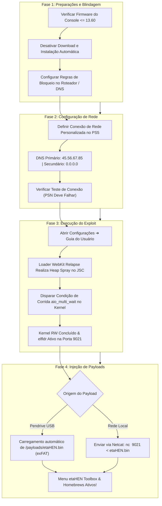
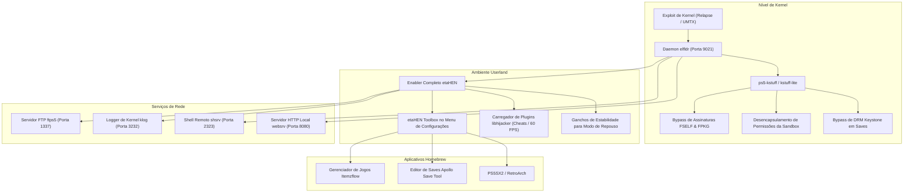
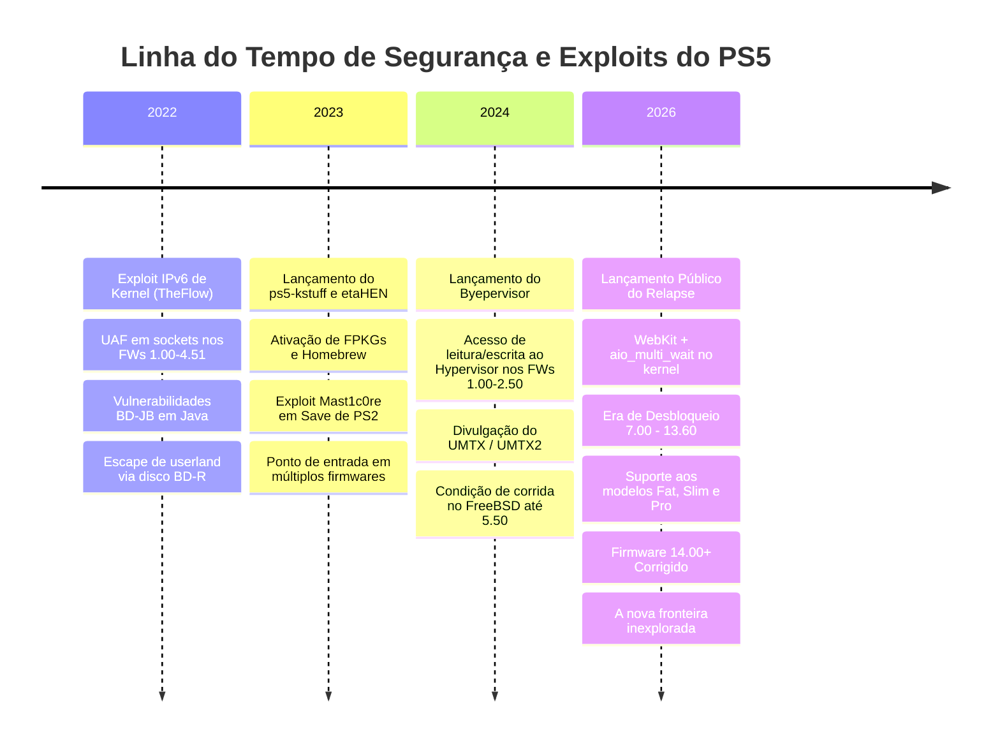

# 🎮 O Compêndio Definitivo de Jailbreak e Exploits do PS5 🚀

<div align="center">

[](https://github.com/alonsojr1980/ps5-jailbreak-compendium)
[-blueviolet?style=for-the-badge&logo=codeforces&logoColor=white)](https://github.com/ntfargo/Relapse-Exploit)
[](https://github.com/alonsojr1980/ps5-jailbreak-compendium)
[](https://github.com/LightningMods/etaHEN)
[](../../LICENSE)

**Idiomas / Languages:**
[🇺🇸 English](../en/README.md) | 🇧🇷 **Português** | [🌐 Voltar ao Início](../../README.md)

</div>

Uma enciclopédia exaustiva, selecionada e verificada pela comunidade contendo links de jailbreak do PlayStation 5, cadeias de exploits, payloads, aplicativos homebrew, ferramentas de desenvolvimento, documentação de engenharia reversa e pesquisa em segurança de sistemas.

---

## 📑 Índice (Organizado por Relevância)

1. [📊 1. Firmwares com Jailbreaks Disponíveis](#-1-firmwares-com-jailbreaks-dispon%C3%ADveis)
   - [Matriz Mestre de Compatibilidade de Firmwares](#matriz-mestre-de-compatibilidade-de-firmwares)
   - [Divisão em Tiers e Recomendações da Cena](#divis%C3%A3o-em-tiers-e-recomenda%C3%A7%C3%B5es-da-cena)
   - [Análise Detalhada: O Exploit Relapse (7.00 – 13.60)](#an%C3%A1lise-detalhada-o-exploit-relapse-700--1360)
   - [Compatibilidade por Modelo de Hardware](#compatibilidade-por-modelo-de-hardware)
2. [🚀 2. Como Fazer Jailbreak: Sequência de Procedimentos e Preparações](#-2-como-fazer-jailbreak-sequ%C3%AAncia-de-procedimentos-e-prepara%C3%A7%C3%B5es)
   - [Fluxograma Completo do Pipeline de Execução](#fluxograma-completo-do-pipeline-de-execu%C3%A7%C3%A3o)
   - [Fase 1: Preparações e Firewall Anti-Atualização](#fase-1-prepara%C3%A7%C3%B5es-e-firewall-anti-atualiza%C3%A7%C3%A3o)
   - [Fase 2: Aviso Crítico sobre o Leitor Removível Slim & Pro](#fase-2-aviso-cr%C3%ADtico-sobre-o-leitor-remov%C3%ADvel-slim--pro)
   - [Fase 3: Configuração de Rede e DNS](#fase-3-configura%C3%A7%C3%A3o-de-rede-e-dns)
   - [Fase 4: Disparo do Exploit](#fase-4-disparo-do-exploit)
   - [Fase 5: Injeção Pós-Exploit de Payloads](#fase-5-inje%C3%A7%C3%A3o-p%C3%B3s-exploit-de-payloads)
3. [🧰 3. Exploits e Pontos de Entrada Selecionados](#-3-exploits-e-pontos-de-entrada-selecionados)
   - [Exploits Modernos (7.00 – 13.60)](#exploits-modernos-700--1360)
   - [Exploits Mid-Range (5.00 – 5.50 / 6.xx)](#exploits-mid-range-500--550--6xx)
   - [Exploits Fundamentais (1.00 – 4.51)](#exploits-fundamentais-100--451)
   - [Exploração de Hypervisor (1.00 – 2.50)](#explora%C3%A7%C3%A3o-de-hypervisor-100--250)
4. [⚙️ 4. Payloads Essenciais e Frameworks do Sistema](#️-4-payloads-essenciais-e-frameworks-do-sistema)
   - [Arquitetura de Execução de Payloads](#arquitetura-de-execu%C3%A7%C3%A3o-de-payloads)
   - [Detalhamento dos Principais Payloads (etaHEN, ps5-kstuff, elfldr, etc.)](#detalhamento-dos-principais-payloads)
   - [Diretório Mestre de Portas de Rede](#diret%C3%B3rio-mestre-de-portas-de-rede)
5. [📦 5. Métodos de Injeção e Automação de Payloads](#-5-m%C3%A9todos-de-inje%C3%A7%C3%A3o-e-automa%C3%A7%C3%A3o-de-payloads)
   - [Método 1: Carregamento Automático via USB](#m%C3%A9todo-1-carregamento-autom%C3%A1tico-via-usb)
   - [Método 2: Injeção via Rede com Netcat / Terminal](#m%C3%A9todo-2-inje%C3%A7%C3%A3o-via-rede-com-netcat--terminal)
   - [Método 3: Script Multiplataforma em Python](#m%C3%A9todo-3-script-multiplataforma-em-python)
6. [🕹️ 6. Aplicativos Homebrew, Emuladores e Gerenciadores de Jogos](#️-6-aplicativos-homebrew-emuladores-e-gerenciadores-de-jogos)
7. [🌐 7. Servidores de Exploit, DNS e Ferramentas Offline](#-7-servidores-de-exploit-dns-e-ferramentas-offline)
8. [🔧 8. Resolução de Problemas e Recuperação de Kernel Panics](#-8-resolu%C3%A7%C3%A3o-de-problemas-e-recupera%C3%A7%C3%A3o-de-kernel-panics)
9. [📚 9. Glossário de Termos da Cena PS5](#-9-gloss%C3%A1rio-de-termos-da-cena-ps5)
10. [🏛️ 10. Contexto: Linha do Tempo e Arquitetura de Segurança](#️-10-contexto-linha-do-tempo-e-arquitetura-de-seguran%C3%A7a)
11. [⚖️ 11. Isenção de Responsabilidade e Nota sobre Curadoria por IA](#️-11-isen%C3%A7%C3%A3o-de-responsabilidade-e-nota-sobre-curadoria-por-ia)

---

## 📊 1. Firmwares com Jailbreaks Disponíveis

> [!IMPORTANT]
> **A Regra de Ouro:** *Nunca atualize o seu console PlayStation 5.*
> As versões de firmware **13.60 e inferiores** são totalmente exploráveis. Consoles executando firmware **14.00 ou superior** tiveram a vulnerabilidade de kernel corrigida e atualmente **não podem ser desbloqueados**.

### Matriz Mestre de Compatibilidade de Firmwares

| Faixa de Firmware | Ponto de Entrada | Exploit de Kernel | Status do Hypervisor (HV) | Suporte kstuff / FPKG | Suporte etaHEN | Veredito & Status da Cena |
| :---: | :---: | :---: | :---: | :---: | :---: | :---: |
| **1.00 – 2.50** | WebKit / BD-JB | IPv6 UAF / UMTX | 🔓 **Byepervisor** (HV Derrotado) | ✅ Suporte Total | ✅ Suporte Total | 👑 **O Santo Graal** (Acesso Root ao Hypervisor) |
| **3.00 – 4.51** | WebKit / BD-JB | IPv6 UAF / UMTX | 🔒 Hypervisor Ativo | ✅ Suporte Total | ✅ Suporte Total | 💎 **Era de Ouro** (Máxima Estabilidade) |
| **5.00 – 5.50** | WebKit / BD-JB | UMTX / UMTX2 | 🔒 Hypervisor Ativo | ✅ Suporte Total | ✅ Suporte Total | 🚀 **Altamente Estável** (Ecossistema Maduro) |
| **6.00 – 6.50** | WebKit / BD-JB | UMTX2 / Mast1c0re | 🔒 Hypervisor Ativo | ⚠️ Em Progresso | ⚠️ Port em Andamento | 🧪 **Desenvolvimento Ativo** |
| **7.00 – 13.60** | **WebKit (JSC)** | **Relapse (aio_multi_wait)** | 🔒 Hypervisor Ativo | ✅ **Suporte Total** | ✅ **Suporte Total** | 🔥 **Era Moderna** (Padrão Atual) |
| **14.00+** | ❌ Corrigido | ❌ Corrigido | 🔒 Hypervisor Ativo | ❌ Nenhum | ❌ Nenhum | 🛑 **NÃO ATUALIZE / Não Explorável** |

---

### Divisão em Tiers e Recomendações da Cena

1. **Tier 1: Firmwares 1.00 – 2.50 (Hypervisor Derrotado)**
   - **Vantagem**: O único intervalo de firmware onde o Hypervisor do PS5 (Ring -1) foi totalmente comprometido através do **Byepervisor**.
   - **Capacidade**: Leitura/escrita arbitrária no Hypervisor, decodificação de memória, manipulação de tabelas de páginas e assinatura de código do kernel completamente desativada.
   - **Recomendação**: *Nunca atualize sob hipótese alguma.*

2. **Tier 2: Firmwares 3.00 – 4.51 (Estabilidade Máxima)**
   - **Vantagem**: Utiliza o exploit maduro IPv6 socket UAF ou UMTX com quase 100% de taxa de sucesso e praticamente zero travamentos (kernel panics).
   - **Capacidade**: Suporte completo ao `ps5-kstuff`, `etaHEN`, `Itemzflow` e pacotes FPKG.
   - **Recomendação**: Perfeito para uso diário em homebrews e backups.

3. **Tier 3: Firmwares 5.00 – 5.50 (Era UMTX)**
   - **Vantagem**: Totalmente explorável via condição de corrida UMTX (CVE-2024-43102). Altamente confiável e compatível com payloads modernos.

4. **Tier 4: Firmwares 7.00 – 13.60 (Era Relapse)**
   - **Vantagem**: Desbloqueia a grande maioria dos consoles modernos, incluindo o PS5 Slim (CFI-2000) e o PS5 Pro (CFI-7000).
   - **Capacidade**: Leitura/escrita completa de kernel, `ps5-kstuff`, `etaHEN` e suporte a homebrew através do exploit `aio_multi_wait`.
   - **Recomendação**: O padrão da cena atual. Não atualize além da versão 13.60!

5. **Tier 5: Firmwares 14.00+ (Corrigido)**
   - **Status**: A vulnerabilidade de corrida em `aio_multi_wait` e as falhas de WebKit foram corrigidas pela Sony. Mantenha o console totalmente offline e aguarde novas pesquisas.

---

### Análise Detalhada: O Exploit Relapse (7.00 – 13.60)

Lançado no final de setembro de 2026 pelo desenvolvedor **ntfargo** (Nathan Fargo) com os pesquisadores **Sonic_Iso**, **Jordy** e **ufm42**, o exploit **Relapse** representa o marco moderno do jailbreak no PS5.

#### Cadeia Técnica de Exploração:
1. **Fase 1 (Escape da Sandbox do WebKit em Userland)**:
   - **Alvo**: Motor JavaScriptCore (JSC) do navegador interno do Guia do Usuário.
   - **Mecanismo**: Explora um vazamento de memória (infoleak) combinado com um descasamento no pool de objetos durante clonagem estruturada (`StructuredSerialize`).
   - **Resultado**: Corrompe o ponteiro butterfly de um `ArrayBuffer` / `Uint32Array`, garantindo leitura e escrita arbitrária e estável no espaço de memória da sandbox do WebKit.
2. **Fase 2 (Escalação de Privilégios no Kernel via `aio_multi_wait`)**:
   - **Alvo**: Subsistema de E/S assíncrona do kernel Prospero (`aio`), herdado do FreeBSD.
   - **Mecanismo**: Dispara uma condição de corrida de alta frequência do tipo Use-After-Free (UAF) na chamada de sistema `aio_multi_wait()`.
   - **Resultado**: Preenche a memória liberada do kernel com dados controlados para forjar estruturas internas (`thread`, `proc` e `cred`). Contorna o `kASLR`, eleva credenciais para `uid=0` (root/kernel) e inicia o daemon `elfldr` na **Porta TCP 9021**.

---

### Compatibilidade por Modelo de Hardware

| Linha de Modelo | Nome Popular | Faixa de Firmware Suportada | Aviso sobre o Leitor de Discos |
| :--- | :--- | :--- | :--- |
| **CFI-1000 / 1100 / 1200** | PS5 "Fat" / Original | Todos os FWs até 13.60 | Leitor físico Plug & Play (não requer ativação online) |
| **CFI-2000** | PS5 "Slim" | FW de fábrica até 13.60 | **Crucial:** Leitor removível requer pareamento online único antes de isolar a rede |
| **CFI-7000** | PS5 "Pro" | FW de fábrica até 13.60 | Totalmente compatível com Relapse; verifique o firmware ao comprar! |

---

## 🚀 2. Como Fazer Jailbreak: Sequência de Procedimentos e Preparações

### Fluxograma Completo do Pipeline de Execução



---

### Fase 1: Preparações e Firewall Anti-Atualização

Atualizações acidentais são a principal causa de perda da capacidade de desbloqueio. Siga este checklist para blindar seu console:

#### 1. Ajustes no Próprio Console:
- [x] **Configurações ➔ Sistema ➔ Software do Sistema ➔ Atualizações e Configurações do Software do Sistema**:
  - Desative **Baixar Arquivos de Atualização Automaticamente**.
  - Desative **Instalar Arquivos de Atualização Automaticamente**.
- [x] **Configurações ➔ Sistema ➔ Economia de Energia ➔ Recursos Disponíveis no Modo de Repouso**:
  - Desative **Continuar Conectado à Internet**.
- [x] **Configurações ➔ Dados Salvos e Configurações de Jogos/Aplicativos ➔ Atualizações Automáticas**:
  - Desative **Download Automático**.
  - Desative **Instalação Automática no Modo de Repouso**.

#### 2. Lista de Domínios para Bloqueio no Roteador / Pi-hole:
Adicione estes domínios no **Pi-hole**, **AdGuard Home** ou nas regras de firewall do roteador:

```text
# Servidores de Atualização do PS5 (BLOQUEIO OBRIGATÓRIO)
fus01.ps5.update.playstation.net
fuk01.ps5.update.playstation.net
feu01.ps5.update.playstation.net
fjp01.ps5.update.playstation.net
fkr01.ps5.update.playstation.net
fcn01.ps5.update.playstation.net
ps5.update.playstation.net

# Endpoints de Telemetria Geral da PlayStation
telemetry.api.playstation.com
telemetry-ingest.api.playstation.com
activity.api.playstation.com
commerce.api.playstation.com
hades.world.playstation.com
ares.dl.playstation.net
```

---

### Fase 2: Aviso Crítico sobre o Leitor Removível Slim & Pro

> [!CAUTION]
> **Aperto de Mão Criptográfico do Leitor Removível:**
> - Nos modelos **PS5 Slim (série CFI-2000)** e **PS5 Pro (série CFI-7000)**, o leitor de Blu-ray removível exige um registro único junto aos servidores da Sony para ser pareado com a placa-mãe.
> - **O Dilemma**: Conectar-se à PlayStation Network em um firmware antigo forçará uma atualização imediata do sistema.
> - **A Solução**: Se adquirir um Slim ou Pro novo, verifique se o leitor já foi pareado. Se não foi, **não atualize** para pareá-lo. Você ainda poderá usar o console para jogos digitais, homebrew, emuladores e armazenamento em SSD NVMe/USB sem a unidade de disco pareada.

---

### Fase 3: Configuração de Rede e DNS

1. No PS5, acerte em **Configurações ➔ Rede ➔ Configurações ➔ Configurar Conexão à Internet**.
2. Destaque sua rede (Wi-Fi ou Cabo) e pressione o botão **Opções (☰)** ➔ **Configurações Avançadas**.
3. Ajuste os seguintes campos:
   - **Configurações de Endereço IP**: `Automático`
   - **Nome de Host DHCP**: `Não Especificar`
   - **Configurações de DNS**: `Manual`
     - **DNS Primário**: `45.56.67.85` (DNS Oficial Relapse) ou `62.210.38.117`
     - **DNS Secundário**: `0.0.0.0`
   - **Servidor Proxy**: `Não Usar`
   - **Configurações de MTU**: `Automático`
4. Salve e execute o teste. *Conexão à Internet: Com Êxito*; *Início de Sessão na PlayStation Network: Com Falha* (isso é normal e confirma o bloqueio).

---

### Fase 4: Disparo do Exploit

1. Navegue até **Configurações ➔ Sistema ➔ Guia do Usuário, Segurança e Saúde e Outras Informações ➔ Guia do Usuário**.
2. Abra o **Guia do Usuário**. Seu DNS redirecionará para a página do exploit WebKit.
3. A tela exibirá o progresso:
   - *Fase 1*: Corrupção de memória no JavaScriptCore (JSC) ocorre automaticamente.
   - *Fase 2*: Condição de corrida do kernel dispara via `aio_multi_wait`.
4. Com o sucesso, uma notificação surgirá na tela:
   `[+] Kernel RW Obtained! elfldr listening on port 9021...`

> [!TIP]
> Se o console travar ou desligar repentinamente, trata-se de um **kernel panic** comum a ataques com timing preciso. Aguarde 30 segundos, ligue o PS5 pelo botão físico, aguarde a reparação do armazenamento e repita o processo.

---

### Fase 5: Injeção Pós-Exploit de Payloads

Assim que o `elfldr` estiver ouvindo na porta 9021:
- **Modo USB Automático**: Caso um pendrive formatado em exFAT contendo `/payloads/etaHEN.bin` esteja conectado, ele carregará sozinho.
- **Modo Manual via Terminal**: Envie o payload do seu computador pela rede local:
  ```bash
  nc -w 3 <IP_DO_PS5> 9021 < etaHEN.bin
  ```
- **Confirmação**: Você verá uma notificação toast do **etaHEN**. O menu **etaHEN Toolbox** estará visível nas Configurações, e os aplicativos como o **Itemzflow** estarão prontos para uso.

---

## 🧰 3. Exploits e Pontos de Entrada Selecionados

### Exploits Modernos (7.00 – 13.60)
- **[ntfargo/Relapse-Exploit](https://github.com/ntfargo/Relapse-Exploit)**: Repositório oficial da cadeia de exploit WebKit + `aio_multi_wait` para firmwares 7.00 a 13.60.
- **[itsPLK/ps5-webkit-autoloader](https://github.com/itsPLK/ps5-webkit-autoloader)**: Executor automatizado de payloads WebKit adaptado para o Relapse e versões modernas.

### Exploits Mid-Range (5.00 – 5.50 / 6.xx)
- **[ChendoChap/PS5-UMTX-Jailbreak](https://github.com/ChendoChap/PS5-UMTX-Jailbreak)**: Implementação do exploit de kernel baseado na condição de corrida do UMTX do FreeBSD (CVE-2024-43102) para firmwares até 5.50.
- **[TheOfficialFloW/UMTX](https://github.com/TheOfficialFloW)**: Pesquisa e relatórios de vulnerabilidade de Andy Nguyen.

### Exploits Fundamentais (1.00 – 4.51)
- **[Cryptogenic/PS5-IPV6-Kernel-Exploit](https://github.com/Cryptogenic/PS5-IPV6-Kernel-Exploit)**: Implementação por SpecterDev da falha UAF em sockets IPv6 descoberta por TheFlow.
- **[ChendoChap/ps5-ipv6-uaf](https://github.com/ChendoChap/ps5-ipv6-uaf)**: Exploit IPv6 de altíssima estabilidade cobrindo firmwares de 3.00 a 4.51.
- **[TheOfficialFloW/bd-jb](https://github.com/TheOfficialFloW/bd-jb)**: Cadeia de escape de sandbox Blu-ray Disc Java (BD-J) para consoles com leitor de disco.
- **[CTurt/mast1c0re](https://github.com/CTurt/mast1c0re)**: Vulnerabilidade em emulador de PS2 via savegame modificado para execução de código em PS4 e PS5.

### Exploração de Hypervisor (1.00 – 2.50)
- **[PS5Dev/Byepervisor](https://github.com/PS5Dev/Byepervisor)**: Ferramenta revolucionária de quebra do Hypervisor explorando transições do modo de repouso / loader seguro para obter leitura/escrita no Hypervisor em firmwares iniciais.
- **[EchoStretch/Byepervisor](https://github.com/EchoStretch/Byepervisor)**: Adaptações comunitárias e branches com suporte a payloads para Byepervisor.

---

## ⚙️ 4. Payloads Essenciais e Frameworks do Sistema

### Arquitetura de Execução de Payloads



---

### Detalhamento dos Principais Payloads

#### 1. etaHEN — Homebrew Enabler Completo
Desenvolvido por **LightningMods**, o **etaHEN** é o principal ativador de homebrew do PS5 (equivalente ao GoldHEN do PS4):
- **Integração nas Configurações (etaHEN Toolbox)**: Adiciona um menu oficial diretamente em **Configurações ➔ Sistema ➔ etaHEN Toolbox**.
- **Suporte a FPKG e FSELF**: Trabalha junto com o `kstuff` para descriptografar e executar pacotes e executáveis não assinados.
- **Servidor FTP Embutido**: Disponibiliza um servidor FTP na **Porta 1337** com acesso a todas as partições (`/user`, `/system`, `/app0`).
- **Logger de Kernel (klog)**: Envia logs de depuração em tempo real pela **Porta 3232** via UDP/TCP.
- **Motor de Cheats e Plugins**: Usa o `libhijacker` para aplicar modificações na memória em tempo real (patches de 60 FPS, câmeras livres, treinadores).
- **Patch de Uso Remoto**: Remove a exigência da PSN para o Remote Play, permitindo conexão com o **Chiaki-ng**.
- **Preservação do Modo de Repouso**: Evita travamentos ao suspender e religar o console.

#### 2. ps5-kstuff & kstuff-lite — Motor de Patches de Kernel
Desenvolvido por **ChendoChap**, **EchoStretch**, **John Törnblom** e **flatz**:
- **Descriptografia FSELF**: Modifica a chamada `sys_execve` para aceitar binários sem as assinaturas proprietárias da Sony.
- **Montagem de FPKG**: Neutraliza a verificação de integridade no banco `app.db` e no serviço de instalação de pacotes (`pkg_install`).
- **Desencapsulamento de Sandbox**: Libera processos homebrew das travas do FreeBSD Capsicum.
- **Neutralização de DRM Keystone**: Permite transferir saves entre diferentes contas e consoles sem corrupção.

#### 3. elfldr — Daemon Carregador Dinâmico de ELF
Criado por **John Törnblom** (`ps5-payload-dev`). Escuta na **Porta TCP 9021**. Permite enviar múltiplos arquivos ELF pela rede sem precisar reiniciar o console.

#### 4. libhijacker — Injeção Dinâmica de Código em Jogos
Mantido por **astrelsky**. Sequestra dinamicamente os processos de jogos (`eboot.bin`) para injetar patches de 60 FPS, mods gráficos e desbloqueio de resolução.

#### 5. shsrv — Shell UNIX Remoto
Abre um terminal interativo root na **Porta TCP 2323**. Conecte-se com `telnet <IP_DO_PS5> 2323` para executar comandos FreeBSD (`ls`, `ps`, `kill`, `mount`, `cp`).

#### 6. ftps5 — Servidor FTP de Alta Velocidade
Servidor FTP multi-threaded na **Porta TCP 1337** (ou `21`) com leitura e escrita nas partições do sistema: `/user`, `/system`, `/app0`, `/data`, `/mnt/usb0` e `/mnt/ext0`.

---

### Diretório Mestre de Portas de Rede

| Porta | Protocolo | Serviço / Payload | Descrição | Exemplo de Comando de Conexão |
| :---: | :---: | :---: | :---: | :---: |
| **9021** | TCP | `elfldr` | Carregador Primário de Payloads ELF | `nc -w 3 <IP_PS5> 9021 < payload.bin` |
| **9027** | TCP | `kstuff-loader` | Soquete dedicado para injeção de kstuff | `nc -w 3 <IP_PS5> 9027 < kstuff.bin` |
| **1337** | TCP | `ftps5` / `etaHEN FTP` | Servidor FTP root de alta velocidade | Conectar pelo FileZilla / WinSCP na porta 1337 |
| **2323** | TCP | `shsrv` | Shell Telnet UNIX com privilégio root | `telnet <IP_PS5> 2323` |
| **3232** | UDP/TCP | `klog` | Fluxo contínuo de logs de kernel | `nc -u -l 3232` (ou cliente Socat) |
| **8080** | TCP | `websrv` | Painel Web Local de Administração | Acessar `http://<IP_PS5>:8080` no navegador |
| **2159** | TCP | `gdbsrv` | Depurador Remoto GDB | `gdb-multiarch -ex "target remote <IP_PS5>:2159"` |

---

## 📦 5. Métodos de Injeção e Automação de Payloads

### Método 1: Carregamento Automático via USB
1. Formate um pendrive USB em **exFAT** com partição MBR.
2. Crie uma pasta chamada `payloads` na raiz do pendrive:
   ```text
   Pendrive USB (exFAT):
   └── payloads/
       ├── etaHEN.bin
       ├── ps5-kstuff.bin
       └── custom_payload.elf
   ```
3. Conecte o pendrive em uma porta USB traseira do PS5. O autoloader executará os arquivos automaticamente ao rodar o exploit.

---

### Método 2: Injeção via Rede com Netcat / Terminal

#### No Linux / macOS / WSL:
```bash
# Injetar etaHEN
nc -w 3 192.168.1.150 9021 < etaHEN.bin

# Injetar kstuff
nc -w 3 192.168.1.150 9021 < ps5-kstuff.bin
```

#### No Windows (PowerShell):
```powershell
$ps5_ip = "192.168.1.150"
$payload = [System.IO.File]::ReadAllBytes("X:\caminho\para\etaHEN.bin")
$client = New-Object System.Net.Sockets.TcpClient($ps5_ip, 9021)
$stream = $client.GetStream()
$stream.Write($payload, 0, $payload.Length)
$stream.Close()
$client.Close()
Write-Host "[SUCESSO] Payload entregue ao PS5!"
```

---

### Método 3: Script Multiplataforma em Python

Salve como `send_payload.py`:
```python
import sys
import socket

def send_payload(ps5_ip: str, payload_path: str, port: int = 9021):
    print(f"[*] Lendo payload: {payload_path}")
    with open(payload_path, "rb") as f:
        data = f.read()
    
    print(f"[*] Conectando ao PS5 em {ps5_ip}:{port}...")
    with socket.socket(socket.AF_INET, socket.SOCK_STREAM) as s:
        s.settimeout(5.0)
        s.connect((ps5_ip, port))
        s.sendall(data)
    print(f"[+] {len(data)} bytes entregues com sucesso a {ps5_ip}!")

if __name__ == "__main__":
    if len(sys.argv) < 3:
        print("Uso: python send_payload.py <IP_DO_PS5> <CAMINHO_PAYLOAD> [PORTA]")
        sys.exit(1)
    port = int(sys.argv[3]) if len(sys.argv) > 3 else 9021
    send_payload(sys.argv[1], sys.argv[2], port)
```

---

## 🕹️ 6. Aplicativos Homebrew, Emuladores e Gerenciadores de Jogos

- **[LightningMods/Itemzflow](https://github.com/LightningMods/Itemzflow)**: O gerenciador de jogos de código aberto mais completo para PS5.
  - Backup direto de jogos para unidades externas NVMe e USB.
  - Baixador integrado de capas e categorização virtual de biblioteca.
  - Execução direta de backups armazenados em mídias USB externas.
  - Motor de trapaças integrado.
- **[bucanero/apollo-ps5](https://github.com/bucanero/apollo-ps5)**: Ferramenta para gerenciar, reassinar, desbloquear e aplicar cheats em saves de jogos de PS4 e PS5.
- **[PS5SX2](https://github.com/)**: Emulador de PlayStation 2 otimizado para a arquitetura do PS5 com aceleração de hardware.
- **[Chiaki-ng](https://github.com/streetpea/chiaki-ng)**: Cliente de Remote Play que se conecta a consoles desbloqueados sem necessidade de login na PSN.
- **[RetroArch PS5](https://github.com/libretro/RetroArch)**: Frontend universal de emulação multiplataforma portado para o sistema operacional Prospero.

---

## 🌐 7. Servidores de Exploit, DNS e Ferramentas Offline

### Principais Servidores DNS Públicos
| Provedor | DNS Primário | DNS Secundário | Exploit Principal |
| :--- | :--- | :--- | :--- |
| **DNS Oficial Relapse** | `45.56.67.85` | `0.0.0.0` | Relapse (7.00 – 13.60) |
| **DNS Al-Azif (Clássico)** | `165.227.83.145` | `192.241.221.79` | Multi-host / 1.00 – 4.51 |
| **DNS EchoStretch** | `62.210.38.117` | `0.0.0.0` | UMTX & Hosts Modernos |

### Hosts Web Recomendados
- **[idlesauce.github.io/ps5-jb](https://idlesauce.github.io/ps5-jb/)**: Host web leve e estável com detecção automática de firmware e cache offline de payloads.
- **[esphost](https://github.com/)**: Firmware para placas ESP32-S2 / ESP32-S3 permitindo hospedar o exploit de forma 100% offline via USB.

### Executando Servidor Local no Computador
```bash
# Clonar o repositório do exploit
git clone https://github.com/ntfargo/Relapse-Exploit.git
cd Relapse-Exploit

# Iniciar servidor leve em Python na porta 8080
python -m http.server 8080
```

---

## 🔧 8. Resolução de Problemas e Recuperação de Kernel Panics

| Sintoma | Causa | Solução |
| :--- | :--- | :--- |
| **Desligamento imediato (Tela preta)** | Kernel Panic durante a condição de corrida do `aio_multi_wait` | Aguarde 30 segundos. Ligue pelo botão físico do console. Deixe a reparação do armazenamento concluir e tente de novo. |
| **"Não há memória de sistema livre suficiente"** | Falha no heap spray do WebKit | Clique em `OK`, recarregue a página ou limpe o cache e cookies do navegador. |
| **Exploit fica em loop sem ativar o elfldr** | Cache corrompido ou descompasso de DNS | Limpe os dados do navegador, reconecte à rede e confira o DNS primário. |
| **Conexão Recusada na Porta 9021** | A fase de kernel não completou ou o `elfldr` encerrou | Reabra o Guia do Usuário até surgir o aviso "Listening on 9021". |
| **Jogos fecham com erro CE-xxxx** | Payload `ps5-kstuff` não foi carregado | Certifique-se de que o `kstuff` ou `etaHEN` foi injetado antes de iniciar os títulos. |
| **Modo de Repouso causa travamento ao religar** | Incompatibilidade de gancho de suspensão | Verifique se `rest_mode_fix=1` no arquivo `etaHEN.ini` ou evite suspender o sistema com apps abertos. |

---

## 📚 9. Glossário de Termos da Cena PS5

- **WebKit**: Motor de renderização usado no Guia do Usuário do PS5. Serve como entrada primária em userland para executar código JavaScript.
- **UAF (Use-After-Free)**: Vulnerabilidade de corrupção de memória onde um ponteiro continua sendo acessado após a liberação da memória alocada, viabilizando condições de corrida.
- **Relapse**: Cadeia de exploit direcionada aos firmwares 7.00 a 13.60 utilizando JavaScriptCore e `aio_multi_wait`.
- **kASLR (Kernel Address Space Layout Randomization)**: Proteção que randomiza os endereços de memória do kernel a cada inicialização. O exploit precisa contorná-la para localizar funções críticas.
- **Hypervisor (HV)**: Camada de segurança acima do kernel FreeBSD (Ring -1). No PS5, aplica proteção contra modificação de tabelas de página (XOM) e assinatura de código.
- **Byepervisor**: Exploit que quebrou o Hypervisor nos firmwares 1.00 a 2.50.
- **FPKG (Fake Package)**: Pacotes de aplicativos e jogos descriptografados e reempacotados para execução livre.
- **FSELF (Fake Signed ELF)**: Binários executáveis desprovidos da assinatura criptográfica ECDSA oficial da Sony.
- **etaHEN**: O Homebrew Enabler mais completo para o PS5, oferecendo menu de configurações e suporte a plugins.
- **ps5-kstuff**: Payload responsável por aplicar patches essenciais no kernel para contornar checagens de segurança.
- **elfldr**: Daemon residente que recebe e executa binários ELF enviados pela porta TCP 9021.
- **libhijacker**: Biblioteca de injeção de processos utilizada para aplicar trapaças, patches de 60 FPS e mods em jogos em execução.

---

## 🏛️ 10. Contexto: Linha do Tempo e Arquitetura de Segurança

A arquitetura de segurança do PlayStation 5 baseia-se em defesa em profundidade: isolamento de processos via sandbox FreeBSD Capsicum, kernel Prospero customizado e processador de segurança AMD com Hypervisor (Ring -1) aplicando proteção eXecute-Only-Memory (XOM).



---

## ⚖️ 11. Isenção de Responsabilidade e Nota sobre Curadoria por IA

*Este repositório e sua documentação destinam-se exclusivamente a pesquisas acadêmicas, interoperabilidade de software, arquivamento de direitos digitais e auditoria de segurança. A modificação do software do console pode anular a garantia do fabricante e violar os termos de serviço. Este projeto não hospeda, não vincula e não endossa binários de jogos protegidos por direitos autorais nem materiais piratas.*

---

<p align="center">
  <b>🤖 Compêndio Gerado e Curado com Auxílio de IA</b><br>
  <i>Este guia de referência foi sintetizado por IA a partir de pesquisas públicas de segurança e documentação da comunidade com propósitos educativos e de arquivamento. Mantenha seu console offline e preserve sua versão de firmware.</i>
</p>
