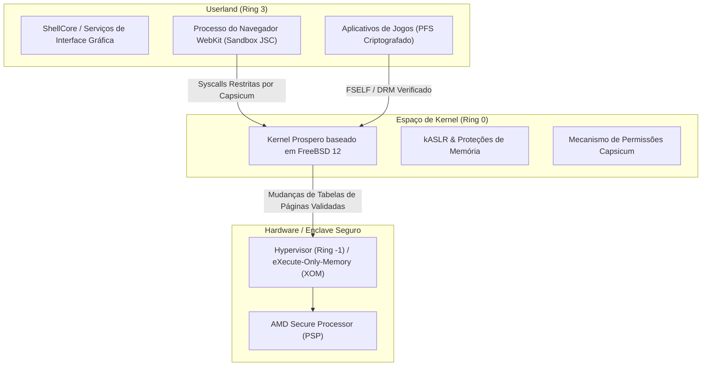
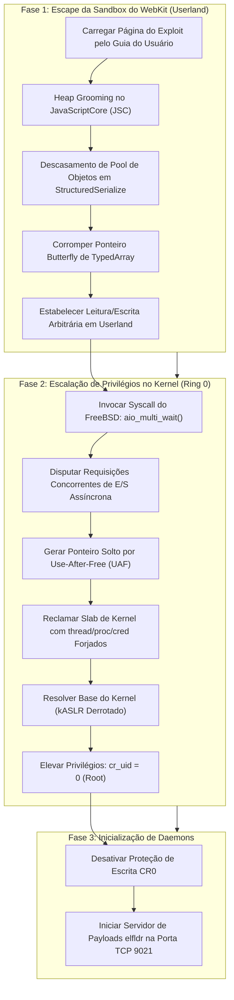
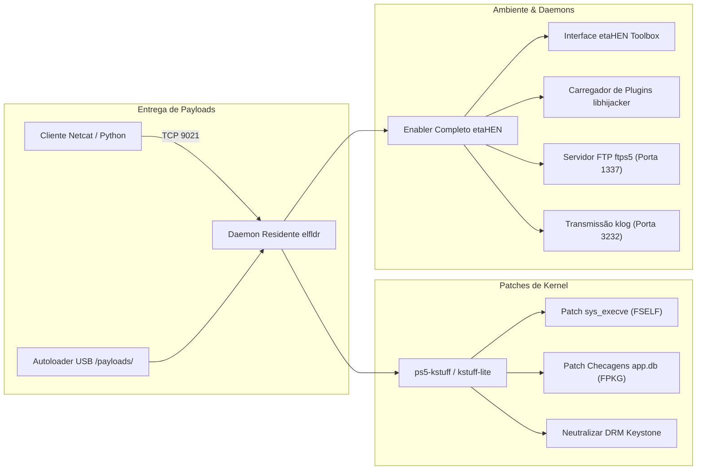
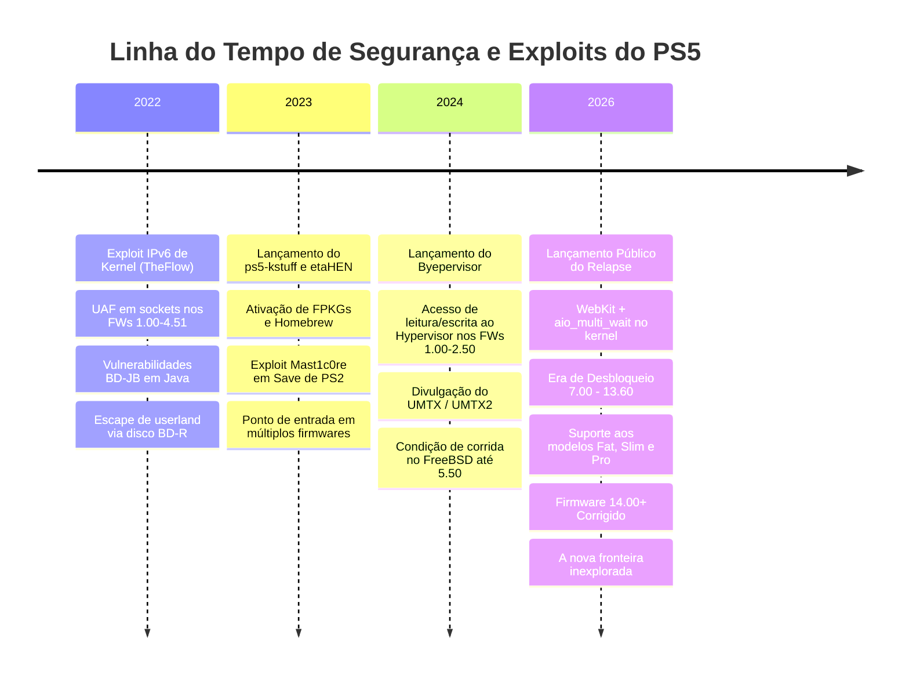

# 🔬 Jailbreak do PS5: Análise Técnica Aprofundada & Arquitetura Interna
### *by ALONSOJR1980*

<div align="center">

[](https://github.com/alonsojr1980/ps5-jailbreak-compendium)
[-blueviolet?style=for-the-badge&logo=c&logoColor=white)](https://github.com/ntfargo/Relapse-Exploit)
[](https://alonsojr1980.github.io/ps5-jailbreak-compendium/)
[-orange?style=for-the-badge)](https://github.com/PS5Dev/Byepervisor)

**Navegação / Navigation:**
[🚀 Guia Prático Passo a Passo (How-To)](jailbreak_how_to.md) | [🇺🇸 English Version](../en/jailbreak_tech_info.md) | [🌐 Portal Principal](../../README.md)

</div>

Uma referência técnica exaustiva cobrindo a arquitetura de segurança do PlayStation 5, mecanismos de exploração de baixo nível (incluindo Relapse e UMTX), primitivas de memória de kernel, engenharia de payloads, estrutura de daemons e soquetes de rede.

---

## 📑 Índice

1. [🏛️ 1. Arquitetura de Segurança do PS5 & Defesa em Profundidade](#️-1-arquitetura-de-seguran%C3%A7a-do-ps5--defesa-em-profundidade)
2. [🔥 2. Análise Detalhada: A Cadeia de Exploit Relapse (7.00 – 13.60)](#-2-an%C3%A1lise-detalhada-a-cadeia-de-exploit-relapse-700--1360)
   - [Fase 1: Corrupção de Memória no WebKit JavaScriptCore (JSC)](#fase-1-corrup%C3%A7%C3%A3o-de-mem%C3%B3ria-no-webkit-javascriptcore-jsc)
   - [Fase 2: Escalação de Privilégios no Kernel via aio_multi_wait](#fase-2-escala%C3%A7%C3%A3o-de-privil%C3%A9gios-no-kernel-via-aio_multi_wait)
   - [Estabilização Pós-Exploit e Primitiva de Kernel RW](#estabiliza%C3%A7%C3%A3o-p%C3%B3s-exploit-e-primitiva-de-kernel-rw)
3. [🧰 3. Mecanismos de Exploits Anteriores & Taxonomia de Vulnerabilidades](#-3-mecanismos-de-exploits-anteriores--taxonomia-de-vulnerabilidades)
   - [Condição de Corrida UMTX / UMTX2 (CVE-2024-43102)](#condi%C3%A7%C3%A3o-de-corrida-umtx--umtx2-cve-2024-43102)
   - [Use-After-Free em Sockets IPv6 (CVE-2020-7457)](#use-after-free-em-sockets-ipv6-cve-2020-7457)
   - [Fugas de Sandbox na Máquina Virtual Java BD-JB](#fugas-de-sandbox-na-m%C3%A1quina-virtual-java-bd-jb)
   - [Byepervisor: Comprometimento Bare-Metal do Hypervisor](#byepervisor-comprometimento-bare-metal-do-hypervisor)
4. [⚙️ 4. Engenharia de Payloads & Frameworks do Sistema](#️-4-engenharia-de-payloads--frameworks-do-sistema)
   - [Arquitetura e Ciclo de Vida da Execução de Payloads](#arquitetura-e-ciclo-de-vida-da-execu%C3%A7%C3%A3o-de-payloads)
   - [etaHEN: Arquitetura e Estrutura de Configuração](#etahen-arquitetura-e-estrutura-de-configura%C3%A7%C3%A3o)
   - [ps5-kstuff: Mecanismos de Modificação de Kernel](#ps5-kstuff-mecanismos-de-modifica%C3%A7%C3%A3o-de-kernel)
   - [elfldr: Daemon de Realocação em Memória](#elfldr-daemon-de-realoca%C3%A7%C3%A3o-em-mem%C3%B3ria)
   - [libhijacker: Sequestro Dinâmico de Processos e Motor de 60 FPS](#libhijacker-sequestro-din%C3%A2mico-de-processos-e-motor-de-60-fps)
   - [Daemons de Administração Remota: shsrv, ftps5, websrv, gdbsrv](#daemons-de-administra%C3%A7%C3%A3o-remota-shsrv-ftps5-websrv-gdbsrv)
5. [🌐 5. Diretório Mestre de Portas de Rede](#-5-diret%C3%B3rio-mestre-de-portas-de-rede)
6. [📦 6. Automação de Payloads & Scripts de Soquete Customizados](#-6-automa%C3%A7%C3%A3o-de-payloads--scripts-de-soquete-customizados)
7. [📚 7. Política de Termos Técnicos & Padrões Não Traduzíveis](#-7-pol%C3%ADtica-de-termos-t%C3%A9cnicos--padr%C3%B5es-n%C3%A3o-traduz%C3%ADveis)
8. [⏳ 8. Linha do Tempo de Exploração & A Fronteira do Firmware 14.00+](#-8-linha-do-tempo-de-explora%C3%A7%C3%A3o--a-fronteira-do-firmware-1400)

---

## 🏛️ 1. Arquitetura de Segurança do PS5 & Defesa em Profundidade

O PlayStation 5 ("Prospero") implementa um modelo de defesa em profundidade em camadas projetado para isolar processos, impor privilégios de execução imutáveis e barrar código não autorizado no kernel:



### Principais Camadas de Segurança:
1. **Isolamento em Userland (FreeBSD Capsicum)**:
   - Processos como o WebKit executam sob descritores de arquivos estritamente limitados e tabelas reduzidas de chamadas de sistema (syscalls). Navegação arbitrária em diretórios e conexões livres de rede são bloqueadas em nível de kernel.
2. **Randomização do Layout de Memória do Kernel (kASLR)**:
   - Os segmentos de código e dados do kernel são randomizados a cada inicialização, exigindo um **Information Leak (Infoleak)** para calcular os offsets de funções antes de disparar o ataque.
3. **O Hypervisor (Ring -1)**:
   - Opera acima do kernel FreeBSD. Aplica **eXecute-Only-Memory (XOM)** e Proteção Reversa de Kernel (RKP). Mesmo obtendo escrita arbitrária no kernel (`cr_uid=0`), o Hypervisor impede a alteração direta das tabelas de página para rodar novo código em Ring 0 (exceto nos FWs 1.00–2.50 via Byepervisor).
4. **Assinaturas FSELF e de Pacotes**:
   - Cada executável (`eboot.bin`, módulos) e pacote (`.pkg`) é criptografado e assinado digitalmente com chaves ECDSA privadas da Sony. Os carregadores de kernel validam essas assinaturas antes da execução.

---

## 🔥 2. Análise Detalhada: A Cadeia de Exploit Relapse (7.00 – 13.60)

Publicado no final de setembro de 2026 por **ntfargo**, **Sonic_Iso**, **Jordy** e **ufm42**, o exploit **Relapse** combina o escape da sandbox do WebKit com uma condição de corrida no subsistema de E/S assíncrona do kernel:



### Fase 1: Corrupção de Memória no WebKit JavaScriptCore (JSC)
- **Vulnerabilidade**: Inconsistência no pool de objetos durante as rotinas de serialização de `StructuredSerialize` do WebKit.
- **Mecanismo**: Quando objetos JavaScript complexos contendo handles de `ArrayBuffer` e `Transferable` são serializados simultaneamente, o coletor de lixo interpreta incorretamente as contagens de referência, permitindo corrupção de índice fora dos limites.
- **Primitiva**: O exploit cria dois objetos `Uint32Array` sobrepostos. Ao alterar o tamanho e o ponteiro de dados do segundo array por meio do primeiro, obtém-se **Leitura e Escrita Arbitrária em Userland**, contornando o ASLR do navegador.

### Fase 2: Escalação de Privilégios no Kernel via `aio_multi_wait`
- **Vulnerabilidade**: Condição de corrida na sincronização de finalização de E/S assíncrona no kernel derivado do FreeBSD (`sys/kern/vfs_aio.c`).
- **Mecanismo**: O exploit submete lotes de operações de E/S não bloqueantes e chama `aio_multi_wait()` em múltiplas threads POSIX concorrentes. Sob alta frequência de chaveamento, uma estrutura interna é liberada enquanto outra thread ainda detém uma referência ativa: **Use-After-Free (UAF)**.
- **Reivindicação de Memória de Kernel**: O exploit aloca blocos no heap do kernel com estruturas forjadas de credenciais de processo (`ucred`), fazendo com que o ponteiro solto aponte para buffers sob controle do atacante.
- **Escalação de Credenciais**:
  ```c
  // Conceito de escalação de privilégios no kernel:
  curthread->td_ucred->cr_uid = 0;      // Define UID efetivo como root
  curthread->td_ucred->cr_ruid = 0;     // Define UID real como root
  curthread->td_ucred->cr_prison = NULL; // Escapa da jail / Capsicum
  ```
- **Ativação da Porta 9021**: Com contexto de root, o exploit inicia em memória o receptor de payloads `elfldr`, abrindo o soquete na porta TCP `9021`.

---

## 🧰 3. Mecanismos de Exploits Anteriores & Taxonomia de Vulnerabilidades

### Condição de Corrida UMTX / UMTX2 (CVE-2024-43102)
- **Firmwares Suportados**: 1.00 – 5.50.
- **Subsistema**: Mutexes em Userland (`umtx`) do FreeBSD (`sys/kern/kern_umtx.c`).
- **Descoberta**: Andy Nguyen (TheFlow).
- **Técnica**: Explora uma falha de temporização em `sys_umtx_op()` ao destruir mutexes compartilhados entre threads simultâneas. Um objeto `umtx_q` liberado é desreferenciado, concedendo leitura e escrita no kernel.

### Use-After-Free em Sockets IPv6 (CVE-2020-7457)
- **Firmwares Suportados**: 1.00 – 4.51.
- **Subsistema**: Pilha de rede IPv6 do FreeBSD (`sys/netinet6/in6_pcb.c`).
- **Técnica**: Múltiplas threads disputam o fechamento e a consulta de opções de sockets IPv6 (`IPV6_2292PKTOPTIONS`). A corrida deixa um ponteiro solto para um buffer `ip6_pktopts` desalocado, viabilizando manipulação de memória de kernel com estabilidade próxima a 100%.

### Fugas de Sandbox na Máquina Virtual Java BD-JB
- **Firmwares Suportados**: 1.00 – 7.61.
- **Subsistema**: Especificação Blu-ray Disc Java (BD-J) e pilha GEM.
- **Descoberta**: Andy Nguyen (TheFlow).
- **Técnica**: Discos Blu-ray físicos contornam o navegador WebKit por completo. Pacotes `.jar` modificados exploram confusões de tipo na JVM e classes de reflexão inseguras para escapar da sandbox Java e rodar código C nativo em userland.

### Byepervisor: Comprometimento Bare-Metal do Hypervisor
- **Firmwares Suportados**: 1.00 – 2.50.
- **Autores**: Equipe PS5Dev, SpecterDev, ChendoChap, EchoStretch, John Törnblom.
- **Técnica**: Ataca as rotinas de transição para o modo de repouso do processador de segurança AMD e do Secure Loader. Ao corromper estruturas durante o estado de suspensão para a RAM, o exploit assume o controle de Ring -1 (Hypervisor), liberando manipulação de tabelas de páginas e descriptografia arbitrária de memória.

---

## ⚙️ 4. Engenharia de Payloads & Frameworks do Sistema

### Arquitetura e Ciclo de Vida da Execução de Payloads



### etaHEN: Arquitetura e Estrutura de Configuração
O **etaHEN** (desenvolvido por **LightningMods**) atua como o sistema central de extensões do PS5:
- Injeta uma entrada nativa de menu no ShellCore usando o `libhijacker`.
- Gerencia ganchos de memória em tempo real, motores de trapaças e patches de jogos.
- Arquivo de configuração padrão em `/data/etaHEN/config.ini`:
  ```ini
  [General]
  log_level=1
  ftp_port=1337
  klog_port=3232
  auto_launch_itemzflow=0
  temperature_threshold=78
  rest_mode_fix=1

  [Plugins]
  enable_game_plugins=1
  allow_cheats=1
  ```

### ps5-kstuff: Mecanismos de Modificação de Kernel
O **ps5-kstuff** (por **ChendoChap**, **EchoStretch**, **John Törnblom**, **flatz**) altera o kernel dinamicamente:
1. **Neutralização de Assinaturas FSELF**: Altera a chamada `sys_execve` para permitir binários sem assinatura ECDSA da Sony.
2. **Montagem de FPKG**: Intercepta a verificação de pacotes em `pkg_install` e no banco `app.db`, viabilizando o carregamento de arquivos `.pkg` descriptografados.
3. **Bypass de DRM Keystone**: Contorna a validação criptográfica do keystone, permitindo compartilhar e editar saves de jogos sem erros de incompatibilidade de conta.

### elfldr: Daemon de Realocação em Memória
Criado por **John Törnblom** (`ps5-payload-dev`). Fica ouvindo na **Porta TCP 9021**. Lê cabeçalhos ELF recebidos, aloca memória executável, resolve símbolos de kernel e inicializa os payloads em threads separadas sem reiniciar o sistema.

### libhijacker: Sequestro Dinâmico de Processos e Motor de 60 FPS
Desenvolvido por **astrelsky**. Utiliza primitivas de depuração do FreeBSD (`ptrace`, `/proc/<pid>/mem`) para injetar threads customizadas dentro de executáveis de jogos em execução (`eboot.bin`). Funções:
- Desbloqueio de taxa de quadros de 30 FPS para 60 FPS (Bloodborne, Red Dead Redemption 2, Driveclub).
- Modos de câmera livre para desenvolvimento e captura.
- Ganchos na memória para aplicação de códigos de trapaça em tempo real.

### Daemons de Administração Remota: shsrv, ftps5, websrv, gdbsrv
- **`shsrv` (Porta 2323)**: Terminal root completo do FreeBSD acessível via Telnet (`telnet <IP_PS5> 2323`).
- **`ftps5` (Porta 1337)**: Servidor FTP com suporte a múltiplos acessos simultâneos nas partições: `/system`, `/user/home`, `/app0`, `/data`, `/mnt/usb0`, `/mnt/ext0`.
- **`websrv` (Porta 8080)**: Painel web integrado para gerenciamento.
- **`gdbsrv` (Porta 2159)**: Stub para depuração remota via GDB conectável ao IDA Pro, Ghidra ou `gdb-multiarch`.

---

## 🌐 5. Diretório Mestre de Portas de Rede

| Porta | Protocolo | Daemon / Serviço | Descrição | Exemplo de Comando de Conexão |
| :---: | :---: | :---: | :---: | :---: |
| **9021** | TCP | `elfldr` | Receptor Primário de Payloads ELF | `nc -w 3 <IP_PS5> 9021 < payload.bin` |
| **9027** | TCP | `kstuff-loader` | Soquete dedicado de injeção de kstuff | `nc -w 3 <IP_PS5> 9027 < kstuff.bin` |
| **1337** | TCP | `ftps5` / `etaHEN FTP` | Servidor FTP root de alta velocidade | Conectar pelo FileZilla / WinSCP na porta 1337 |
| **2323** | TCP | `shsrv` | Terminal Telnet Root do FreeBSD | `telnet <IP_PS5> 2323` |
| **3232** | UDP/TCP | `klog` | Fluxo ao vivo de logs do kernel | `nc -u -l 3232` (ou cliente Socat) |
| **8080** | TCP | `websrv` | Painel Web de Administração | Abrir `http://<IP_PS5>:8080` no navegador |
| **2159** | TCP | `gdbsrv` | Stub de Depurador Remoto GDB | `gdb-multiarch -ex "target remote <IP_PS5>:2159"` |

---

## 📦 6. Automação de Payloads & Scripts de Soquete Customizados

### Injetor Automático de Payloads em Python (`send_payload.py`)
```python
import sys
import socket

def send_payload(ps5_ip: str, payload_path: str, port: int = 9021):
    print(f"[*] Lendo payload: {payload_path}")
    with open(payload_path, "rb") as f:
        data = f.read()
    
    print(f"[*] Conectando ao PS5 em {ps5_ip}:{port}...")
    with socket.socket(socket.AF_INET, socket.SOCK_STREAM) as s:
        s.settimeout(5.0)
        s.connect((ps5_ip, port))
        s.sendall(data)
    print(f"[+] {len(data)} bytes entregues com sucesso a {ps5_ip}:{port}!")

if __name__ == "__main__":
    if len(sys.argv) < 3:
        print("Uso: python send_payload.py <IP_DO_PS5> <CAMINHO_PAYLOAD> [PORTA]")
        sys.exit(1)
    port = int(sys.argv[3]) if len(sys.argv) > 3 else 9021
    send_payload(sys.argv[1], sys.argv[2], port)
```

Execução:
```bash
python send_payload.py 192.168.1.150 etaHEN.bin 9021
```

---

## 📚 7. Política de Termos Técnicos & Padrões Não Traduzíveis

Termos técnicos padronizados da indústria de segurança cibernética **nunca devem ser traduzidos** para garantir clareza e aderência às ferramentas:

| Termo Técnico | Domínio | Definição & Contexto Técnico | Por Que NUNCA Deve Ser Traduzido |
| :--- | :--- | :--- | :--- |
| **Handshake** | Criptografia / Redes | Processo mútuo de autenticação e verificação entre o hardware do console e os servidores da Sony (ex.: pareamento do leitor removível do Slim/Pro). | Traduzir como "aperto de mão" descaracteriza o protocolo criptográfico. |
| **Jailbreak** | Segurança de Sistemas | Processo de escalação de privilégios para obter acesso root/kernel e rodar código não assinado. | Termo universal da cena hacker desde o iOS, PS3, PS4 e PS5. |
| **Exploit / Exploit Chain** | Pesquisa de Segurança | Código ou técnica que aproveita uma vulnerabilidade (ex.: WebKit + `aio_multi_wait`) para alterar o fluxo de execução. | Nomenclatura internacional e padrão da taxonomia de vulnerabilidades. |
| **Payload** | Execução de Binários | Código executável injetado na memória após a exploração (`etaHEN`, `kstuff`, `elfldr`). | Traduzir como "carga útil" gera confusão conceitual e quebra ferramentas. |
| **Payload Injection** | Entrega de Execução | Ato de transmitir e executar binários na memória via portas TCP (Porta 9021) ou pendrives USB. | Termo técnico consagrado de injeção de código em memória. |
| **Kernel Panic (KP)** | Sistema Operacional | Falha crítica irrecuperável disparada pelo kernel FreeBSD quando ocorrem exceções ou corrupções de memória. | Classificação padrão de crash em sistemas UNIX/POSIX. |
| **Use-After-Free (UAF)** | Corrupção de Memória | Vulnerabilidade em que a memória é acessada após ser liberada, gerando ponteiros soltos. | Categoria oficial de vulnerabilidade (CWE-416). |
| **Heap Spray / Grooming** | Exploração de Memória | Alocação repetida de estruturas na memória heap para torná-la previsível e controlável. | Conceito clássico de exploração de memória. |
| **Race Condition** | Falha de Concorrência | Condição de corrida em que duas threads competem pelo acesso a recursos compartilhados do kernel. | Classificação internacional de defeitos de concorrência. |
| **Information Leak (Infoleak)** | Segurança de Memória | Vulnerabilidade que revela endereços internos da memória, permitindo contornar o kASLR. | Termo essencial da cadeia de exploração de sistemas modernos. |
| **Sandbox / Sandbox Escape** | Isolamento de Processos | Ambiente isolado de segurança (Capsicum/WebKit) e a técnica de fuga de suas restrições. | Termo padrão da computação moderna para limites de execução. |
| **Userland** | Espaço de Execução | Espaço de privilégio comum da CPU (Ring 3) onde rodam o navegador WebKit, jogos e a interface gráfica. | Termo padrão de arquitetura de sistemas operacionais. |
| **Kernel** | Sistema Operacional | Núcleo de Ring 0 com privilégio supervisor gerenciando hardware, syscalls e memória virtual. | Termo fundamental e universal de sistemas operacionais. |
| **Hypervisor (HV)** | Virtualização | Camada de segurança em Ring -1 acima do kernel que protege tabelas de páginas (XOM) e assinatura de código. | Termo padrão da indústria para virtualizadores de baixo nível. |
| **kASLR** | Mitigação de Segurança | Randomização do layout do espaço de endereçamento do kernel aplicada a cada boot. | Sigla padrão da indústria para proteção de memória. |
| **FSELF** | Formato de Binário | Fake Signed ELF; executáveis desprovidos das assinaturas oficiais ECDSA da Sony. | Nomenclatura proprietária da cena PlayStation para binários modificados. |
| **FPKG** | Formato de Pacote | Fake Package; arquivos de pacotes de jogos/aplicativos assinados com chaves falsas para homebrew. | Padrão consagrado para instalação de pacotes não oficiais no PS4/PS5. |
| **Rest Mode** | Estado de Energia | Modo de repouso / suspensão oficial do sistema operacional do PlayStation. | Designação oficial do recurso da Sony e do sistema. |
| **Dump / Dumping** | Extração de Arquivos | Processo de extração e descriptografia de jogos em disco, digitais ou partições do console. | Termo unânime na cena para extração de arquivos. |
| **Hook / Hooking** | Injeção Dinâmica | Interceptação de chamadas de funções ou syscalls em tempo de execução para alterar o comportamento. | Conceito universal da engenharia reversa. |
| **Keystone / Keystone DRM** | DRM da PlayStation | Arquivo criptográfico que vincula os saves de jogos à conta e ao console do usuário. | Mecanismo proprietário da Sony de proteção de dados salvos. |
| **Autoloader** | Automação | Ferramenta ou script que carrega e injeta payloads automaticamente após a conclusão do exploit. | Designação consagrada de utilitários de automação. |

---

## ⏳ 8. Linha do Tempo de Exploração & A Fronteira do Firmware 14.00+



No firmware 14.00, a Sony corrigiu a condição de corrida em `aio_multi_wait` redesenhando o sincronismo de requisições assíncronas e adicionando checagens de integridade no alocador do kernel. Consoles no firmware 14.00+ devem permanecer offline aguardando novas divulgações de segurança.

---

<p align="center">
  <b>Procurando o passo a passo prático de desbloqueio?</b><br>
  👉 Leia o guia companheiro: <b><a href="jailbreak_how_to.md">Como Fazer Jailbreak no PS5: Guia Prático Passo a Passo</a></b>
</p>
