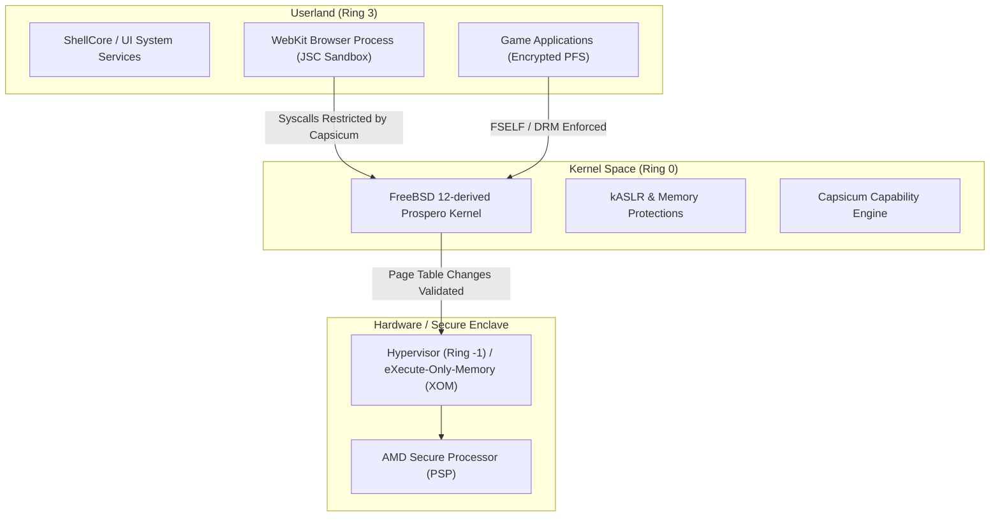
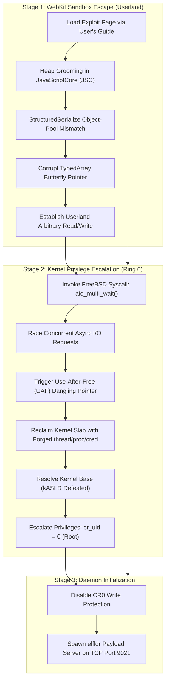
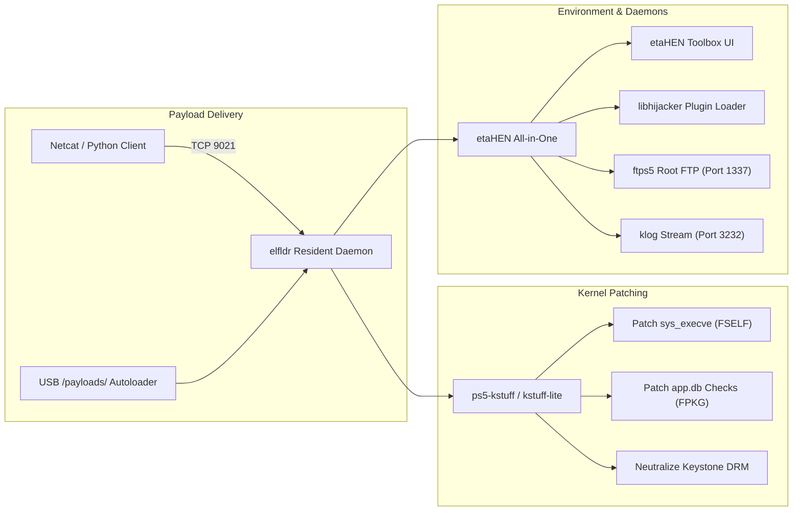
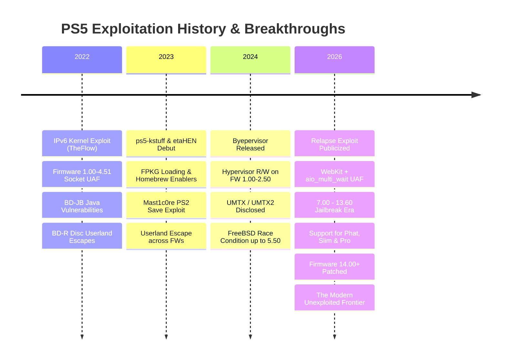

# 🔬 PS5 Jailbreak: Technical Deep Dive & Internals
### *by ALONSOJR1980*

<div align="center">

[](https://github.com/alonsojr1980/ps5-jailbreak-compendium)
[-blueviolet?style=for-the-badge&logo=c&logoColor=white)](https://github.com/ntfargo/Relapse-Exploit)
[](https://alonsojr1980.github.io/ps5-jailbreak-compendium/)
[-orange?style=for-the-badge)](https://github.com/PS5Dev/Byepervisor)

**Navigation:**
[🚀 Direct How-To Guide (Step-by-Step)](jailbreak_how_to.md) | [🇧🇷 Versão em Português](i18n/pt/jailbreak_tech_info.md) | [🌐 Main Portal](README.md)

</div>

An exhaustive technical reference covering the PlayStation 5 security architecture, low-level exploit mechanics (including Relapse and UMTX), kernel memory primitives, payload engineering, daemon internals, and network socket interfaces.

---

## 📑 Table of Contents

1. [🏛️ 1. PS5 Security Architecture & Defense-in-Depth](#️-1-ps5-security-architecture--defense-in-depth)
2. [🔥 2. Deep Dive: The Relapse Exploit Chain (7.00 – 13.60)](#-2-deep-dive-the-relapse-exploit-chain-700--1360)
   - [Stage 1: WebKit JavaScriptCore (JSC) Memory Corruption](#stage-1-webkit-javascriptcore-jsc-memory-corruption)
   - [Stage 2: Kernel Privilege Escalation via aio_multi_wait](#stage-2-kernel-privilege-escalation-via-aio_multi_wait)
   - [Post-Exploit Stabilization & Kernel RW Primitive](#post-exploit-stabilization--kernel-rw-primitive)
3. [🧰 3. Prior Exploit Internals & Vulnerability Taxonomy](#-3-prior-exploit-internals--vulnerability-taxonomy)
   - [UMTX / UMTX2 Race Condition (CVE-2024-43102)](#umtx--umtx2-race-condition-cve-2024-43102)
   - [IPv6 Socket Use-After-Free (CVE-2020-7457)](#ipv6-socket-use-after-free-cve-2020-7457)
   - [BD-JB Java Virtual Machine Sandbox Escapes](#bd-jb-java-virtual-machine-sandbox-escapes)
   - [Byepervisor: Bare-Metal Hypervisor Compromise](#byepervisor-bare-metal-hypervisor-compromise)
4. [⚙️ 4. Payload Engineering & System Frameworks](#️-4-payload-engineering--system-frameworks)
   - [Payload Execution Architecture & Lifecycle](#payload-execution-architecture--lifecycle)
   - [etaHEN: Architecture & Configuration Structure](#etahen-architecture--configuration-structure)
   - [ps5-kstuff: Kernel Patching Mechanics](#ps5-kstuff-kernel-patching-mechanics)
   - [elfldr: In-Memory Relocation Daemon](#elfldr-in-memory-relocation-daemon)
   - [libhijacker: Dynamic Process Hooking & 60 FPS Engine](#libhijacker-dynamic-process-hooking--60-fps-engine)
   - [Remote Administration Daemons: shsrv, ftps5, websrv, gdbsrv](#remote-administration-daemons-shsrv-ftps5-websrv-gdbsrv)
5. [🌐 5. Master Network Ports Directory](#-5-master-network-ports-directory)
6. [📦 6. Payload Automation & Custom Socket Scripting](#-6-payload-automation--custom-socket-scripting)
7. [📚 7. Technical Terms Policy & Untranslatable Standards](#-7-technical-terms-policy--untranslatable-standards)
8. [⏳ 8. Exploitation Timeline & The 14.00+ Frontier](#-8-exploitation-timeline--the-1400-frontier)

---

## 🏛️ 1. PS5 Security Architecture & Defense-in-Depth

The PlayStation 5 ("Prospero") implements a layered defense model designed to isolate processes, enforce immutable execution permissions, and prevent unauthorized kernel code execution:



### Key Security Layers:
1. **Userland Sandboxing (FreeBSD Capsicum)**:
   - Processes like WebKit run with constrained file descriptors and reduced system call tables. Arbitrary path traversal and network access are restricted at the kernel level.
2. **Kernel Address Space Layout Randomization (kASLR)**:
   - Kernel code and data segments are randomized on each boot, necessitating an **Information Leak (Infoleak)** to resolve function offsets before exploitation.
3. **The Hypervisor (Ring -1)**:
   - Operates above the FreeBSD kernel. Enforces **eXecute-Only-Memory (XOM)** and Reverse Kernel Protection (RKP). Even if code achieves arbitrary kernel write (`cr_uid=0`), the Hypervisor prevents modifying page tables directly to execute new code in Ring 0 (except on FW 1.00–2.50 via Byepervisor).
4. **FSELF & Package Signing**:
   - Every executable (`eboot.bin`, modules) and package (`.pkg`) is encrypted and digitally signed with Sony's private ECDSA keys. Kernel loaders verify these signatures before execution.

---

## 🔥 2. Deep Dive: The Relapse Exploit Chain (7.00 – 13.60)

Published in late September 2026 by **ntfargo**, **Sonic_Iso**, **Jordy**, and **ufm42**, the **Relapse Exploit** chains a WebKit sandbox escape with an asynchronous I/O kernel race condition:



### Stage 1: WebKit JavaScriptCore (JSC) Memory Corruption
- **Vulnerability**: An object-pool mismatch in the serialization routines of WebKit's `StructuredSerialize`.
- **Mechanics**: When complex JavaScript objects containing `ArrayBuffer` and `Transferable` handles are serialized concurrently, the garbage collector misinterprets reference counts, permitting an out-of-bounds index corruption.
- **Primitive**: The exploit crafts two overlapping `Uint32Array` objects. By mutating the length and data pointer of the second array via the first, it constructs an **Arbitrary Userland Read/Write** primitive, bypassing userland ASLR.

### Stage 2: Kernel Privilege Escalation via `aio_multi_wait`
- **Vulnerability**: A race condition in the asynchronous I/O completion logic within the FreeBSD-derived kernel (`sys/kern/vfs_aio.c`).
- **Mechanics**: The exploit submits batches of non-blocking I/O operations and calls `aio_multi_wait()` across multiple POSIX threads. Under high-frequency thread synchronization, an internal tracking struct is freed while a companion thread still maintains an active reference: **Use-After-Free (UAF)**.
- **Kernel Memory Reclaim**: The exploit sprays kernel heap allocations (slabs) with fake process credential structures (`ucred`), aligning memory so the dangling pointer references userland-controlled payload buffers.
- **Credential Escalation**:
  ```c
  // Conceptual privilege escalation in kernel space:
  curthread->td_ucred->cr_uid = 0;      // Set effective UID to root
  curthread->td_ucred->cr_ruid = 0;     // Set real UID to root
  curthread->td_ucred->cr_prison = NULL; // Escape FreeBSD jail / Capsicum
  ```
- **Port 9021 Activation**: With root privileges, the exploit spawns the in-memory payload receiver `elfldr`, binding to TCP port `9021`.

---

## 🧰 3. Prior Exploit Internals & Vulnerability Taxonomy

### UMTX / UMTX2 Race Condition (CVE-2024-43102)
- **Supported Firmwares**: 1.00 – 5.50.
- **Subsystem**: FreeBSD Userland Mutex (`umtx`) subsystem (`sys/kern/kern_umtx.c`).
- **Discovery**: Andy Nguyen (TheFlow).
- **Technique**: Exploits a race condition in `sys_umtx_op()` when tearing down shared mutexes between concurrent threads. A freed `umtx_q` object is dereferenced, granting kernel read/write primitives.

### IPv6 Socket Use-After-Free (CVE-2020-7457)
- **Supported Firmwares**: 1.00 – 4.51.
- **Subsystem**: FreeBSD network stack (`sys/netinet6/in6_pcb.c`).
- **Technique**: Multiple threads race on closing and querying IPv6 socket options (`IPV6_2292PKTOPTIONS`). A race condition leaves a dangling pointer to a freed `ip6_pktopts` buffer, allowing kernel memory manipulation with exceptional stability.

### BD-JB Java Virtual Machine Sandbox Escapes
- **Supported Firmwares**: 1.00 – 7.61.
- **Subsystem**: Blu-ray Disc Java (BD-J) specification and GEM stack.
- **Discovery**: Andy Nguyen (TheFlow).
- **Technique**: Physical Blu-ray discs bypass the WebKit browser entirely. Custom `.jar` packages exploit JVM type confusions and insecure reflection classes to escape the Java sandbox into userland native C execution.

### Byepervisor: Bare-Metal Hypervisor Compromise
- **Supported Firmwares**: 1.00 – 2.50.
- **Authors**: PS5Dev team, SpecterDev, ChendoChap, EchoStretch, John Törnblom.
- **Technique**: Targets the sleep-mode transition routines of the AMD Secure Processor and Secure Loader. By corrupting memory structures during the suspend-to-RAM state, the exploit takes control of Ring -1 (Hypervisor), granting bare-metal page table manipulation and arbitrary hypervisor memory decryption.

---

## ⚙️ 4. Payload Engineering & System Frameworks

### Payload Execution Architecture & Lifecycle



### etaHEN: Architecture & Configuration Structure
**etaHEN** (by **LightningMods**) functions as the core system extension framework:
- Injects a native Settings menu item via `libhijacker` into ShellCore.
- Manages real-time memory hooks, cheat engines, and custom game patches.
- Default configuration file at `/data/etaHEN/config.ini`:
  ```ini
  [General]
  log_level=1
  ftp_port=1337
  klog_port=3232
  auto_launch_itemzflow=0
  temperature_threshold=78
  rest_mode_fix=1

  [Plugins]
  enable_game_plugins=1
  allow_cheats=1
  ```

### ps5-kstuff: Kernel Patching Mechanics
**ps5-kstuff** (by **ChendoChap**, **EchoStretch**, **John Törnblom**, **flatz**) dynamically modifies the kernel:
1. **FSELF Signature Neutralization**: Patches `sys_execve` to permit binaries lacking Sony's ECDSA cryptographic signature.
2. **FPKG Mounting**: Hooks the package verification routines in `pkg_install` and `app.db`, permitting decrypted `.pkg` archives to mount and run.
3. **Keystone DRM Bypass**: Circumvents the hardware-unique keystone validation, allowing game saves to be shared and modified without encryption mismatch errors.

### elfldr: In-Memory Relocation Daemon
Authored by **John Törnblom** (`ps5-payload-dev`). Listens continuously on **TCP Port 9021**. Parses incoming ELF headers, allocates executable memory, resolves kernel symbol relocations, and executes payloads in separate kernel-level threads without requiring console reboots.

### libhijacker: Dynamic Process Hooking & 60 FPS Engine
Developed by **astrelsky**. Leverages low-level FreeBSD process control primitives (`ptrace`, `/proc/<pid>/mem`) to inject custom threads into running game executables (`eboot.bin`). Used to:
- Unlock frame rates from 30 FPS to 60 FPS (Bloodborne, Red Dead Redemption 2, Driveclub).
- Enable free-camera debug modes and developer HUDs.
- Hook into game memory for live cheat trainer modification.

### Remote Administration Daemons: shsrv, ftps5, websrv, gdbsrv
- **`shsrv` (Port 2323)**: Spawns a full root POSIX terminal session accessible via standard Telnet (`telnet <PS5_IP> 2323`).
- **`ftps5` (Port 1337)**: Multi-threaded FTP daemon exposing system mount points: `/system`, `/user/home`, `/app0`, `/data`, `/mnt/usb0`, `/mnt/ext0`.
- **`websrv` (Port 8080)**: Lightweight embedded web administrative interface.
- **`gdbsrv` (Port 2159)**: Remote GDB server stub allowing live breakpoint debugging with `gdb-multiarch`, IDA Pro, or Ghidra.

---

## 🌐 5. Master Network Ports Directory

| Port | Protocol | Daemon / Service | Description | Example Connection Command |
| :---: | :---: | :---: | :---: | :---: |
| **9021** | TCP | `elfldr` | Primary ELF Payload Receiver | `nc -w 3 <PS5_IP> 9021 < payload.bin` |
| **9027** | TCP | `kstuff-loader` | Dedicated kstuff injection socket | `nc -w 3 <PS5_IP> 9027 < kstuff.bin` |
| **1337** | TCP | `ftps5` / `etaHEN FTP` | High-speed root FTP server | Connect via FileZilla / WinSCP on port 1337 |
| **2323** | TCP | `shsrv` | Root UNIX Telnet Shell | `telnet <PS5_IP> 2323` |
| **3232** | UDP/TCP | `klog` | Live Kernel Logger Stream | `nc -u -l 3232` (or Socat client) |
| **8080** | TCP | `websrv` | Local Web Admin Interface | Open `http://<PS5_IP>:8080` in browser |
| **2159** | TCP | `gdbsrv` | Remote GDB Debugger Stub | `gdb-multiarch -ex "target remote <PS5_IP>:2159"` |

---

## 📦 6. Payload Automation & Custom Socket Scripting

### Python Automated Payload Injector (`send_payload.py`)
```python
import sys
import socket

def send_payload(ps5_ip: str, payload_path: str, port: int = 9021):
    print(f"[*] Reading payload: {payload_path}")
    with open(payload_path, "rb") as f:
        data = f.read()
    
    print(f"[*] Connecting to PS5 at {ps5_ip}:{port}...")
    with socket.socket(socket.AF_INET, socket.SOCK_STREAM) as s:
        s.settimeout(5.0)
        s.connect((ps5_ip, port))
        s.sendall(data)
    print(f"[+] Successfully delivered {len(data)} bytes to {ps5_ip}:{port}!")

if __name__ == "__main__":
    if len(sys.argv) < 3:
        print("Usage: python send_payload.py <PS5_IP> <PAYLOAD_PATH> [PORT]")
        sys.exit(1)
    port = int(sys.argv[3]) if len(sys.argv) > 3 else 9021
    send_payload(sys.argv[1], sys.argv[2], port)
```

Run via:
```bash
python send_payload.py 192.168.1.150 etaHEN.bin 9021
```

---

## 📚 7. Technical Terms Policy & Untranslatable Standards

Industry-standard technical terms must **never be translated** into regional dialects in international documentation to maintain technical precision and alignment with developer tools:

| Technical Term | Domain | Definition & Technical Context | Why It Must NOT Be Translated |
| :--- | :--- | :--- | :--- |
| **Handshake** | Cryptography / Networking | Automated mutual verification between console hardware/firmware and Sony servers (e.g., Slim/Pro detachable disc drive pairing). | Translating as "aperto de mão" obscures the cryptographic protocol definition. |
| **Jailbreak** | System Exploitation | Privilege escalation process gaining root/kernel access to execute unsigned code. | Universal term across iOS, PS4, and PS5 scenes. |
| **Exploit / Exploit Chain** | Security Research | Software technique leveraging a vulnerability (e.g. WebKit + `aio_multi_wait`) to alter execution flow. | Standard security vulnerability taxonomy term. |
| **Payload** | Binary Execution | Executable code delivered and run post-exploitation (`etaHEN`, `kstuff`, `elfldr`). | Translating as "carga útil" causes confusion with physical/network payloads. |
| **Payload Injection** | Execution Delivery | Transmitting binary payloads to memory over TCP sockets (Port 9021) or USB loaders. | Standard low-level execution terminology. |
| **Kernel Panic (KP)** | Operating System | Critical internal crash halted by the FreeBSD kernel when memory corruption or illegal states occur. | Standard POSIX/UNIX crash classification. |
| **Use-After-Free (UAF)** | Memory Corruption | Vulnerability where memory is accessed after deallocation, creating race condition primitives. | Standard CWE category (CWE-416). |
| **Heap Spray / Grooming** | Memory Exploitation | Allocating structured objects across memory to make memory layouts deterministic and exploitable. | Technical memory exploitation concept. |
| **Race Condition** | Concurrency Flaw | Asynchronous timing flaw where two threads compete for access to shared kernel resources. | Standard concurrency defect classification. |
| **Information Leak (Infoleak)** | Memory Safety | Vulnerability revealing memory addresses, enabling bypass of kASLR. | Standard exploitation primitive term. |
| **Sandbox / Sandbox Escape** | Security Boundary | Process isolation jail (Capsicum/WebKit) and the breakout technique used to escape it. | Universal security boundary term. |
| **Userland** | Execution Ring | Unprivileged CPU privilege space (Ring 3) running the UI, games, and WebKit browser. | Standard operating systems architectural term. |
| **Kernel** | Operating System | Ring 0 privileged core supervisor managing hardware, syscalls, and virtual memory. | Standard OS terminology. |
| **Hypervisor (HV)** | Virtualization | Ring -1 security layer above the kernel enforcing code signing and eXecute-Only-Memory (XOM). | Universal computing architecture term. |
| **kASLR** | Security Mitigation | Kernel Address Space Layout Randomization; randomizes base kernel memory addresses on each boot. | Industry-standard security mitigation acronym. |
| **FSELF** | Sony Binary Format | Fake Signed ELF; binary executables stripped of proprietary Sony ECDSA signatures. | Proprietary PlayStation binary format designation. |
| **FPKG** | Package Format | Fake Package; decrypted PlayStation application archive signed with dummy keys for homebrew. | PlayStation scene standard package format. |
| **Rest Mode** | Power State | Official low-power sleep state of the PlayStation operating system. | Official Sony console feature and state name. |
| **Dump / Dumping** | File Extraction | Extracting and decrypting disc or digital games, keys, and system partitions to storage. | Universal scene terminology for extraction. |
| **Hook / Hooking** | Dynamic Code Injection | Intercepting function calls or syscalls at runtime to alter behavior (used by `libhijacker`). | Standard software engineering & reverse engineering term. |
| **Keystone / Keystone DRM** | PlayStation DRM | Cryptographic data file tying game saves to individual user account IDs. | Proprietary Sony save data encryption mechanism. |
| **Autoloader** | Automation | Script or web routine that automatically runs and injects payloads upon exploit trigger. | Scene automation utility term. |

---

## ⏳ 8. Exploitation Timeline & The 14.00+ Frontier



In Firmware 14.00, Sony patched the `aio_multi_wait` race condition by redesigning async request synchronization and introducing additional integrity validations in the kernel allocator. Consoles on firmware 14.00+ must remain offline and await new vulnerability disclosures.

---

<p align="center">
  <b>Looking for the step-by-step practical instructions?</b><br>
  👉 Read the companion guide: <b><a href="jailbreak_how_to.md">PS5 Jailbreak: Direct How-To Guide</a></b>
</p>
